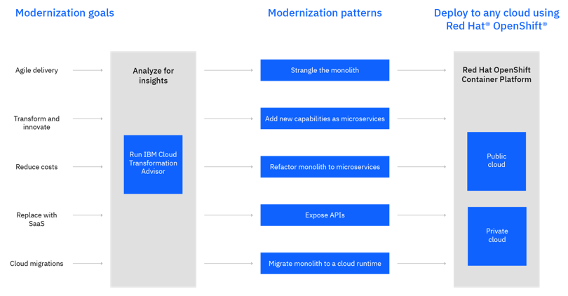

<PageDescription>

Modernize your existing application workloads towards a more cloud-native model built on a modern cloud platform.

</PageDescription>

## Overview

Application modernization is a journey of moving existing applications to a more modern cloud-native infrastructure.

A high level overview of key application modernization concepts is available in the [Application Modernization Field Guide](https://www.ibm.com/cloud/garage/content/field-guide/app-modernization-field-guide/) and the IBM Architecture Center [Application Modernization reference architecture](https://www.ibm.com/cloud/garage/architectures/application-modernization/)

## Solutions

Reference implementations for several approaches to application modernization are provided that can be used as starting point when approaching your own implementation.

### Runtime modernization
Updating the application runtime to a suitable cloud-native framework (Liberty) and deploying on Red Hat OpenShift.

This solution shows the process of analyzing, containerizing and deploying the application to Red Hat OpenShift. Two different deployment options including using modern CI/CD tools (OpenShift Pipelines/Tekton) and the IBM Garage Cloud Native Toolkit are provided.
* [Walk through the code and solution](liberty)
* [View solution introduction](https://www.ibm.com/cloud/architecture/architectures/runtime-modernization-solution) at IBM Cloud Architecture Center

### Operational modernization
Repackaging the application to deploy within a container but maintaining a monolith application without changes to the application or runtime

This solution shows the process of analyzing, containerizing and deploying the application to Red Hat OpenShift
* [Walk through the code and solution](was90/README)
* [View solution introduction](https://www.ibm.com/cloud/architecture/architectures/op-modernization-solution) at IBM Cloud Architecture Center

### Refactoring Java EE Applications
Refactoring the application from a monolith to a set of micro services

This solution shows the process of refactoring, containerizing and deploying the application to Red Hat OpenShift
* [Walk through the code and solution](refactor)

### Spring Framework modernization
Modernizing a legacy Spring application by updating to the latest Spring Boot and deploying in Red Hat OpenShift
* [Walk through the code and solution](spring/README)
* [View solution introduction](https://www.ibm.com/cloud/architecture/architectures/springboot-modernization-solution) at IBM Cloud Architecture Center

## Additional Resources

* [Application Modernization](https://ibm-cloud-architecture.github.io/deliverables/application-modernization.html) assets
* [Installing](https://cloudpak8s.io/apps/cp4a_overview/) Cloud Pak for Applications
* [Installing Cloud Pak for Applications on IBM Cloud](https://github.com/vandepol/CP4AonOCPonIBMCloud/blob/master/README.md)
