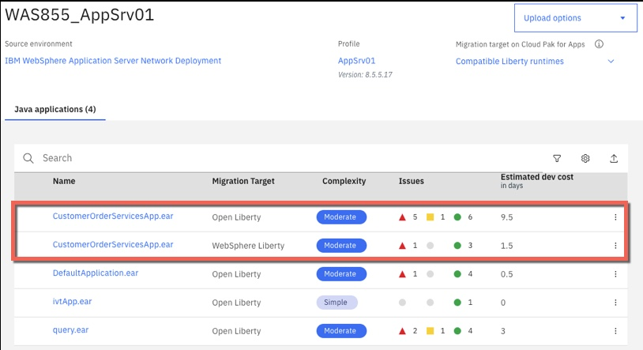
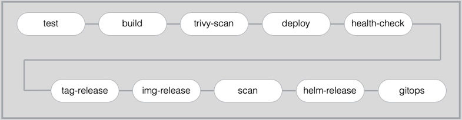

export const Title = () => (
  <span>
Modernizing runtimes with Liberty<br/> <h2>Move applications to Liberty runtime</h2>
  </span>
);

<PageDescription>

Modernizing workloads to run on a cloud-native application runtime is key step.  Explore how to move an existing WebSphere application to run on Liberty.

</PageDescription>

<AnchorLinks>
  <AnchorLink>Introduction</AnchorLink>
  <AnchorLink>Application Overview </AnchorLink>
  <AnchorLink>Analysis</AnchorLink>
  <AnchorLink>Build</AnchorLink>
  <AnchorLink>Deploy</AnchorLink>
</AnchorLinks>


## Run it yourself
Detailed step-by-step instructions are available to deploy the solution in your environment:

- [Deploy the solution on Red Hat OpenShift using Cloud Nativet Toolkit Pipelines](liberty-deploy-cloud-native-toolkit)
- [Deploy the solution on Red Hat OpenShift using OpenShift Pipelines (Tekton)](liberty-deploy-openshift-pipelines)

## Introduction
**Runtime modernization** moves an application to a 'built for the cloud' runtime with the least amount of effort. **WebSphere Liberty** is a fast, dynamic, and easy-to-use Java application server, built on the open source Open Liberty project. Ideal or the cloud, Liberty is a combination of IBM technology and open source software, with fast startup times (<2 seconds), no server restarts to pick up changes, and a simple XML configuration.

However, WebSphere Liberty doesn't support all of the legacy Java EE and WebSphere proprietary functionality and some code changes maybe required to move an existing application to the new runtime. Effort is also required to move the application configuration from traditional WebSphere to WebSphere Liberty's XML configuration files.

**This path gets the application on to a cloud-ready runtime container which is easy to use and portable. However, the application is mostly unchanged and has not been 'modernized' to a newer architecture such as micro-services**

Applications deployed on the WebSphere Liberty container runtime can be build, deployed and managed with the same common technologies and methodologies that would be used by cloud-native (built for the cloud) applications.

  The diagram below shows the high level decision flow where IBM Cloud Transformation Advisor is used to analyze existing assets and a decision is made to move the monolithic application to the Liberty container.

  

This repository holds a solution that is the result of a **runtime modernization** for an existing WebSphere Java EE application that was moved from WebSphere ND v8.5.5 to WebSphere Liberty and deployed to Red Hat OpenShift.

## Application Overview
The **Customer Order Services** application is a simple store-front shopping application, built during the early days of the Web 2.0 movement. Users interact directly with a browser-based interface and manage their cart to submit orders.  This application is built using the traditional [3-Tier Architecture](http://www.tonymarston.net/php-mysql/3-tier-architecture.html) model, with an HTTP server, an application server, and a supporting database.


There are several components of the overall application architecture:
- Starting with the database, the application leverages two SQL-based databases running on [IBM DB2](https://www.ibm.com/analytics/us/en/technology/db2/).

- The application exposes its data model through an [Enterprise JavaBean](https://en.wikipedia.org/wiki/Enterprise_JavaBeans) layer, named **CustomerOrderServices**.  This components leverages the [Java Persistence API](https://en.wikibooks.org/wiki/Java_Persistence/What_is_JPA%3F) to exposed the backend data model to calling services with minimal coding effort.
  - This build of the application uses JavaEE6 features for EJBs and JPA.
- The next tier of the application, named **CustomerOrderServicesWeb**, exposes the necessary business APIs via REST-based web services.  This component leverages the [JAX-RS](https://en.wikipedia.org/wiki/Java_API_for_RESTful_Web_Services) libraries for creating Java-based REST services with minimal coding effort.
  - This build of the application is using **JAX-RS 1.1** version of the respective capability.
- The application's user interface is exposed through the **CustomerOrderServicesWeb** component as well, in the form of a [Dojo Toolkit](#tbd)-based JavaScript application.  Delivering the user interface and business APIs in the same component is one major inhibitor our migration strategy will help to alleviate in the long-term.
- Finally, there is an additional integration testing component, named **CustomerOrderServicesTest** that is built to quickly validate an application's build and deployment to a given application server.  This test component contains both **JPA** and **JAX-RS**-based tests.

## How the Application was Modernized
In order to modernize the application from WebSphere ND v8.5.5 to WebSphere Liberty running on OpenShift, the application went through **analysis**, **build** and **deploy** phases.

### Analysis
[IBM Cloud Transformation Advisor](https://www.ibm.com/cloud/garage/practices/learn/ibm-transformation-advisor) was used to analyze the existing Customer Order Services application and the WebSphere ND runtime. The steps were:

- Install IBM Cloud Transformation Advisor either in to a [Kubernetes Cluster](https://www.ibm.com/support/knowledgecenter/SS5Q6W/gettingStarted/operatorHub.html) or [locally](https://www.ibm.com/support/knowledgecenter/en/SS5Q6W/gettingStarted/deployTALocal.html)

- Download and execute the **Data Collector** against the existing WebSphere ND runtime

- Upload the results of the data collection in to IBM Cloud Transformation Advisor and review the analysis. A screenshot of the analysis is shown below:


- In the case of the **CustomerOrderServicesApp.ear** application, IBM Cloud Transformation Advisor has determined that the migration to WebSphere Liberty on Private Cloud is of **Moderate** complexity and that there are two **Severe Issues** that have been detected.

- Drilling down in to **Detailed Migration Analysis Report** that is part of the application analysis, it is apparent that IBM Cloud Transformation Advisor has detected that there are issues with lookups for Enterprise JavaBeans and with accessing the Apache Wink APIs.


- **Behavior change on lookups for Enterprise JavaBeans** In Liberty, EJB components are not bound to a server root Java Naming and Directory Interface (JNDI) namespace as they are in WebSphere Application Server traditional. The fix for this is to change the three classes that use `ejblocal` to use the correct URL for Liberty

- **The user of system provided Apache Wink APIs requires configuration** To use system-provided third-party APIs in Liberty applications, you must configure the applications to include the APIs. In WebSphere Application Server traditional, these APIs are available without configuration. This is a configuration only change and can be achieved by using a `classloader` definition in the Liberty server.xml file.

- In summary, some minimal code changes are required to move this application to the WebSphere Liberty runtime and the decision was taken to proceed with these code changes.

Detailed, step-by-step instructions on how to replicate these steps are provided [here](liberty-analyze)

### Build
The **build** phase made changes to source code and created the WebSphere Liberty configuration artifacts. The steps were:

- Make the simple code changes required for the EJB lookups which were recommended by IBM Cloud Transformation Advisor. The three Java classes that should be modified to look up Enterprise JavaBeans differently are shown in the detailed analysis view of IBM Cloud Transformation Advisor:


- Below is an example of the code changes required for one of the three Java classes. The `org.pwte.example.resources.CategoryResource.java` is changed from using `ejblocal` on line 28 as shown below:

Before:

```java
...
InitialContext().lookup("ejblocal:org.pwte.example.service.ProductSearchService");
...
```

After:

```java
...
InitialContext().lookup("java:app/CustomerOrderServices/ProductSearchServiceImpl!org.pwte.example.service.ProductSearchService");
...
```

- The WebSphere Liberty runtime configuration files `server.xml`, `server.env` and `jvm.options` were created from the templates provided by IBM Cloud Transformation Advisor. The final versions of files can be found here:

    - [server.xml](https://github.com/ibm-cloud-architecture/appmod-liberty-jenkins/blob/master/liberty/server.xml)
    - [server.env](https://github.com/ibm-cloud-architecture/appmod-liberty-jenkins/blob/master/liberty/server.env)
    - [jvm.options](https://github.com/ibm-cloud-architecture/appmod-liberty-jenkins/blob/master/liberty/jvm.options)

- WebSphere Liberty was configured for application monitoring using Prometheus and the Prometheus JMX Exporter. This was necessary to integrate WebSphere Liberty with the Red Hat OpenShift monitoring framework.

- The `Dockerfile` required to build the **immutable Docker Image** containing the application and WebSphere Liberty was created from the template provided by IBM Cloud Transformation Advisor. The final file for use with Jenkins can be found here:

    - [Dockerfile](https://github.com/ibm-cloud-architecture/appmod-liberty-jenkins/blob/master/Dockerfile)

- The final `Dockerfile` file for use with Tekton/OpenShift Pipelines can be found here:

    - [Dockerfile](https://github.com/ibm-cloud-architecture/appmod-liberty-tekton/blob/master/Dockerfile)

- The containerized application was tested locally before the code and configuration files were committed to the **git** repository

Detailed, step-by-step instructions on how to replicate these steps are provided [here](liberty-build)

### Deploy

<AnchorLinks>
  <AnchorLink>Deploy using Cloud Native Toolkit Pipelines</AnchorLink>
  <AnchorLink>Deploy using Tekton </AnchorLink>
</AnchorLinks>

### Deploy using Cloud Native Toolkit Pipelines
IBM Cloud-Native Toolkit is an open-source collection of assets that provide an environment for developing cloud-native applications for deployment within Red Hat OpenShift and Kubernetes. It embodies IBM Garage Method principles and practices for consistently developed applications, incorporating best practices that increase developer velocity for efficient delivery of business value.

The [steps](liberty-deploy-cloud-native-toolkit) will deploy the modernized Customer Order Services application in a WebSphere Liberty container to a Red Hat OpenShift cluster using the pipelines provided by the **Cloud Native Toolkit**.

The diagram below shows the following flow:

  

- test: the application code is compiled and unit tests are executed using [Maven](https://maven.apache.org/) before the static code is analyzed for quality using [SonarQube](https://www.sonarqube.org/).

- build: the container image for the application is created using [buildah](https://buildah.io) and pushed to the Image Registry in the local OpenShift cluster

- trivy-scan: the container image in the local Image Registry is scanned for vulnerabilities using [Trivy](https://github.com/aquasecurity/trivy)

- deploy: deploy the application to the `dev` namespace

- health-check: validate the the application is functioning correctly in the `dev` namespace. Automated testing may occur at this step but is out of the scope of this solution.

- tag-release: create a new 'release' for the application in the Git repository

- img-release: tag and push the container image to the central Image Repository

- scan: scan the container image in the central Image Registry using [IBM Vulnerability Advisor](https://cloud.ibm.com/apidocs/container-registry/va)

- helm-release: package a helm release for the application and load it in to the central Artifact Repository [Artifactory](https://jfrog.com/artifactory)

- gitops: update the GitOps repository with the latest helm release information to trigger [ArgoCD](https://argoproj.github.io/argo-cd/) to deploy the application to the `test` namespace

Detailed, step-by-step instructions on how to replicate these steps are provided [here](liberty-deploy-cloud-native-toolkit)

### Deploy using OpenShift Pipelines
The [steps](liberty-deploy-openshift-pipelines) will deploy the modernized Customer Order Services application in a WebSphere Liberty container to a Red Hat OpenShift cluster using **OpenShift Pipelines**.

The diagram below shows the following flow:

- 1) A developer commits code to the `application repository`

- 2) A webhook starts a `tekton pipeline` running in the `build` project

- 3) A `tekton task` clones the application source code (4) from the application repository, uses `Maven` to compile and test the application before using `buildah` to create a `Docker image` which is pushed to the docker registry (5)

- 6) A `tekton task` deploys the `application` to the local namespace using the image from the `docker registry` (7)

  

Detailed, step-by-step instructions on how to replicate these steps are provided [here](liberty-deploy-openshift-pipelines)

## Summary
This application has been modified from the initial [WebSphere ND v8.5.5 version](https://github.com/ibm-cloud-architecture/cloudpak-for-applications/tree/was855) to run on WebSphere Liberty and to Red Hat OpenShift.
