export const Title = () => (
  <span>
Modernizing runtimes with Liberty <br/> <h2>Deploy using Cloud Native Toolkit Pipelines</h2>
  </span>
);

<PageDescription>

This section covers how to deploy the CustomerOrderServices application to Red Hat OpenShift using the pipelines provided by the [Cloud Native Toolkit](https://cloudnativetoolkit.dev)
</PageDescription>

## Summary
This section has the following steps:

<AnchorLinks small>
  <AnchorLink>Cloud Native Toolkit pipelines</AnchorLink>
  <AnchorLink>Prerequisites</AnchorLink>
  <AnchorLink>Create application database</AnchorLink>
  <AnchorLink>Create the application in Git</AnchorLink>
  <AnchorLink>Clone the application code locally</AnchorLink>
  <AnchorLink>Configure the application namespace</AnchorLink>
  <AnchorLink>Register the application with the Toolkit pipeline</AnchorLink>
  <AnchorLink>Execute the Toolkit pipeline</AnchorLink>
  <AnchorLink>Review the Sonar Scan for the application</AnchorLink>
  <AnchorLink>Validate the application</AnchorLink>
  <AnchorLink>Review and Next Steps</AnchorLink>
</AnchorLinks>

## Cloud Native Toolkit pipelines
[Cloud Native Toolkit](https://cloudnativetoolkit.dev) is an open-source collection of assets that provide an environment for developing cloud-native applications for deployment within Red Hat OpenShift and Kubernetes. It embodies IBM Garage Method principles and practices for consistently developed applications, incorporating best practices that increase developer velocity for efficient delivery of business value.

The diagram below shows the flow of the pipeline which starts when the developer checks their code in to Git:

  

- test: the application code is compiled and unit tests are executed using [Maven](https://maven.apache.org/) before the static code is analyzed for quality using [SonarQube](https://www.sonarqube.org/).

- build: the container image for the application is created using [buildah](https://buildah.io) and pushed to the Image Registry in the local OpenShift cluster

- trivy-scan: the container image in the local Image Registry is scanned for vulnerabilities using [Trivy](https://github.com/aquasecurity/trivy)

- deploy: deploy the application to the `dev` namespace

- health-check: validate the the application is functioning correctly in the `dev` namespace. Automated testing may occur at this step but is out of the scope of this solution.

- tag-release: create a new 'release' for the application in the Git repository

- img-release: tag and push the container image to the central Image Repository

- scan: scan the container image in the central Image Registry using [IBM Vulnerability Advisor](https://cloud.ibm.com/apidocs/container-registry/va)

- helm-release: package a helm release for the application and load it in to the central Artifact Repository [Artifactory](https://jfrog.com/artifactory)

- gitops: update the GitOps repository with the latest helm release information to trigger [ArgoCD](https://argoproj.github.io/argo-cd/) to deploy the application to the `test` namespace

## Deploy the Application
The following steps will deploy the modernized Customer Order Services application in a WebSphere Liberty container to a Red Hat OpenShift cluster.

### Prerequisites
You will need the following:

- [Git CLI](https://git-scm.com/book/en/v2/Getting-Started-Installing-Git)
- [GitHub Personal Access Token](https://cloudnativetoolkit.dev/getting-started/prereqs#configure-github-personal-access-token)
- Red Hat OpenShift Container Platfrom 4.4 with Cluster Admin permissions
- [Cloud Native Toolkit installed and configured](https://cloudnativetoolkit.dev/getting-started-day-0/plan-installation/ibm-cloud)
- [igc CLI](https://cloudnativetoolkit.dev/getting-started/cli)
- [oc CLI](https://docs.openshift.com/container-platform/3.11/cli_reference/get_started_cli.html)
- DB2 Database

### Create application database
As said in the prerequisites section above, the Customer Order Services application uses uses DB2 as its database.

If you want to use a pre-configured DB2 database in a container in OpenShift, use the instructions provided [here](db2)

Alternatively, if you have a DB2 server that you want to use, follow these steps to create the appropriate database, tables and data the application needs to:

- Copy the createOrderDB.sql and initialDataSet.sql files you can find in the Common directory of this repository over to the db2 host machine (or git clone the repository) in order to execute them later.

- ssh into the db2 host

- Change to the db2 instance user: `su {database_instance_name}``

- Start db2: `db2start`

- Create the ORDERDB database: `db2 create database ORDERDB`

- Connect to the ORDERDB database: `db2 connect to ORDERDB`

- Execute the createOrderDB.sql script you copied over in step 1 in order to create the appropriate tables, relationships, primary keys, etc: `db2 -tf createOrderDB.sql`

- Execute the initialDataSet.sql script you copied over in step 1 to populate the ORDERDB database with the needed initial data set: `db2 -tf initialDataSet.sql`

If you want to re-run the scripts, please make sure you drop the databases and create them again.

### Create the application in Git
Create an instance of the `template GitHub repository` in your own GitHub account using the following steps:

- Click [here](https://github.com/ibm-cloud-architecture/appmod-liberty-toolkit/generate) to create an instance of the template

- Ensure that the `owner` field is set correctly, and then enter a unique `repository name`

- Leave the repository as a `public` repository and click **Create repository from this template**

  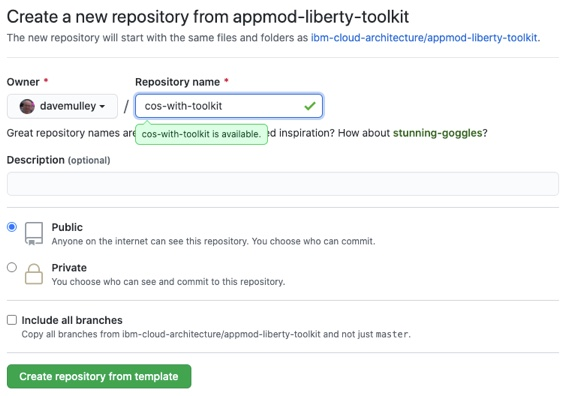

### Clone the application code locally
The newly created repository will be shown in your browser. In order to clone the code locally, use the following steps

- In the browser, click the green **Code** button and use the **copy* icon to copy the `https://github.com/...` URL

- Navigate to a `directory/folder` on your local machine where you want to clone the code

- Enter the following command, pasting the copied URL after the `git clone `:

```
git clone <URL>
```

- Navigate in to the cloned code. The `folder` will have the same name as the `repository`

```
cd <REPO_NAME>
```

  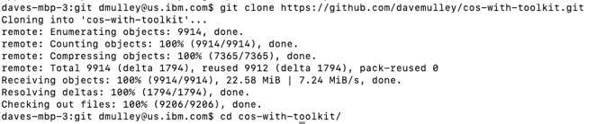

### Configure the application namespace
Create a new OpenShift project for the `dev` namespace using the following steps

- Issue the following command to new OpenShift `project` and configure it with the required `Service Accounts`, `Config Maps` and `Secrets`

```
oc sync cos-with-toolkit-dev --dev
```

- Issue the following command to set the current project to `cos-with-toolkit-dev`

```
oc project cos-with-toolkit-dev
```

### Register the application with the Toolkit pipeline
In order to configure the application to use the pipeline provided by the toolkit, use the following steps

- Issue the following command

```
oc pipeline
```

- When prompted to **Select the type of pipeline that should be run**, select `Tekton`

- When prompted for your **git credentials** use your `username`, `API token` and the `master` branch

- When prompted to **Select the Pipeline to use in the PipelineRun**, select `ibm-appmod-liberty`

- When asked if you would **like to enable the pipeline to scan the image for vulnerabilities**, enter `Y`

  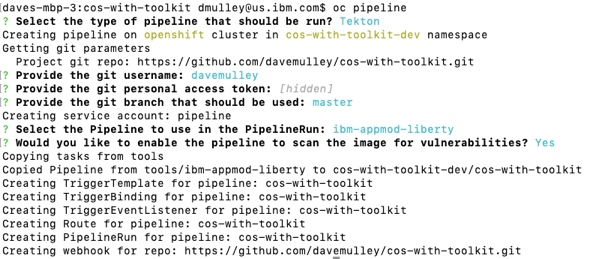

The result will be a specialized `tekton pipeline` for Liberty applications that has been configured with a **WebHook** from your `GitHub repository`.

### Verify that the pipeline failed to complete successfully
An instance of the pipeline was executed at the completion of the pipeline configuration in the previous step. This `pipeline run` failed as the pipeline needs to be configured for the CustomerOrderServices application.

- In the **OpenShift Container Platform UI**, select the `cos-with-toolkit-dev` project and navigate to **Pipelines --> Pipeline Runs**

  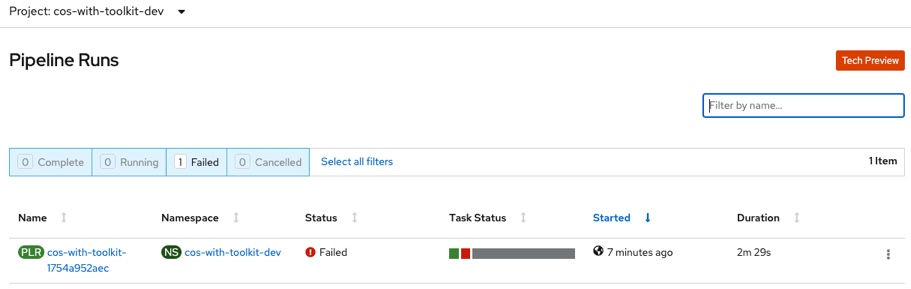

- Click on the **name** of the failed Pipeline Run, select the **Logs** tab and scroll down in the log until you find the `ERROR: Error during SonarScanner execution` line as shown below

  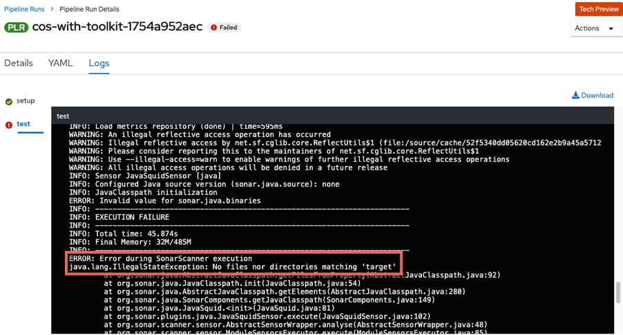

This error occured because the pipeline default is to expect the compiled application to be in the `/target` folder but in the case of CustomerOrderServices, the compiled application code is inthe `/CustomerOrderServicesApp/target` folder. You will fix this in the next step

### Modify the Toolkit pipeline
- In the **OpenShift Container Platform UI**, navigate to **Pipelines --> Pipelines**

- Click on the **name** of the `cos-with-toolkit` Pipeline, select the **YAML** tab and scroll down to the `-name: test` line at approximately line 70 as shown below:

  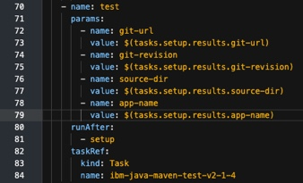

- At the **end** of the **params** section add the two lines below:
```
- name: sonarqube-java-bin-path
  value: CustomerOrderServicesApp/target
```

Ensure that the indentation is as shown below:
  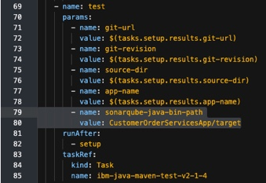

- Click **Save**

### Execute the Toolkit pipeline
- In the **OpenShift Container Platform UI**, navigate to **Pipelines --> Pipelines Runs**


- Use the right-side menu to **re-run** the previous `PipelineRun`
  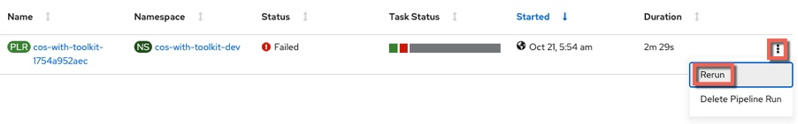


- Click on the newly created `PipelineRun` instance and select the **Logs** tab to follow the progress of the Pipeline. It will take a while to complete.
  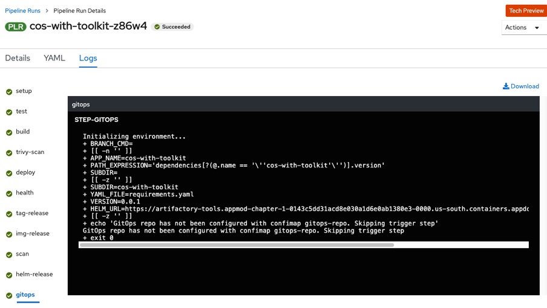


- In the logs view, click on the `trivy-scan` task and review the results of the Vulnerability scan performed by the IBM Vulnerability Advisor. Note that this step would have failed if any issues had been detected
  


- In the view, click on the `health` task and review the results of the health check that was executed against the application before proceeding to the release stage. Note that this step would have failed if the `health` endpoint for the application returned an error
  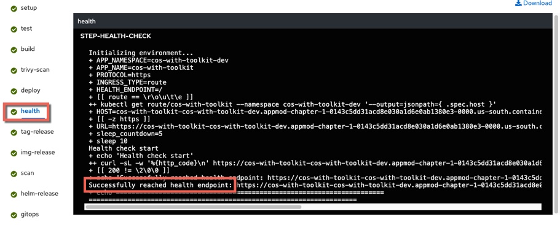


- In the view, click on the `scan` task and review the results of the Vulnerability scan. Note that this step would have failed if any **CRITICAL** vulnerabilities had been detected
  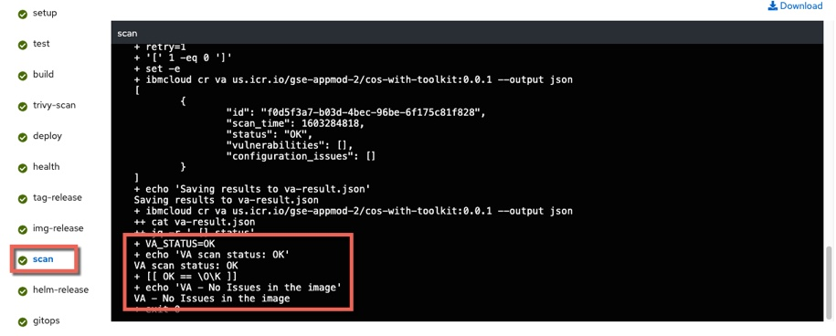

### Review the Sonar Scan for the application
- Use the `Cloud Native Toolkit Dashboard` to find the link to SonarQube in your environment

```
igc dashboard
```
  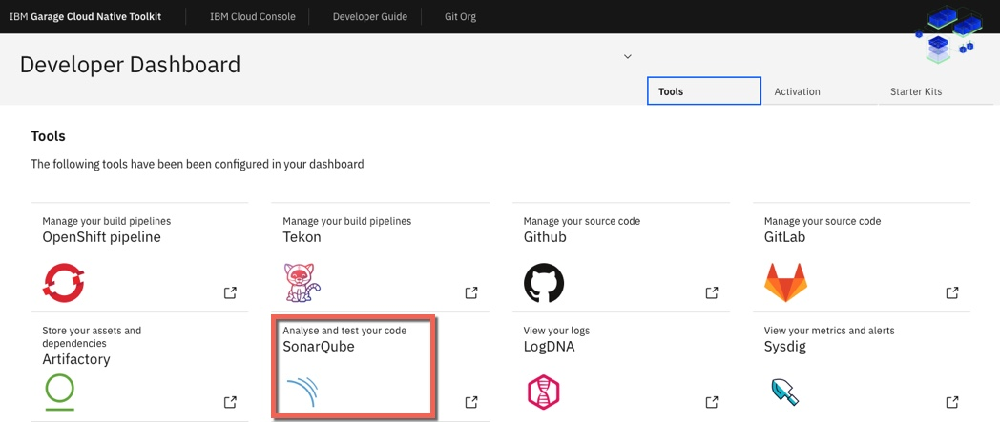


- Once in the SonaQube UI, click **Projects** and review the results for your project
  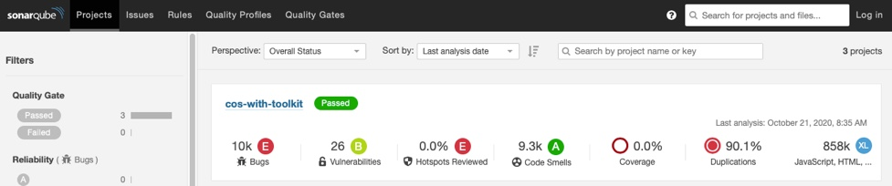

### Validate the application
Now that the pipeline is complete, validate the Customer Order Services application is deployed and running in `cos-with-tekton-dev` project

- In the OpenShift Console, navigate to **Workloads --> Deployments** view and click on the `cos-with-toolkit` Deployment to view deployment details
  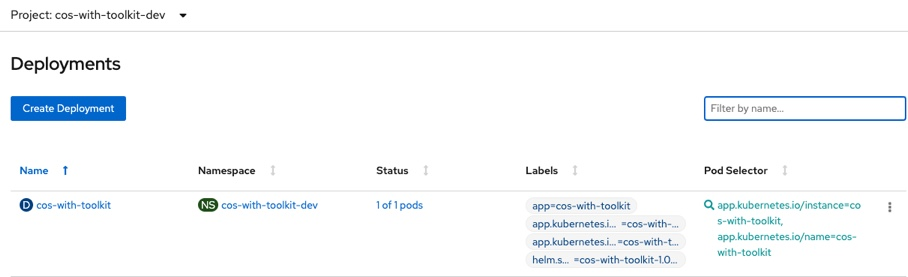


- Next, navigate to the **Networking --> Routes** view and click on the **Location** to open a browser session for the application
  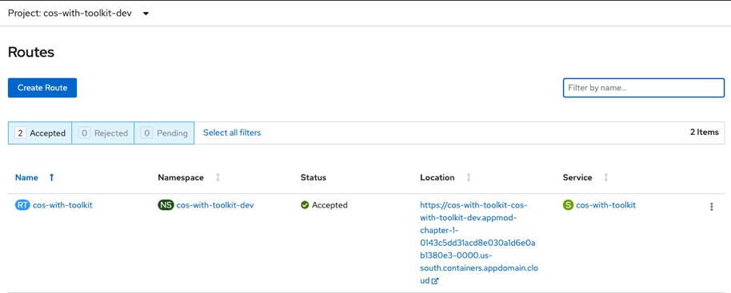


- Add `/CustomerOrderServicesWeb` to the end of the URL in the browser to access the application

  

- Log in to the application with `username: rbarcia` and `password: bl0wfish`

## Review and Next Steps
In this section you configured a CI/CD pipeline for the CustomerOrderServices application that builds, tests, scans and validates the application code and Container Image and results in the application running in a `dev` environment.
