One of the best ways to modernize business applications is to refactor them into microservices, allowing each microservice to be then independently enhanced and scaled, providing agility and improved speed of delivery. 

IBM Mono2Micro is an AI-based semi-automated toolset that uses novel machine learning algorithms and a first-of-its-kind code generation technology to assist you in that refactoring journey to full or partial microservices, all without rewriting the Java application and the business logic within. 

It analyzes the monolith application in both a static and dynamic fashion, and then provides recommendations for how the monolith can be partitioned into groups of classes that can become potential microservices. 
Based on the partitioning, Mono2Micro also generates the microservices foundation code and APIs which alongside the existing monolith Java classes can be used to implement and deploy running microservices.

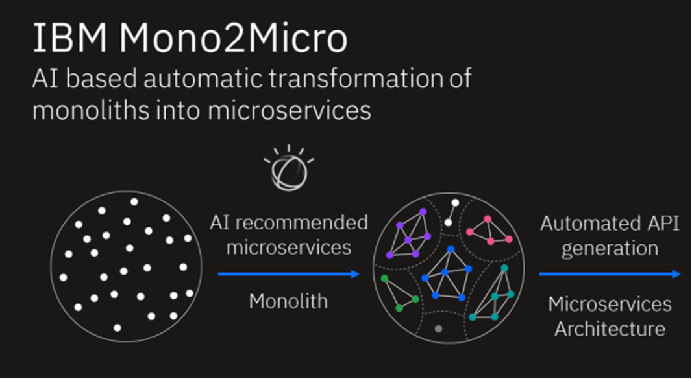

### 1. Business Scenario

Your company has a traditional WebSphere Application Server application called **DefaultApplication**, a monolith web application provides the following servlet functions:

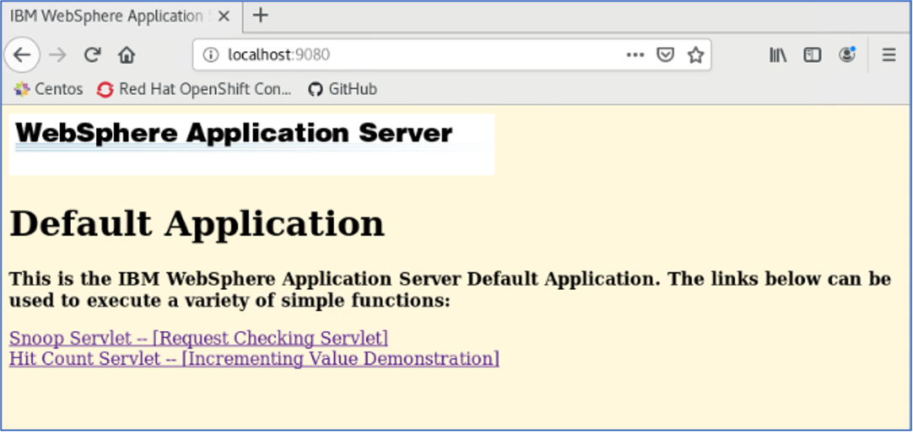

**Snoop servlet**

Use the Snoop servlet to retrieve information about a servlet request. This servlet returns the following information:
  * Servlet initialization parameters
  * Servlet context initialization parameters
  * URL invocation request parameters
  * Preferred client locale
  * Context path
  * User principal
  * Request headers and their values
  * Request parameter names and their values
  * HTTPS protocol information
  * Servlet request attributes and their values
  * HTTP session information
  * Session attributes and their values

The Snoop servlet includes security configuration so that when WebSphere Security is enabled, clients must supply a user ID and password to initiate the servlet.

**HitCount application**

Use the HitCount demonstration application to demonstrate how to increment a counter using a variety of methods, including:
  * A servlet instance variable
  * An HTTP session
  * An enterprise bean

You can instruct the servlet to execute any of these methods within a transaction that you can commit or roll back. If the transaction is committed, the counter is incremented. If the transaction is rolled back, the counter is not incremented.

The enterprise bean method uses a container-managed persistence enterprise bean that persists the counter value to an Apache Derby database. This enterprise bean is configured to use the DefaultApp Datasource, which is set to the DefaultDB database.

When using the enterprise bean method, you can instruct the servlet to look up the enterprise bean, either in the WebSphere global namespace, or in the namespace local to the application.


As a tech leader, you are leading the effort to use IBM Mono2Micro to transform the monolith application to Microservices.

### 2. Getting Started with Mono2Micro

Below is a high-level flow diagram of getting started with Mono2Micro in collecting data on an existing monolith application, and then running the AI analyzer tool to generate two kinds of recommendations as how to partition the application into recommended microservices.

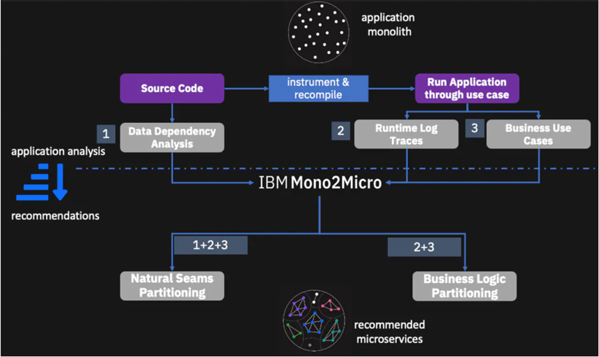

  *	The data is collected from static code analysis, capturing data (Class) dependencies, depicted in [1].
  *	Data is dynamically collected through runtime trace logs as the instrumented monolith application is run through various use case scenarios to exercise as much of the codebase as possible, depicted in [2] & [3].  

Based on all three kinds of data, Mono2Micro generates a Natural Seams Partitioning recommendation that aims to partition and group the monolith classes such that there are minimal class containment dependencies and entanglements (i.e. classes calling methods outside their partitions) between the partitions. 

The **Data Dependency Analysis** in [1] refers to this kind of dependency analysis between the Java classes. In effect, this breaks up the monolith along its natural seams with the least amount of disruption.

Based on [2] and [3] alone, and not taking class containment dependencies and method call entanglements into account, Mono2Micro also generates a Business Logic Partitioning that might present more entanglements and dependencies between partitions, but ultimately provides a more useful partitioning of the monolith divided along functional and business logic capabilities.

#### 2.1 How does Mono2Micro work?

In this lab, you will use a simple JEE monolith application named **DefaultApplication**, and step through the entire Mono2Micro toolset, end to end, starting with the monolith and ending with a deployed and containerized microservices version of the same application. 

Mono2Micro consists of five components, each of them serves a specific purpose. The component and their uses are listed in the following:

**Bluejay** - instruments the Java source code of monoliths. The instrumentation captures entry and exit of every Java method in the application. 

**Flicker** - A Java program that is used while running test cases that gathers runtime analysis data. Flick is used to align the start and end times of a use case with the timestamps generated from the instrumented code. This allows for Mono2Micro to track the code being executed in the monolith to specific use cases.  

**AIPL** - The AI engine of Mono2Micro which uses machine learning and deep learning techniques on the user supplied runtime traces and metadata obtained from Bluejay and Flicker to generate microservice recommendations. AIPL also produces a detailed report for the recommended microservices.

**Mono2Micro UI** - The results obtained from AIPL are stored in user’s local storage. The results can be uploaded to Mono2Micro UI to display them in a graphical visualizer. The UI also allows user to modify the AIPL generated microservice recommendations.

**Cardinal** - The program with deep knowledge of the semantics of the Java programming language. Cardinal uses the recommendations from AIPL. 

Cardinal performs these important capabilities:
  *	Provides detailed invocation analyses of the recommended microservices
  *	Generates a significant portion of the code needed to realize the recommended microservices in containers

#### 2.2 Mono2Micro usage flow

The illustration below shows how the Mono2Micro components fit into the end-to-end process. 

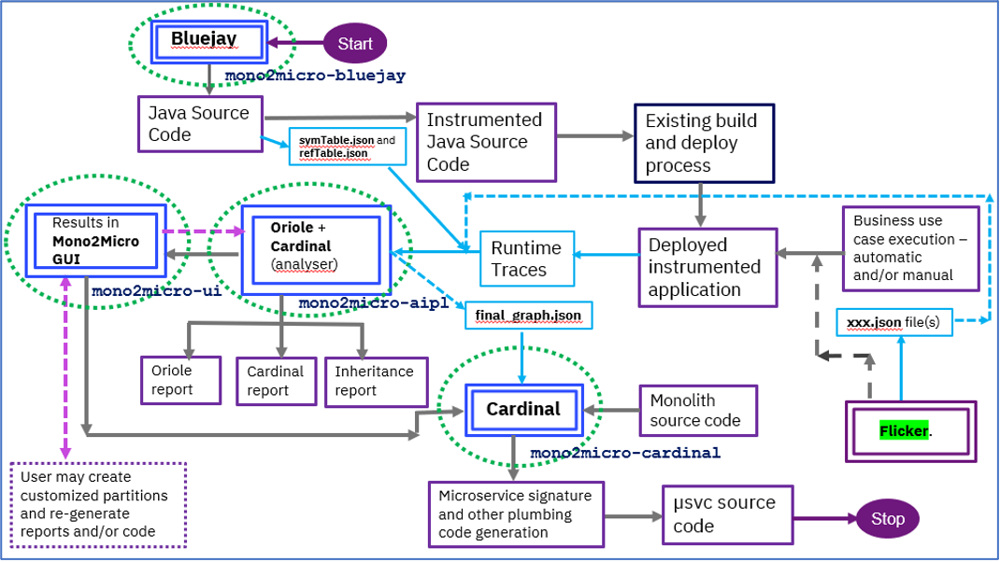

At this point, do not get bogged down with the details in the diagram. You will explore these details as you progress through the lab. 
  *	Use Bluejay to instrument the monolith application
  *	Use Flicker and run test cases to capture runtime execution Trace data in the server logs, based on the instrumented code, updated by Bluejay.  
  *	Use AIPL to analyze the data and produce recommended microservices based on Natural Seams and/or Business logic. 
  *	Use Mono2Micro UI to visualize the microservices recommendations, and tweak the recommendations as needed to meet your objectives.  
  *	Use Cardinal to generate the plumbing and service code needed to realize the recommended microservices. 

### 3. Objective

The objectives of this lab are to help you:
  * Learn how to perform the end-to-end process of using Mono2Micro to analyze a Java EE monolith and to transform it to Microservices
  *	Learn how to build and run the transformed microservices in containers using Docker and OpenLiberty

### 4.	Prerequisites

The following prerequisites must be completed prior to beginning this lab:
  *	3 GB free storage for the Mono2Micro Docker images and containerized microservices
  *	Docker 17.06 CE or higher, which supports multi-stage builds
  *	Git CLI (needed to clone the GitHub repo)
  *	Java 1.8  
  *	Maven 3.6.3
  *	Internet connectivity with access to dockerhub and maven-central
  *	Understanding of command line for your environment 

### 5.	What is Already Completed

One (1) Linux CentOS version 7 VM has been provided for this lab. 

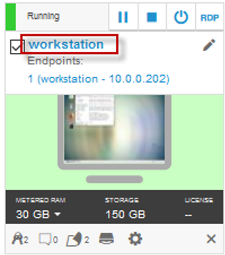

Use the link below to reserve your Lab environment:

https://dte2.us1a.cirrus.ibm.com/my/reservations/create/5fd399855bdac2001e0d42f8

The Workstation VM has the following software installed (you can use your own workstation with the same configurations):
  *	Docker 19.03.13
  *	Git 2.24.1
  *	Maven 3.6.3
  *	Java OpenJDK 1.8.0

The login credentials for the Workstation VM are:

User ID: **ibmadmin**

Password: **passw0rd**          

**Note: You can also use your own workstation as the lab environment with the same configuration listed above. You only need to make three changes highlighted in Appendix C.**
 
### 6.	Lab Tasks
During this lab, you complete the following tasks:
  *	Login to the Workstation VM and Get Started
  * Build and run the Transformed Java Microservices Using Docker
  * Use Mono2Micro to analyze the Java EE monolith application and recommend microservices partitions
  * Generating Initial Microservices Foundation Code

### 7.	Execute Lab Tasks

#### 7.1 Log in to the Workstation VM and get started 

_1.  If the VM is not already started, start it by clicking the Play button.
 
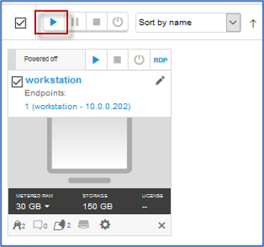

_2.	After the VM is started, click the Workstation VM icon to access it. 
 
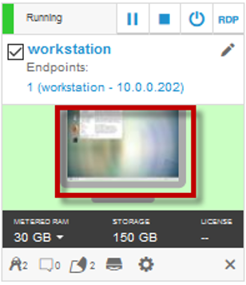

_3.	Enter the password as **passw0rd** and log in.

The Workstation Desktop is displayed. You execute all the lab tasks on this VM.

#### 7.2 Build and run the Transformed Java Microservices Using Docker (Pert 1)

Before you get started using Mono2Micro to transform a monolith application to Microservices, let’s fast forward to the end results and see the transformed microservices in action. 

The resources we provide for this lab includes the **Completed and Transformed** Microservices as a result of using Mono2Mico. 

The goal here is to just let you see the transformed Microservices in a working state before you work through the transformation process yourself. 

**Objectives**
  *	See the transformed monolith application running as independent microservices on OpenLiberty in separate Docker containers, before you use Mono2Micro to transform the monolith in this lab.
  *	Learn how to build and run the transformed microservices with Docker and OpenLiberty

In this part of the lab, you build and deploy the microservices that have already been transformed using Mono2Micro. 

You leverage new and updated build components that have been created in Mono2Micro refactoring phase in order to build and run the microservices as independent OpenLiberty server runtimes in Docker containers. 

The basic steps in this part of the lab include: 
  *	Clone the GitHub repository that contains the resources required for the lab
  *	Use Docker to build the two transformed microservices for the application 
  *	Setup a local Docker Network for the local docker containers to communicate
  * Start the docker containers and run the microservices based application
  *	View the microservices logs to see the communication and data flowing between the services as you test the application from a web browser

The GitHub repository contains all the source code and files needed to perform all the steps for using Mono2micro to transform the monolith application used in this lab to microservices, including:
  * The DefaultApplication Source Code
  *	The newly constructed dockerfiles to build and run the microservices in containers
  *	The updated POM files that have been reduced to contain only the resources needed for the individual microservice
 
Structure of the m2m-ws-sample GitHub repository is as follows (details in the README within the GitHub repo):
  * Monolith source code: ./defaultapplication/monolith
  * Monolith application data: ./defaultapplication/application-data/
  * Mono2Micro analysis (initial recommendations): ./defaultapplication/mono2micro-analysis
  * Mono2Micro analysis (further customized): ./defaultapplication/mono2micro-analysis-custom
  * Deployable Microservices: ./defaultapplication/microservices

_1.	Clone the GitHub repository by openning a Terminal window and running the following commands:

```
cd /home/ibmadmin

git clone https://github.com/kpostreich/m2m-ws-sample

```

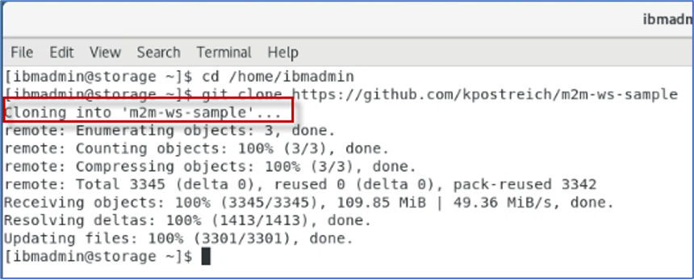

_2.	Change to the directory that contains the artifacts needed to build and run the generated microservices in local Docker containers. The artifacts needed to build and run the two microservices, generated by Mono2Micro, are in the /home/ibmadmn/m2m-ws-sample/defaultapplication/microservices/ folder.

```
cd /home/ibmadmin/m2m-ws-sample/defaultapplication/microservices/
```

_3. Build the resulting microservices in Docker containers

Let’s do a basic overview of the two microservices that form the DefaultApplication used in this lab.

First, notice that there are two services. Mono2Micro places these services into logical partitions. The **web** partition is the UI front-end microservice. It includes the HTML, JSPs, and Servlets, all needed to run within the same Web Container, according to JEE specifications. The **partition0** partition is the backend service for the IncrementAction service. It contains an EJB and JPA component that is responsible for persisting the data to the embedded Derby database used by the microservice. 
 
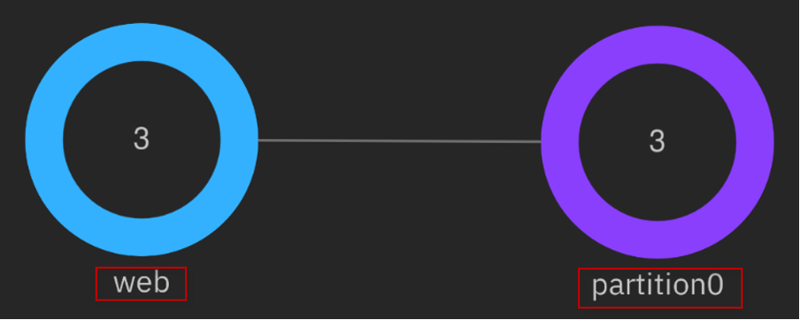

Web partition (front-end microservice) invokes partition0 (back-end), when the HitCount Service via EJB is executed by the user. 

What happens is the HitCount Servlet in the **Web partition** invokes a Rest Service interface in **partition0** through a local HitCount proxy, both generated by Mono2Micro as plumbing code for invoking the RESTful Microservices. 

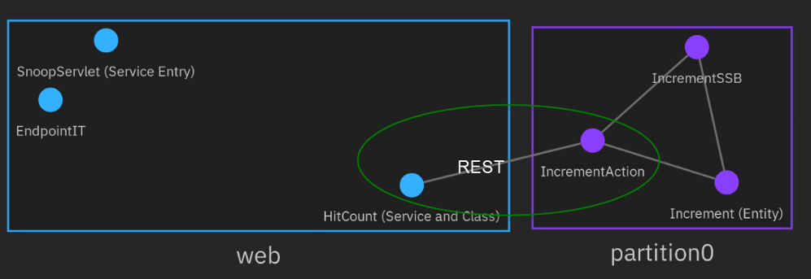

a.	Create a Docker Network for the two containers to communicate.   
    
You will use Docker to build and run the microservices based application. For the Docker containers to communicate, a local Docker network is required. 

Tip: Later, when you launch the Docker containers, you will specify the network for the containers to join, as command line options. 

```
docker network create defaultappNetwork

docker network list
```

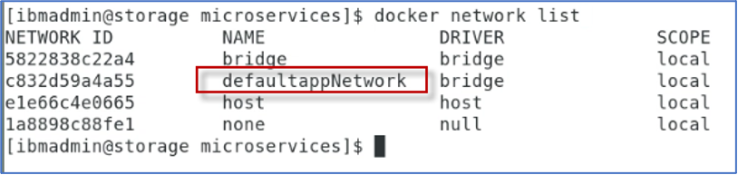

Note: When using a Kubernetes based platform like RedHat OpenShift, the service to service communication is automatically handled by the underlying Kubernetes platform. 
 
b.	Build the defaultapplication-web (front-end) container.
    
This container is the web front end service. It contains the html, jsp, and servlets. 
    
The defaultapp-web folder contains the Dockerfile used to build the front-end microservice. 
  
```
cd /home/ibmadmin/m2m-ws-sample/defaultapplication/microservices/defaultapp-web

docker build -t defaultapp-web  . | tee web.out
```

The dockerfile performs these basic tasks:
  *	Uses the projects pom.xml file to do a Maven build, which produces the deployable EAR. 
  *	Copies the EAR file and OpenLiberty Server configuration file to the appropriate location in the Docker container for the microservice to start once the container is started.

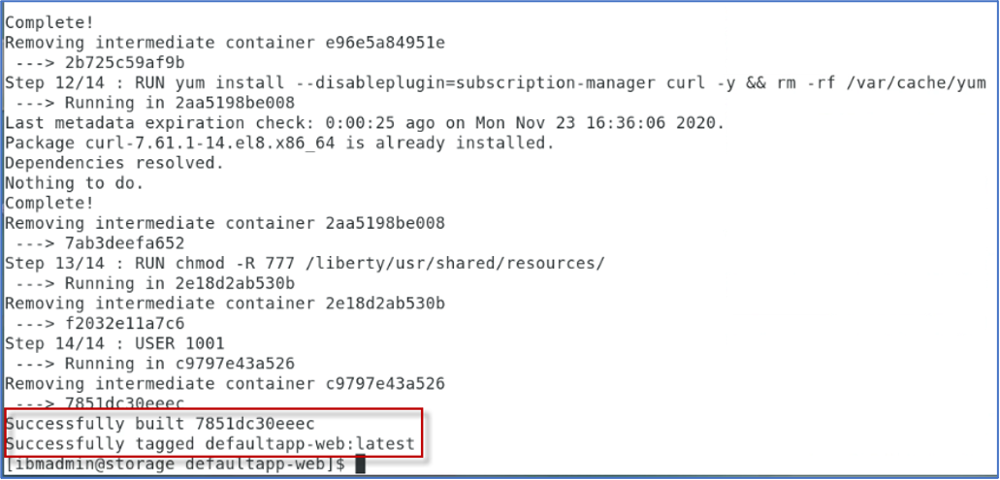

c.	Start the partition-web (front-end) docker container.

Notice the command line options that are required for the microservice to run properly. 
  *	The partition-web container needs to expose port 9095 for the application to be invoked from a web browser. The OpenLiberty sever is configured to use HTTP port 9080 internally. 
  *	The container must be included in the defaultappNetwork that you defined earlier. The back-end microservice will also join this network allowing the services to communicate with one another. 

```
docker run --name=defaultapp-web --hostname=defaultapp-web --network=defaultappNetwork -d -p 9095:9080 defaultapp-web:latest

docker ps
```
  
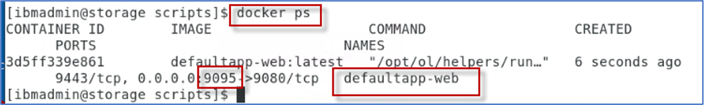

Note: The application is exposed on port 9095 and running on port 9080 in the container.
 
d.	Build the defaultapplication-partition0 (back-end) container.

This container is the back-end service. It contains EJB and JPA components that persists data to the Derby database, when the user executes the HitCount service with the EJB option. 

Tip: Ensure you are in the /home/ibmadmin/m2m-ws-sample/defaultapplication/microservices/defaultapp-partition0 folder before running the docker build. 

The default-partition0 folder contains the dockerfile used to build the back-end microservice. 

```
cd /home/ibmadmin/m2m-ws-sample/defaultapplication/microservices/defaultapp-partition0

docker build -t defaultapp-partition0 . | tee partition0.out
```

The dockerfile performs these basic tasks:
  *	Uses the projects pom.xml file to do a Maven build, which produces the deployable EAR. 
  *	Copies the EAR file and OpenLiberty Server configuration file to the appropriate location in the Docker container for the microservice to start once the container is started.
  *	Copies the Derby Database library and database files to the container

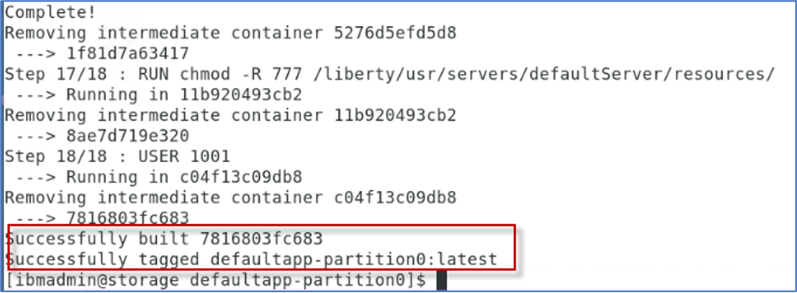

e.	Start the partition-partition0 (back-end) docker container.

Notice the command line options that are required for the microservice to run properly. 
  *	The partition-partition0 container exposes port 9096.This is only necessary if we want to hit the Service interface directly while testing.
  *	The container must be included in the defaultappNetwork that you defined earlier. 

```
docker run --name=defaultapp-partition0 --hostname=defaultapp-partition0 --network=defaultappNetwork -d -p 9096:9080 defaultapp-partition0:latest

docker ps
```


 
Note: The application is exposed on port 9096 and running on port 9080 in the container

f.	Inspect Docker’s defaultappNetwork and ensure both microservices are joined in the network

```
docker inspect defaultappNetwork
```

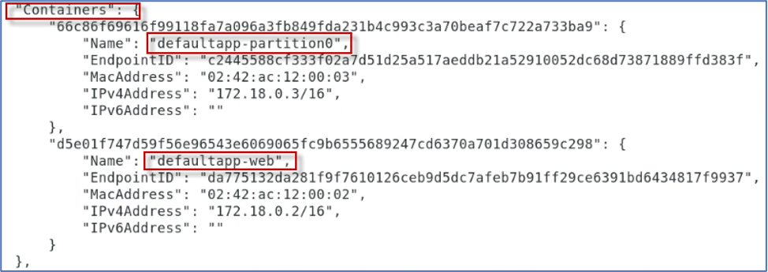

The microservices are now running on separate OpenLiberty servers in the local Docker environment. 

In the next section, you will test the microservices application from a web browser.

_4.   View the OpenLiberty Server logs for the microservices

At this point, the microservices should be up and running inside of their respective docker containers. 

First, you look at the OpenLiberty server logs for both microservices to ensure the server and application started successfully. 

a. View the server log in the partition-web (front-end) docker container by running the following command to view the OpenLiberty Server log in the defaultapp-web container

```
docker logs defaultapp-web
```

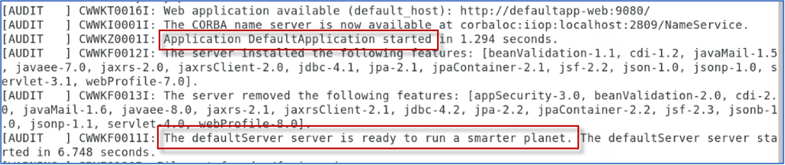

You should see messages indicating the DefaultApplication and the defaultServer have been successfully started and is running.
	 
b. View the server log in the partition-partition0 (back-end) docker container by running the following command to view the OpenLiberty Server log in the defualtapp-web container

```
docker logs defaultapp-partition0
```

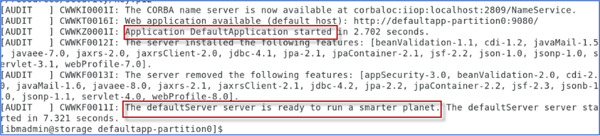
    
You should see messages indicating the DefaultApplication and the defaultServer have been successfully started and is running.

_5. Test the microservices from your local Docker environment

Once all the containers have started successfully, the DefaultApplication can be opened at http://localhost:9095/

In this section, you run the microservices based application, using the variety of options in the application user interface. 

a.	Launch a web browser and go to http://localhost:9095/
 
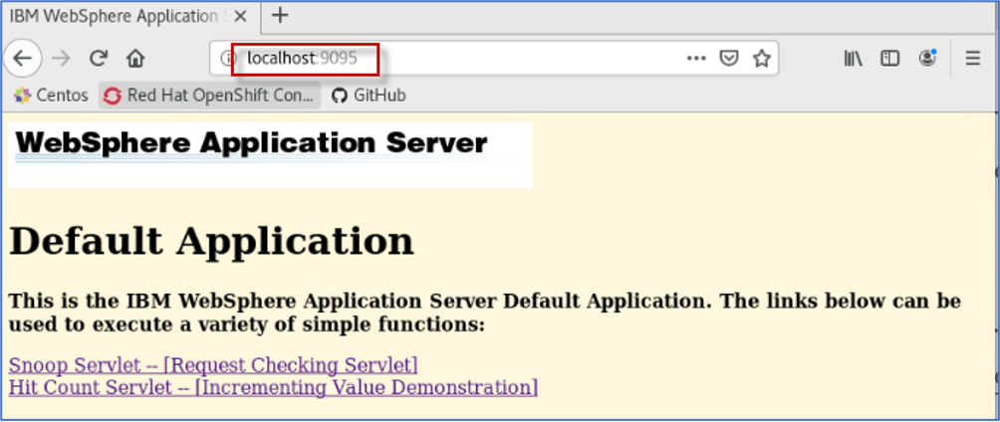
  
b.	Click the **Snoop Servlet** link to invoke it, which is running in the defaultapp-web (front-end) Microservice
  
The Snoop Servlet requires authentication, as defined in the OpenLiberty server configuration. The credentials to access the Snoop servlet is: 
    
Username: **user1**
    
Password: **change1me**

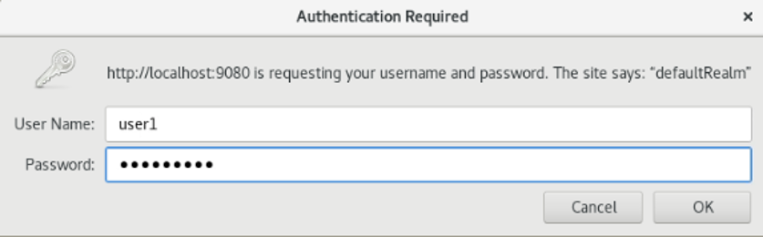

  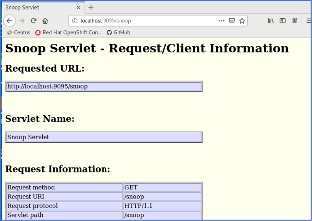

c.	Click the Browser back button to return to the **DefaultApplication** main page.
 
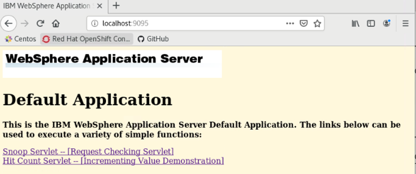
    
Next, you run the HitCount service. The HitCount service can be run using a variety of options that illustrate different mechanisms of handling application state in JEE applications. 

You learn a little about the application that pertains to run the microservice based application that now makes distributed REST API calls between services.   
    
When using Mono2Micro for application analysis and microservice recommendations, we chose to separate the WEB UI components into a microservice and place the EJB components that interact with the back-end database into its own microservice. 

This approach provides separation of the front-end from the back-end as a first pass for adopting a microservices architecture for the DefaultApplication. 

This was not the only option, and we understand that further refactoring might be necessary. But this is a good first step to illustrate the capabilities of Mono2Micro.

Here is a brief introduction to the multiple methods of running the HitCount Service. As illustrated below, selecting any of these three (3) options from the application UI, the HitCount service runs using the local Web Container session / state and runs the defaultapp-web (front-end) microservice. 
  * Servlet instance variable
  * Session state (create if necessary)
  * Existing session state only

Selecting the Enterprise Java Bean (JPA) option from the application, the Web front-end microservice calls out to the back-end microservice. 
  * Enterprise Java Bean (JPA)

It calls the IncrementAction REST service in the defaultapp-container0 container. The REST endpoint invokes an EJB which uses JPA to persist to the Derby database. Using this option also requires a selection for Transaction Type. 
    
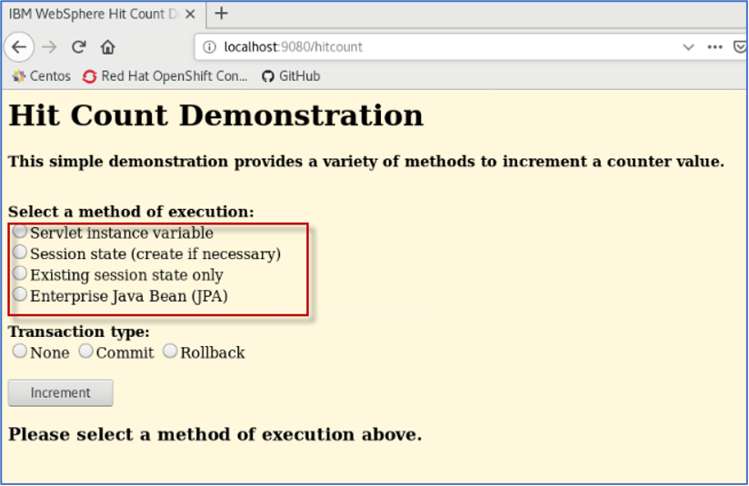
  
d.	Run the HitCount service, choosing each of the three options below:

  * Servlet instance variable
  * Session state (create if necessary)
  * Existing session state only

You should see a message in the HTML page indicating the Hit Count value: An ERROR message is displayed in the event of an error. 
 
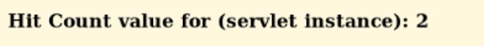

TIP: The logging level in the Mono2Micro generated code has been set to **INFO** in the source code. 

This means that logging statements will be generated in the server log file for all inter-partition calls. 

In the defaultapp-web partition, the logs will show calling the IncrementAction Rest service running in defaultapp-partition0 (back-end) service  

In the defaultapp-partition0 (back-end) partition, the logs will show the response being sent back to the caller. 

Since using any of these options above run ONLY in the defaultapp-web (front-end) container, you will not see anything of significance logged in the server log files. This is expected behavior. 
  
e. Run the HitCount service, choosing the Enterprise Java Bean (JPA) option.
  
f.	Invoke the HitCount service multiple times, selecting different options for **Transaction Type**。

_6.	View the server logs from both microservices.
  
In this case, the front-end microservice does call the back-end microservice, and you will see relevant messages in their corresponding log files. 

```
docker logs defaultapp-web

docker logs defaultapp-partition0
``` 

Output from defaultapp-web container 
 
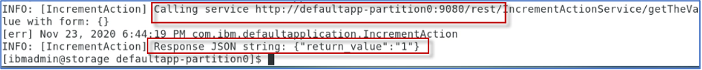

Output from defaultapp-partition0 container
 


_7.	Close the Web Browser window

You have successfully built run the DefaultApplication that was transformed using the IBM Mono2Micro. 

The converted application has also been deployed locally in Docker containers running OpenLiberty Server, which is ideally suited for Java based microservices and cloud deployments. 

Now that you have seen the transformed application in action, it is time to use Mono2Micro and perform the steps that produced the transformed microservices. 

#### 7.3 Use Mono2Micro to analyze the Java EE monolith application and recommend microservices partitions (Part 2)

Objectives
  *	Learn how to use the AI-driven Mono2Micro tools to analyze a Java EE monolith and to recommend the different ways it can be partitioned into microservices
  *	Learn how to use Mono2Micro tools to further customize the partitioning recommendations 

In this part of the lab, you first pull the Mono2Micro tools from Dockerhub, then you :
  *	Run Mono2Micro’s Bluejay tool to analyze the Java source code, instrument it, and produce the analysis files that will be used as input to the Mono2Micro’s AI engine. 
  *	Use Mono2Micro’s Flicker tool to gather time stamps and use case data as you run test cases against the instrumented version of the monolith application. 
  *	Use Mono2Micro’s Oriole analyzer tool (AIPL) to produce the initial microservices recommendations. 
  *	Use Mono2Micro’s UI tool to visualize the microservice recommendations and modify the initial recommendations to further customize the microservice recommendations.

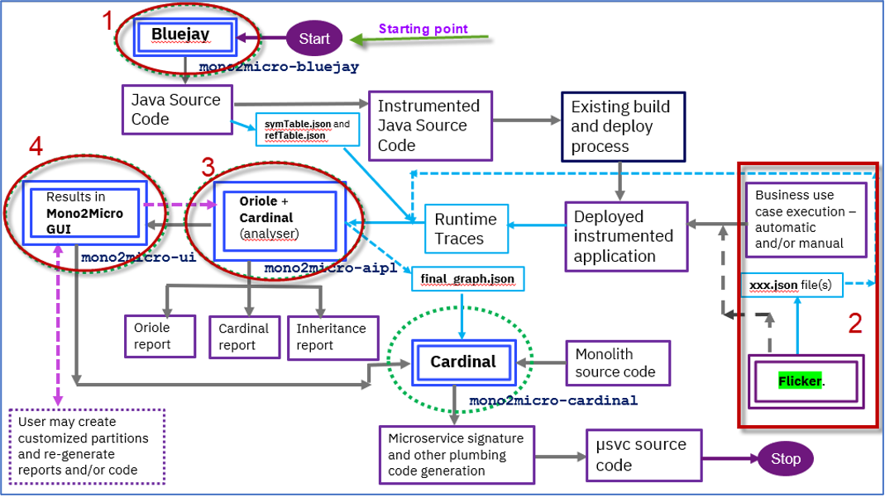

_1. Pull the Mono2Micro Images from Dockerhub

All the four Mono2Micro container images are available from Dockerhub
  * https://hub.docker.com/r/ibmcom/mono2micro-bluejay
  * https://hub.docker.com/r/ibmcom/mono2micro-aipl
  * https://hub.docker.com/r/ibmcom/mono2micro-ui 
  * https://hub.docker.com/r/ibmcom/mono2micro-cardinal

a. Download all the Mono2Micro images by issuing the docker pull commands: 

```
docker pull ibmcom/mono2micro-bluejay

docker pull ibmcom/mono2micro-aipl

docker pull ibmcom/mono2micro-ui

docker pull ibmcom/mono2micro-cardinal
```

b.	List the docker images. You should see the four images listed

```
docker images | grep ibmcom
```

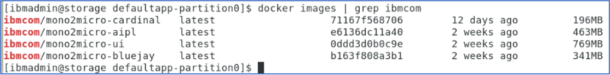

_2. Use Flicker and Mono2Micro Bluejay

For this lab, we have provided the Flicker java program and its required open-source jars in the GitHub repository, that you cloned earlier in the lab. You use Flicker later in the lab, when you run the test case for the application. 

Prerequisites for using Flicker: 
  * Flicker requires Java 1.8 or higher for execution.
  * Flicker also requires two open source jars, and are included in the GitHub repository for this lab: 
  *	commons-net-3.6.jar
  *	json-simple-1.1.jar 

The first step in using Mono2Micro is to prepare the monolith’s Java source code for static and dynamic analysis. Mono2Micro Bluejay tool is used to analyze the application source code, instrument it, and produce the analysis in two .json files.

For the **DefaultApplication** used in this lab, the complete set of source code for the monolith application is already available in a single directory structure cloned from GitHub. 

For this lab, the monolith source files tree can then be found in **/home/ibmadmin/m2m-ws-sample/defaultapplication/monolith**  directory. 

Let’s begin with the static data collection phase by running Mono2Micro’s Bluejay tool to analyze the Java source code, instrument it, and produce the analysis in two .json files. 

a. Run the Bluejay analysis using the following commands:

```
cd /home/ibmadmin/m2m-ws-sample

docker run --rm -it -v /home/ibmadmin/m2m-ws-sample/:/var/application ibmcom/mono2micro-bluejay /var/application/defaultapplication/monolith out
```
    
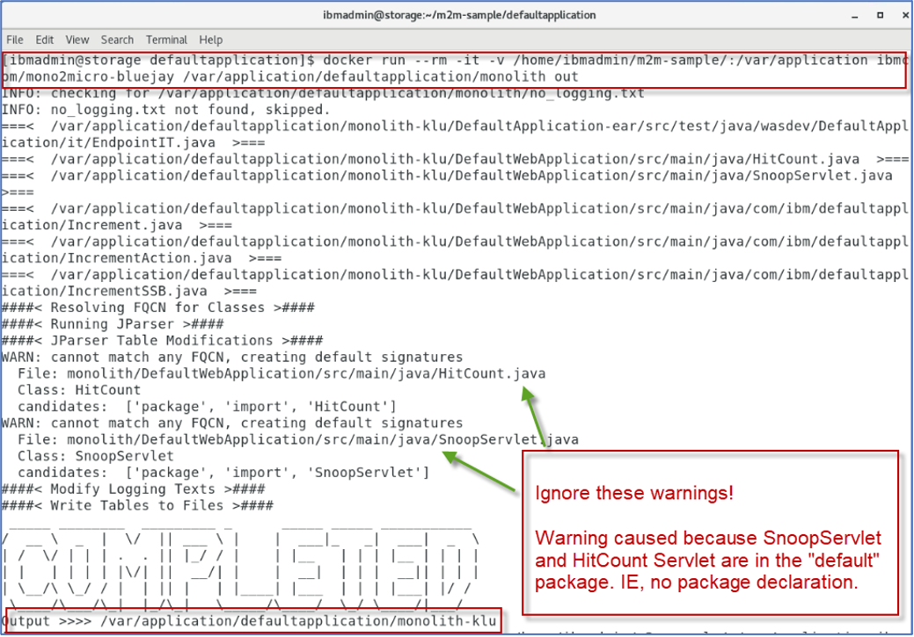
    
Note: The command displays the directory where the output files were generated, as illustrated below.

In this example: /home/ibmadmin/m2m-ws-sample/defaultapplication/monolith-klu

b.	Review the output from Bluejay: 

```
cd /home/ibmadmin/m2m-ws-sample/defaultapplication/monolith-klu

ls -al
```

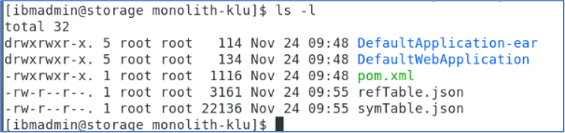

Bluejay creates a mirror copy of the input source directory in its parent directory with a **-klu** extension where all the Java files within the entire directory tree will be instrumented to log entry and exit times in each method.  

In addition to instrumenting the source, Bluejay creates two .json files in the in the monolith-klu directory: 
  *	refTable.json
  *	symTable.json

These json file capture various details and metadata about each Java class such as:   
  *	method signatures
  *	class variables and types
  *	class containment dependencies (when one classes uses another class as a instance variable type, or method return/argument type)
  *	class inheritance
  *	package dependencies
  *	source file locations
  *	etc. 

This static analysis therefore gathers a detailed overview of the Java code in the monolith, for use by Mono2Micro’s AI analyzer tool to come up with recommendations on how to partition the monolith application. 

Furthermore, this information is also used by Mono2Micro’s code generation tool to generate the foundation and plumbing code for implementing each partition as microservices.

c.	Look at an example of the instrumentation in the monolith code.  

```
cd /home/ibmadmin/m2m-ws-sample/defaultapplication/monolith-klu/DefaultWebApplication/src/main/java

gedit /home/ibmadmin/m2m-ws-sample/defaultapplication/monolith-klu/DefaultWebApplication/src/main/java/HitCount.java
```

As illustrated below, you will find **System.out.println…** statements for the entry and exit of each method in the classes. 

This trace data captures the Thread ID and Timestamp during the test case execution flow, which you will perform later in the lab. 

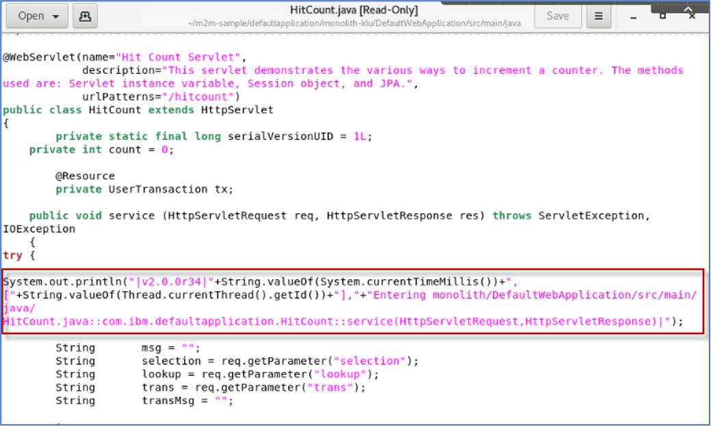

d.	Close the gedit editor window

e.	Change the permissions on monolith-klu directory, so that it can be updated by the current user.  

Bluejay runs in a Docker container. By default, Docker runs as **root** user, and therefore all the files in the instrumented monolith directory are owned by root. 

```
cd /home/ibmadmin/m2m-ws-sample/defaultapplication

sudo chmod -R 777 ./monolith-klu
```
    
When prompted for a password, enter: **passw0rd**   (That is a numeric zero in passw0rd)
  
The next step is to run test cases against the instrumented monolith application to capture runtime data for analysis. 

_3. Run test cases using the instrumented monolith for Runtime data analysis

Now you are ready to proceed to the next phase of data collection from the monolith application. This is a crucial phase where both the quantity and quality of the data gathered will impact the quality and usefulness of the partitioning recommendations from Mono2Micro’s AI analyzer tool. 

The key concept here is to run as much user scenarios as possible in the running instrumented monolith application, exercising as much of the codebase as possible.  

These user scenarios (or business use cases if you will), should be typical user threads through the application, related to various functionality that the application provides. More akin to functional verification testcases or larger green thread testcases, and less so unit testcases.

In the DefaultApplication’s case, these scenarios are very simple, which is partially why we selected this application for the lab. For real applications, your test cases could be quite extensive in order to achieve maximum code coverage in the tests.  

Test cases for DefaultApplication:
  *	Run the Snoop action
  *	Run the HitCount action

_4. Deploy the instrumented application to Liberty for testing

The test cases (use cases) that you will run must be executed on the instrumented code base, which is in the **monolith-klu** directory. 

As such, the instrumented code needs to be compiled, new deployment binaries generated, and redeployed to the local Liberty server that you will use to run the test cases. 

The DefaultApplication is a Maven based project. The instrumented application can easily be rebuilt using Maven CLI. Maven version 3.6.3 has been verified to work in this lab. 

a.	Build and package the instrumented version of the DefaultApplication  

The top-level pom.xml that is used to build and package the application is in the **monolith-klu** folder. You will change to that directory and run the Maven build. 

```
cd /home/ibmadmin/m2m-ws-sample/defaultapplication/monolith-klu

mvn clean install
```

Maven should have successfully built the application and generated the binary artifacts (EAR, WAR), and placed them in the Liberty Server **apps** folder.  Now the application is ready to run test cases.   

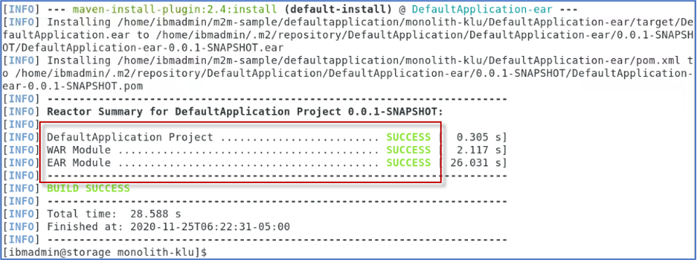
  
b.	Run the scripts below to Start the Liberty server and check that the server is in the running state

As a convenience, we have provided simple scripts for you to use to start and stop the Liberty server, as well as check the status of the server. 

```
/home/ibmadmin/m2m-ws-sample/defaultapplication/scripts/startServer.sh

/home/ibmadmin/m2m-ws-sample/defaultapplication/scripts/serverStatus.sh
```
    
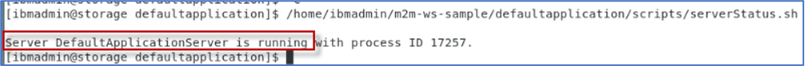
    
Tip: The Liberty server is in the folder: **/home/ibmadmin/m2m-ws-sample/defaultapplication/monolith-klu/DefaultApplication-ear/target/liberty/wlp/usr/servers/DefaultApplicationServer**.

c.	Open a Web Browser and launch the **DefaultApplication** URL: http://localhost:9080
  
The main HTML page will be displayed. 

Notice the application only has two main features: 
  * Snoop
  *	Hit Count
  
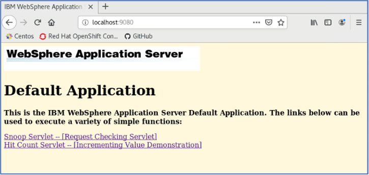

_5. Run the test cases for the DefaultApplication

Since this is a simple application, you will run the test cases manually using the applications web UI. There are only two use cases for this simple application.: Snoop and Hit Count. 

As these use cases are run on the instrumented monolith application, you will use Mono2Micro’s Flicker tool to record use case labels and the start and stop times of when that use case or scenario was run.  

The Flicker tool essentially acts like a stopwatch to record use cases. 

The labels provided to Flicker for each use case should be meaningful as this will come into play later when viewing Mono2Micro’s AI analysis where the classes and flow within the code is associated with the use case labels. 

Flicker is a simple Java based tool that prompts the user for the use case label, and then records the start time. Then prompts again for the **stop** command after the user finishes running that scenario on the monolith.
  
_5.1.	First, start the Flicker tool, using the command below in a new Terminal window:

```
cd /home/ibmadmin/m2m-ws-sample/Flicker

java -cp commons-net-3.6.jar:json-simple-1.1.jar:. Flicker -no_ntp
```

Notice that Flicker is just waiting for you to provide a **Label** or name of the test case to run. You will do that in the next step.  

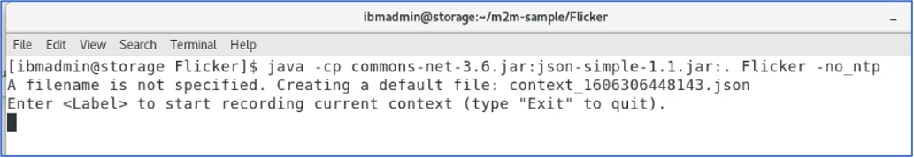
  
_5.2.	Run the **Snoop** test case. Follow the steps below to run the Snoop test case.

a. In the web browser, go to http://localhost:9080/

b.	From Flicker, provide the label named **snoop** and press **ENTER**. This starts Flicker’s stopwatch for the snoop test case. 
 
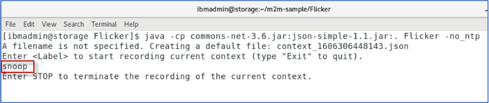

c.	From the Web Browser, click on the **Snoop Servlet** link in the DefaultApplication HTML page. Snoop requires basic authentication. If prompted for credentials, enter the following username and password:

Username: **user1**

Password: **change1me**   (that is the number 1 in the password).  
 
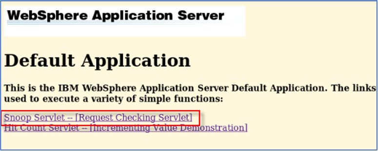

d.	Run snoop multiple times: Just click the Browsers **Reload Page** button. 
e.	When finished, click on the Browsers **Back** button   to return to the applications main HTML page. 
f.	In Flicker, enter **STOP**, to stop Flickers stopwatch for the test case

Note: **STOP** must be in upper-case and is Case Sensitive. 
  
Notice Flicker has recorded the START and STOP times for the **snoop** test case. These timestamps correspond with the timestamps in the Liberty log file, from the instrumented version of the DefaultApplication running in Liberty. 
  
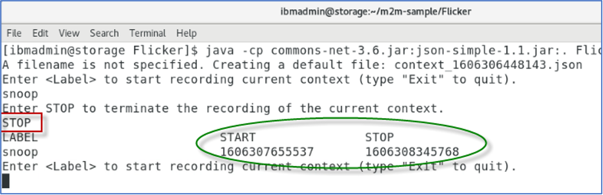
  
_5.3.	Run the Hit Count test case. Running the Hit Count test case requires the same basic step as Snoop, but has a few more options to test in the application: 
  
a.	In Flicker, provide the label named **hitcount** which will start Flicker’s stopwatch for the snoop test case. 
 
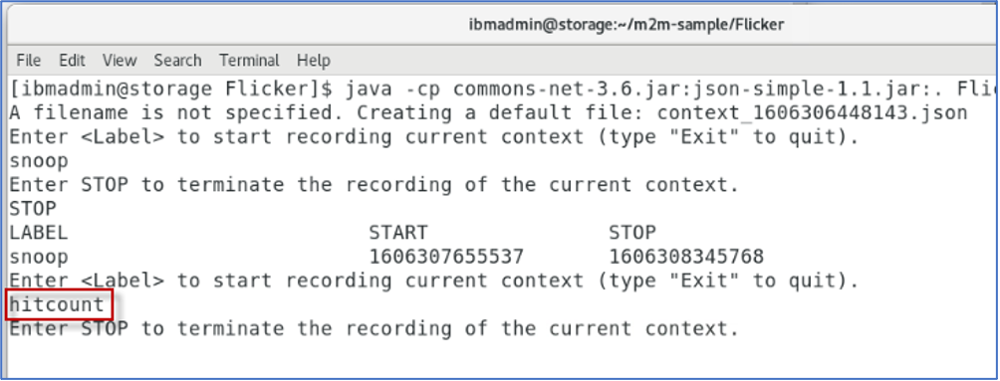
  
b.	From the Web Browser, click on the Hit Count link in the DefaultApplication HTML page. 

Hit count displays a JSP page with several options that demonstrate a variety of methods to increment a counter, while maintaining state.  

c.	Run hitcount, choosing each of the following options from the application in the web browser: 
		  
  * Servlet instance variable
  * Session state (create if necessary)
  * Existing session state only

d.	Run hitcount, choosing the following option from the application in the web browser: ** Enterprise Java Bean (JPA)**.

When choosing the EJB option, you also must select one of the following Transaction Types, radio buttons:
  * None
  * Commit
  * Rollback
 
This action invokes an EJB and uses JPA to persist the increment state to a Derby database. 

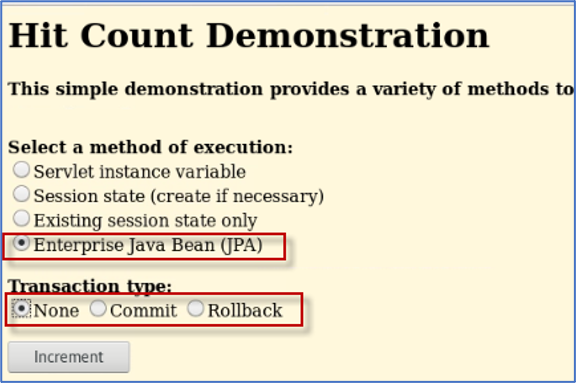
    
e.	You can run HitCount multiple times, choosing different **Transaction Type** options. 
      
f.	In Flicker, enter **STOP**, to stop Flickers stopwatch for the test case

Note: **STOP** must be in upper-case and is Case Sensitive. 

Flicker has now captured the START and STOP timestamps for the use cases, which corresponds to the timestamps recorded in the Liberty log file from the instrumented version of the DefaultApplication.
  
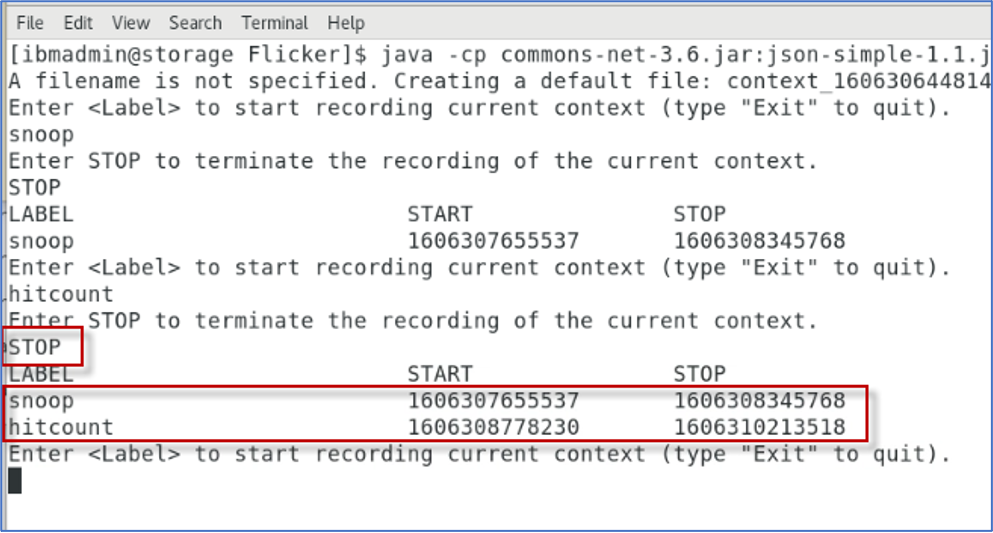
    
g.	In Flicker, enter **Exit**, to quit Flicker    (Case sensitive, Capital E)

_5.4.	Run the script below to Stop the Liberty server. As a convenience, we have provided simple scripts for you to use to start and stop the Liberty server, as well as check the status of the server. 

```
/home/ibmadmin/m2m-ws-sample/defaultapplication/scripts/stopServer.sh
````

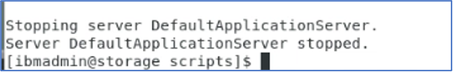

_6. Review the output from Flicker and the Liberty Log file based on the test cases

After exiting the Flicker tool, it produces a context json file that captures the use case labels and their start/stop times. The context json files are generated in the same directory where Flicker ran. 

This context json file will be used as input to the AI engine in Mono2Micro for shaping the recommendations for microservices partitioning. 

_6.1 Review the output from Flicker and Liberty log file based on the test cases you executed

Take a quick look at the context file that Flicker generated for the snoop and hit count test cases

a.	View the context json file. 

The name of the context json file contains timestamp in its name. So view the files in the Flicker directory, and then view the **context*.json** file. 

```
cd /home/ibmadmin/m2m-ws-sample/Flicker

ls *.json

cat context*.json
```

Notice the two test cases were recorded, along with the start and stop timestamps for each testcase. 

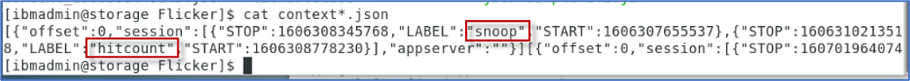

b.	View the Liberty log file to ensure the log contains the trace statements from the instrumented version of the application.  

```
cat /home/ibmadmin/m2m-ws-sample/defaultapplication/monolith-klu/DefaultApplication-ear/target/liberty/wlp/usr/servers/DefaultApplicationServer/logs/messages.log
```

As illustrated in the screenshot below, the Liberty server log file (messages.log) will include trace data that captures the entry and exit of each Java method called, along with the timestamp of the invocation. 
    
If the log file does NOT contain trace statements for Snoop and Hit count as illustrated below, it is likely that the instrumented version of the application was not deployed to the Liberty server. 

Do not worry, we have captured a known good log file and Flicker context json file that can be used to continue the lab, without having to go back and redo previous steps.  

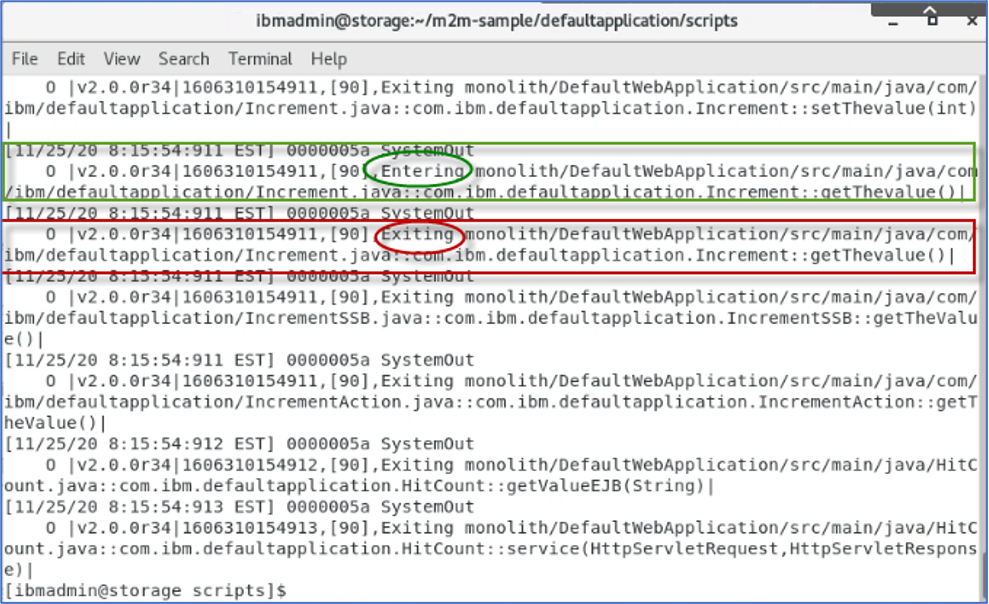
    
Tip: It is critical that the server log files DO NOT get overwritten during the execution of the test cases. 

System Administrators configure limits for how much data is logged and kept. 
    
They do this by configuring a MAX size for the log files, and the MAX number of log files to keep. If or when these maximum thresholds are reached, Liberty will write over the messages.log file, resulting in the timestamps from our test cases to be out of whack. 
    
Therefore, it is critical to ensure proper sizing of these logging thresholds to ensure log files are not overwritten when running the test cases.  

Since the tests in this lab are short and simple, there will not be an issue. But something to look out for when running larger test suites. 

_7. Recap of the data has been collected for the monolith 

Let’s review the data that has been collected on the monolith:
  *	Bluejay generated two table json files containing specific information about the java classes and their relationships via static analysis of the code: 
  *	refTable.json
    *	symTable.json
    *	Flicker generated one or more context json files that contains use case names/labels and their start and stop times
    *	All the standard console output/error log files captured on the application server side as the use cases were being run on the instrumented application 

With these three sets of data, Mono2Micro can now correlate what exact Java classes and methods were executed during the start and stop times of each use case, and thereby associate the observed flow of code within the application to a use case. 

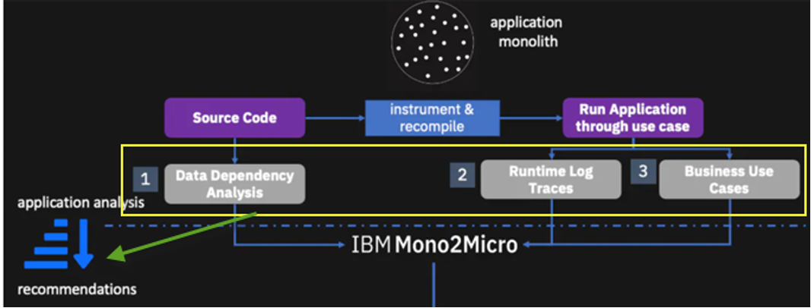
  
Let’s proceed to the next phase of using Mono2Micro, which is to run the AI analyzer tool against this data.

_8. Running Mono2Micro’s AI Analyzer for Application Partitioning Recommendations

Mono2Micro’s AIPL tool is the analyzer that uses unsupervised machine learning AI techniques to analyze the three sets of data collected on a monolith applicated as done in the previous section.  

Once you have completed the executing all the test scenarios, you should have the following categories of data collected:
  * symTable.json
  * refTable.json
  * one or more json files generated by Flicker, and
  * one or more log files containing the runtime traces

Prepare the input directories for running the AIPL tool 

To prepare for the analysis, the input directories and an optional config.ini file need to be gathered and placed (copied) into a common folder structure before running the AIPL tool.  

For this lab, the input directories have been placed into the following directory structure for you. 

The /home/ibmadmin/m2m-ws-sample/defaultapplication/application-data/ directory contains the subdirectories within which the data files are placed:
  
**contexts/** - One or more context .json files generated while running the Flicker tool alongside the use case runs
    
**logs/** - One or more console logs from the application server as the instrumented monolith was run through the various use cases
  
**tables/** - The two table .json files generated by the Bluejay tool 
  
**config.ini** -  Optional file to configure various parameters for the analysis tool. If one doesn’t exist, AIPL generates one for you with default values. 
 
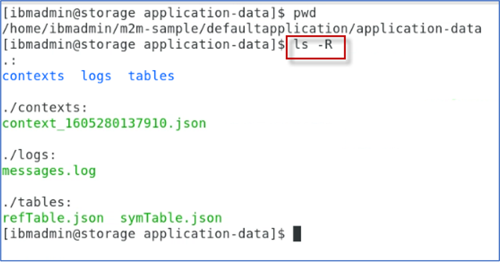
  
_8.1 Run the AIPL tool to generate the microservices recommendations. 

Once you have completed the data collection process for the Java monolith under consideration, you can feed the data to the AIPL tool to generate microservices recommendations.

a.	Change directory to application-data directory

```
cd /home/ibmadmin/m2m-ws-sample/defaultapplication/application-data
```

b.	Run the AIPL tool, using the following command:

```
docker run --rm -it -v /home/ibmadmin/m2m-ws-sample/defaultapplication/application-data:/var/application ibmcom/mono2micro-aipl
```

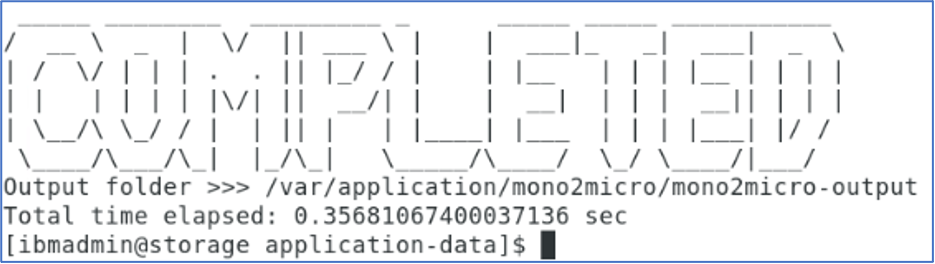
    
When the AIPL tool finishes its analysis, it will generate an application partitioning recommendations graph .json file, various reports, and other output files in the mono2micro/mono2micro-output/ subdirectory within the parent directory of the input subdirectories.
    
Next. Explore some of the notable files and reports generated by Mono2Micro. 
    
Listed here are some of the notable files that were generated from the AIPL tool

**Cardinal-Report.html** is a detailed report of all the application partitions, their member classes, outward facing classes, etc

**/home/ibmadmin/m2m-ws-sample/defaultapplication/application-data/mono2micro/mono2micro-output/Cardinal-Report.html**

**Oriole-Report.html** is a summary report of all the application partitions and their associated business use cases

**/home/ibmadmin/m2m-ws-sample/defaultapplication/application-data/mono2micro/mono2micro-output/Oriole-Report.html**

**final_graph.json** is the full set of application partition recommendations (natural seams and business logic) and associated details, viewable in the Mono2Micro UI

**/home/ibmadmin/m2m-ws-sample/defaultapplication/application-data/mono2micro/mono2micro-output/oriole/final_graph.json**

**cardinal/** is a folder that contains a complete set of input files (based on the partitioning) for the next and last stage of the Mono2Micro pipeline, running the code generator

**/home/ibmadmin/m2m-ws-sample/defaultapplication/application-data/mono2micro/mono2micro-output/cardinal/**

c.	Continue to the next section. You will explore the generated reports later in the lab. 

_8.2   Use the mono2micro UI to view and manipulate the partitioning recommendations generated from the AIPL tool 

Let’s now take a look at the partitioning recommendations Mono2Micro generated by loading the final_graph.json in the graph UI. 

a.	Launch the Mono2Micro UI using the following command:

```
docker run -d -p 3000:3000 --name=m2mgui ibmcom/mono2micro-ui
```

b.	From a web browser, navigate to http://localhost:3000/
 
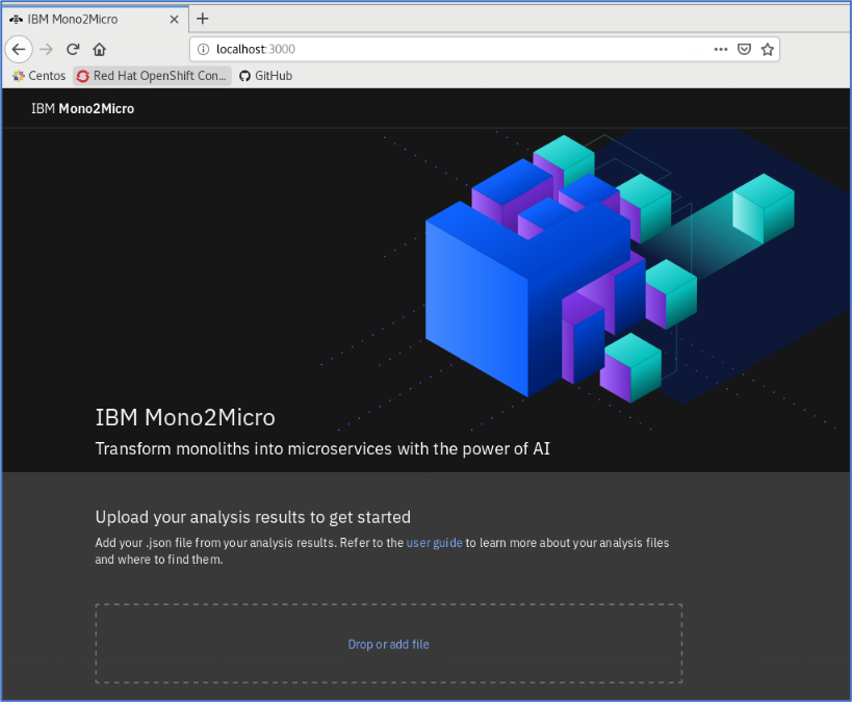

c.	Load the final_graph.json file in the mono2micro UI
  
d.	From the UI, click the **Drop or Add File** link 

e.	From the **File Upload** dialog window, navigate to the following final_graph.json file: **Home>ibmadmin>m2m-ws-sample>defaultapplication>mono2micro-analysis>oriole>final_graph.json**.

f.	Click the **Open** button on the File Upload dialog, to load the file into the UI.

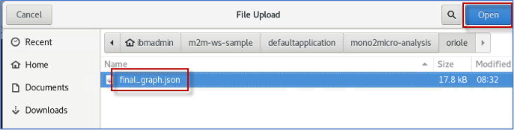
 
g.	From the UI, click the **X** to SKIP the tour, and proceed to the results
 
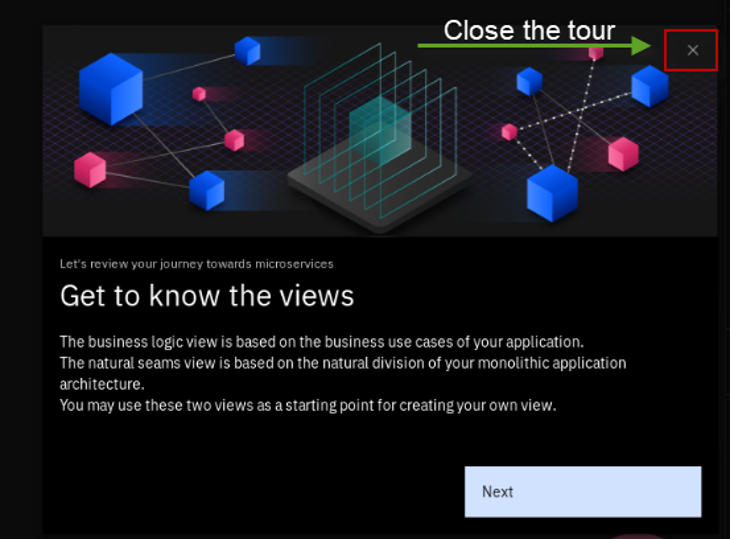
  
As illustrated below, the UI displays the initial recommendations for partitioning the application into microservices. From the UI, you can explore the partition recommendations 
    
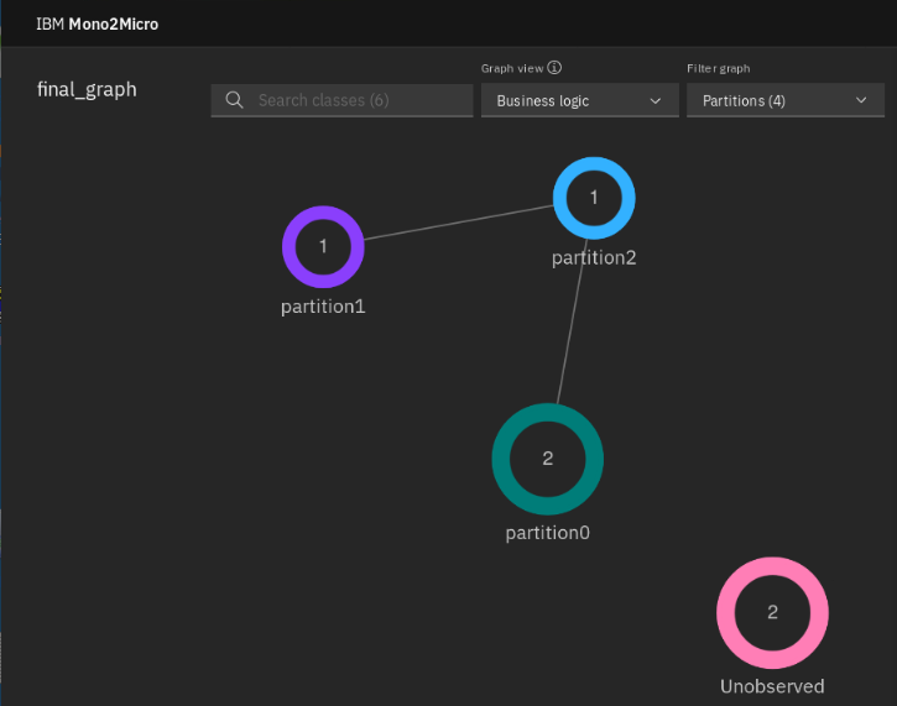
    
The initial partitioning recommendations is a starting point and generated taking into consideration based on the business logic and natural seams that were discovered during the analysis. 

At the time of this writing, there is a known issue in Mono2Micro where in certain cases a class is placed in the Unobserved part despite use cases being run where its use is captured in the logs. This affects Snoop Servlet for this application. However, in the lab, you will slightly customize the partition recommendations to suit our goals, and at that time, you will move the Snoop class into an appropriate partition. This will provide an opportunity to see how easy it is to customize the recommendations to tailor them to exactly suit your desired end state.  

The Default Application contains two major Java components in the application: **Snoop Servlet** and **HitCount application**.

In addition to the Java components, the application also contains HTML, JSP, and other web resources. 

The goal of this lab is to split the Default Application monolith into separate microservices, such that the (Front-end) Web components run as a microservice, and the (back-end) EJB and data layer run as a separate microservice.  

In this exercise, we will ensure that the Web components (Servlets, HTML, JSP, etc) will be in the (front-end) web partition, and the (back-end) HitCount’s increment action Java / EJB components run in a separate partition. 
  
h.	Ensure the view in the UI to display partitioning recommendations are set to **Business Logic**. 
 
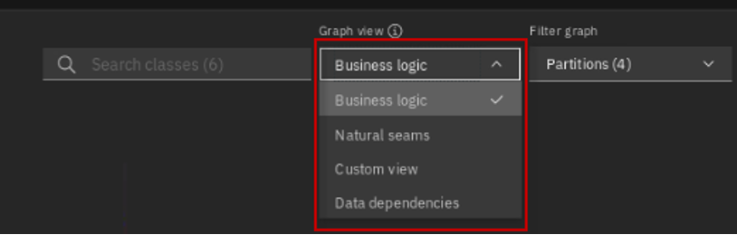
    
Alternatively, you can use the pull-down selector to view the recommendations based on **Natural Seems**, Custom Views, or **Data Dependencies**. 
  *	Business logic partitioning is based on the runtime calls from the test cases
  *	Natural Seems partitioning is based on the runtime calls and class dependencies.  For example, an Object of class A holds a reference to an object of class B as a variable

For natural seams-based partitioning, Mono2Micro creates partitions while avoiding inter-partition containment data dependencies – containment data dependencies between classes belonging to different partitions
  *	Custom: Customize how your classes are grouped. Start from either the Business logic view or the Natural seams view.

i.	If you explored other views, return to the **Business Logic** view.  
  
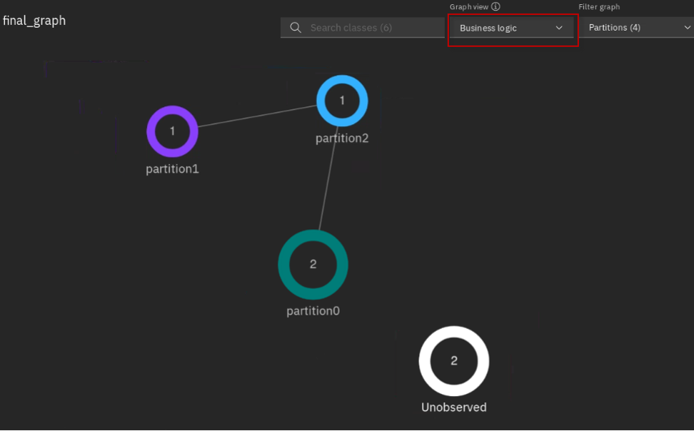

From the Business Logic view, notice that there are three partitions created, and a special partition for **Unobserved** classes. 
  *	The Numeric value in the partitions reflects the number of Java classes inside of the partition
  *	The Lines between partitions indicates where classes from one partition make calls to classes in a different partition
  *	The Unobserved partition is a group of classes that were analyzed but were not found to be included in any of the use case test that were executed earlier. This could be due to dead code, or incomplete set of test cases for adequate code coverage. 

NOTE: And as noted earlier, there is a bug in the Beta version of Mono2Micro that caused SnoopServlet to be unobserved, even though it was included in a test case.  

j.	Explore the Java classes in partition0, partition1, and partition by double-clicking on each of the partitions to display the classes in each partition

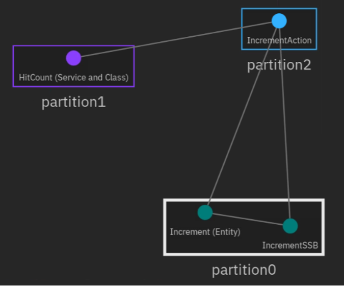
  
  * Partiton0 contains two classes (Increment and IncrementSSB) which are EJB components that are used to persist increment data to a backend Derby database. 
  * The **Increment** EJB classis called from the **IncrementAction** Java class that is in partition2.  
  * Partition1 contains the HitCount Servlet, which then calls the IncrementAction Java class in Partition2. 

k.	Explore the Java classes in the **Unobserved** group by double-clicking on the Unobserved group to display the classes. This is a group of classes that Mono2Micro analyzed but were not included in any of the test cases. 

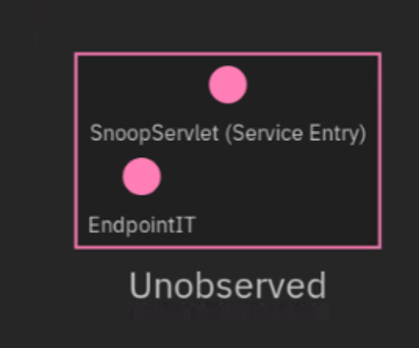
  
  *	EndpointIT is a class that exists in the Junit Tests in the Java project. We did not run the Junit tests as part of the test cases. Therefore, it is expected that this class is not included in any of the partitions. 
  *	SnoopServlet is a core class that was included in the snoop test case and should have been included in partition1 along with the HitCount Servlet. This is a known bug in the Mono2Micro beta at the time of this writing. You will move this class to an appropriate partition in the next section of the lab, when we customize the partition recommendations from the Mono2Micro UI. 

The initial partitioning recommendations are a starting point and generated taking into consideration based on the business logic and natural seams that were discovered during the analysis.

In this lab, you slightly customize the partition recommendations to suit our desired goals while providing an opportunity to see how easy it is to customize the recommendations to tailor them to exactly suit your desired end state.  

_8.3 Customizing & Adjusting Partitions

In order to refine the recommended business logic partitions, let’s consider the classes in partiton1 and the Unobserved group. In these partitions, the classes were servlet classes, as well as a Junit test class. 

Given that the DefaultApplication  monolith has a web based front-end and UI, let’s use one single partition to house all the front-end code for the application, which then would include all html/jsp/etc files, and the Java servlet classes which are referred to by the html file. 
 	
The important point to note here is that Java servlets need to be running on the *same* application server instance that serves up the html files referring to the servlets

The goal of this lab is to split the Default Application monolith into separate microservices such that: 
  *	The (Front-end) Web components run as a microservice
  *	The (back-end) EJB and data layer run as a separate microservice

The partition recommendations from Mono2Micro is a good first step toward partitioning the application for microservices. 

The illustration below shows our desired final state of the partitioning, which will then be used as the basis for the microservice code generation later in the lab. 

In this section of the lab, you use the Mono2Micro UI and tweak the graph to the desired state. 
 
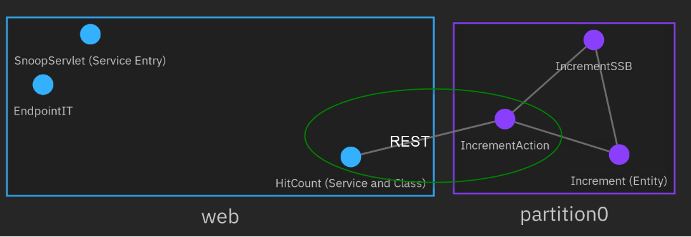
  
Tweaking the business logic recommendations is straight forward using the UI, and includes these basic steps, which you will do next: 
  *	Rename partition1 to web. This is not required but illustrates the capability to create partitions with names that make sense. This is useful during the code generation phase. 
  *	Move SnoopServlet class to the web partition. All the Servlets and other front-end components should be here. 
  *	Move the IncrementAction class to partition0. This class will become the new REST service class during the code generation phase

_8.3.1    Customize the graph

This section shows how to create a custom view for editing the partitioning recommendations
  
a.	To create a custom view, first select Custom View from the Graph view selection pull-down menu
 
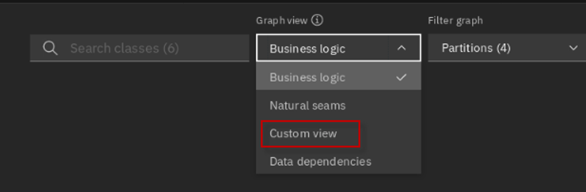
  
b.	Select Business Logic view as the starting point for the custom view. The click the Start button. 
 
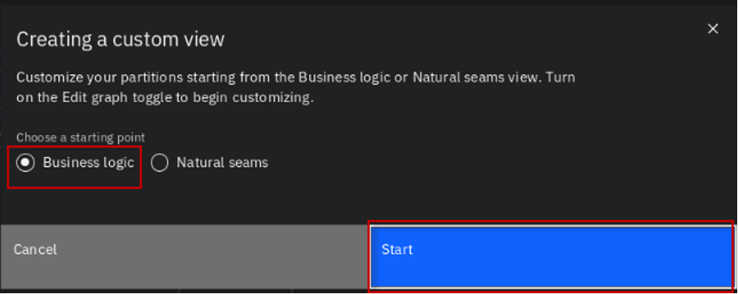
  
c.	Toggle the Edit graph to the **ON** position to allow editing of the graph
 
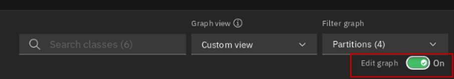
  
d.	Double-click on each of the partitions to view the classes within the partitions and Unobserved group. 
 

  
e.	Rename **partition1** to **web** by clicking on partition1 that includes the HitCount class

f.	Click on the pencil icon  to rename the partition.  
 
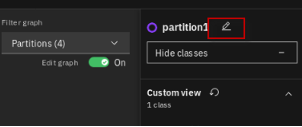
  
g.	Type **web** as the new partition name. Then press **ENTER** key to finalize the name change.
 
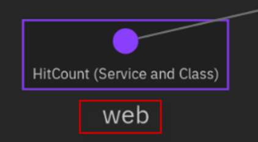
  
The partition has been renamed to **web**.

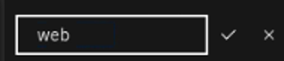
 
h.	Move the SnoopServlet class to the **web** partition by dragging and dropping the SnoopServlet class from the Unobserved partition to the web partition
 
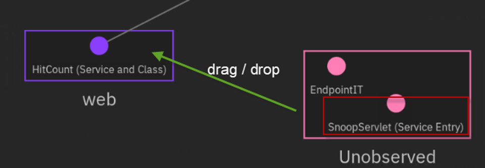
    
The **SnoopServlet** is now located in the web partition.
  
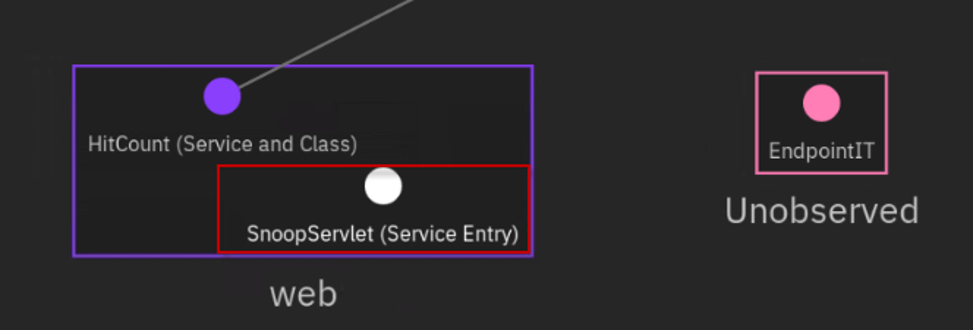
    
i.	Move the **IncrementAction** class from **partition2** to **partition0** by dragging **IncrementAction** class from partition2 to partition0
 
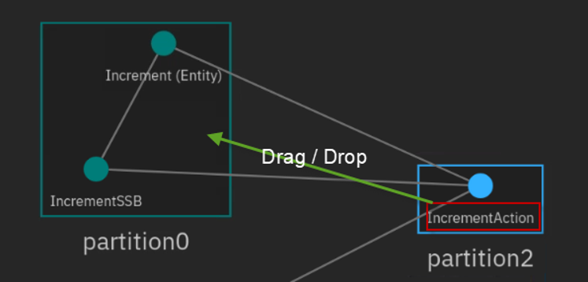
  
The **IncrementAction** class is now located in partition0
 
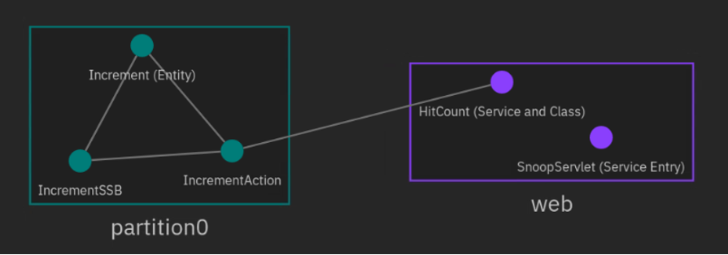
  
l.	Click on the **Save** icon to save the updated custom view. The customized final_graph.json file is saved to the Downloads folder. 
 
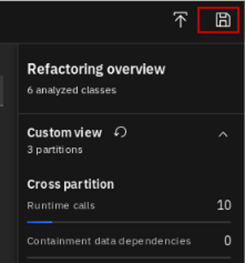
  
_8.4 Regenerate the partition recommendations by rerunning AIPL against the customized graph

To generate the new microservice recommendations and the relevant reports for a modified graph you must execute the AIPL tool with the regen_p option. 

Additionally, the AIPL tool must reference the customized version of the final_graph.json file. To prepare to run the AIPL tool again, you must first do a couple of manual steps: 
  *	Move the customized final_graph.json file from **Downloads** folder to a known location by Mono2Micro.
  *	Rename the customized **final_graph.json** file to a name that makes it obvious this is our customized graph and not the original
  *	Modify the Mono2Micro **config.ini** file to reference the name and location of the customized graph file. 

_8.4.1.	Copy the customized final_graph.json file from users **Downloads** folder to a known location by Mono2Micro’s AIPL tool, and name it custom_graph.json

By default, the AIPL tool will look in the root directory of the application-data folder where the contexts, logs, and tables are located. 

This is the directory structure that was setup for the initial run of the AIPL tool earlier in the lab. All you will do now I copy the final_graph.json file to this folder location where it will be discovered by the AIPL tool. 
    
Run the following commands to copy the file, change to the target directory, and list the files and ensure the custom_graph.json has been copied to the desired directory

```
cp /home/ibmadmin/Downloads/final_graph.json /home/ibmadmin/m2m-ws-sample/defaultapplication/application-data/custom_graph.json 

cd /home/ibmadmin/m2m-ws-sample/defaultapplication/application-data

ls -l 
```
  
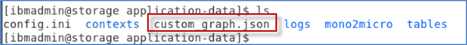

_8.4.2	From the same folder as the custom-graph.json, modify the permissions for config.ini so that we have write permissions

```
sudo chmod 777 ./config.ini 
```
  
When prompted, enter the sudo password for ibmadmin:  **passw0rd**

_8.4.3	Edit the config.ini file to reference the new custom_graph.json file to be used for regenerating the partition recommendations. (Use any editor available)

```
gedit ./config.ini
```

a. Modify the config.ini by changing the value for the **UserModifiedGraph** property to **custom_graph.json**.

b.	Save and Close the config.ini file.
 
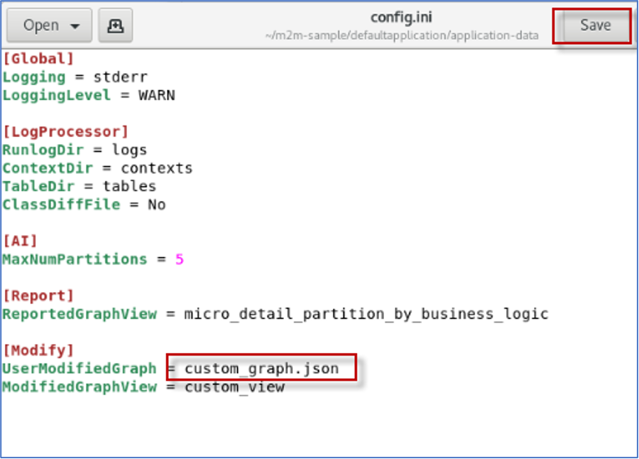

_8.4.4	Rerun the AIPL tool with the regen_p option to generate the partitioning recommendations based on the updated graph file. 

```
docker run --rm -it -v /home/ibmadmin/m2m-ws-sample/defaultapplication/application-data:/var/application ibmcom/mono2micro-aipl regen_p
``` 

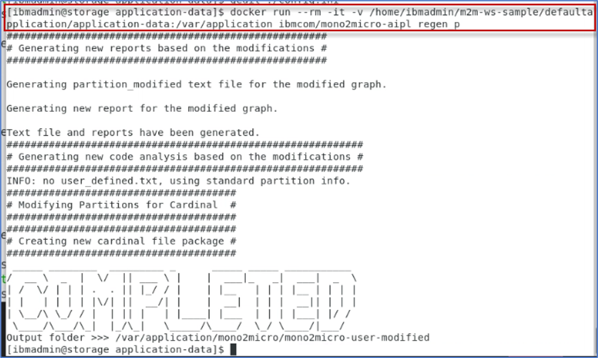

_8.4.5 Explore the generated Cardinal report based on the customized graph and regenerated recommendations from AIPL

The AIPL created a new folder based on the user modified graph in the following directory: **/home/ibmadmin/m2m-ws-sample/defaultapplication/application-data/mono2micro/mono2micro-user-modified**

a.	List the files / folders of the generated directory.

```
ls -l  /home/ibmadmin/m2m-ws-sample/defaultapplication/application-data/mono2micro/mono2micro-user-modified
```
  
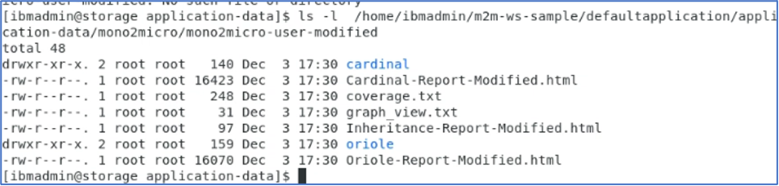

b.	View the generated Cardinal report to verify the partitions and exposed services are defined as expected. 

```
cd  /home/ibmadmin/m2m-ws-sample/defaultapplication/application-data/mono2micro/mono2micro-user-modified

firefox ./Cardinal-Report-Modified.html
```

The Cardinal-Report provides a deep analysis of all the inter-partition invocations, the types of all the non-primitive parameters passed to partitions during their invocations, and foreign class references within a partition. 

Classes are foreign to a partition if they are defined in another partition.

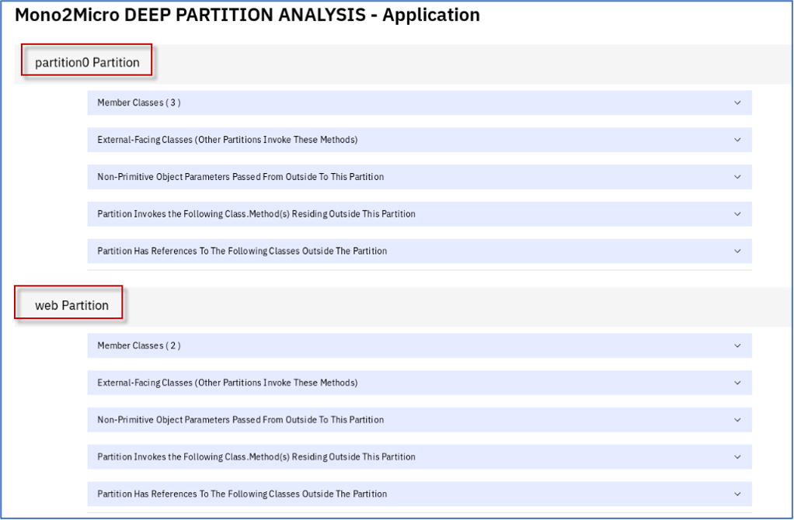
  
c.	Review the partition0 Partition.

Partition0 should include three Member classes:   
  *	Increment
  *	IncrementAction
  *	IncrementSSB

Partition0 should have one External Facing class:
  * IncrementAction

Mono2Micro detected that there are classes outside of partition0 that call methods on the IncrementAction Class. 
      
During the code generation phase of Mono2Micro, the Cardinal tool will generate a REST service interface for the IncrementAction class, so that other microservices can make the remote method calls in a loosely coupled Microservices architecture. 
  
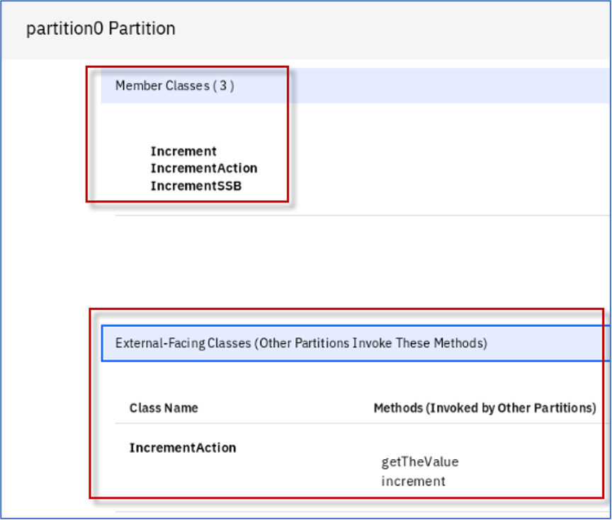
    
d.	Review the web Partition

The web partition should include two Member classes:
  *	HitCount
  *	SnoopServlet

The web partition invokes one class method residing outside of this partition:
  *	Outside partition: partition0
  *	Class Name IncrementAction
  *	Methods:  getTheValue and increment

Mono2Micro detected that classes in the web partition call methods in partition0.  

During the code generation phase of Mono2Micro, the Cardinal tool will generate a Proxy for the class to call the REST service interface in partition0. 
 
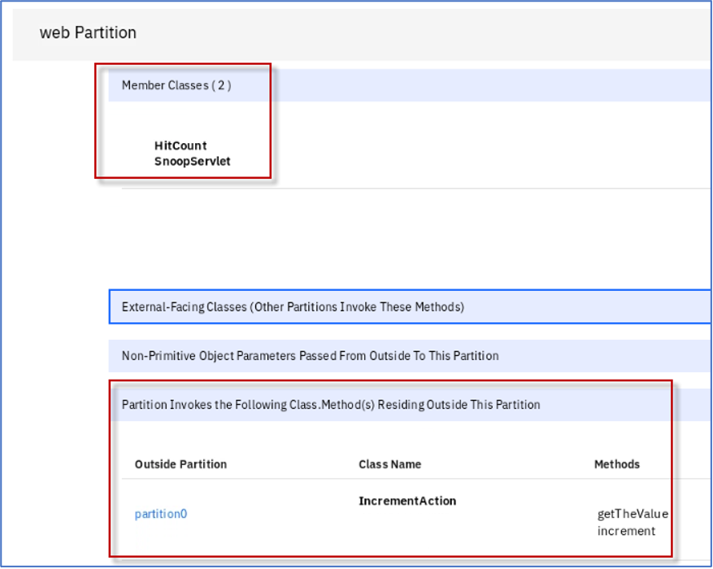

#### 7.4 Generating Initial Microservices Foundation Code (Part 3)

Objectives
  *	Learn how to use Mono2Micro tools to generate a bulk of the foundation microservices code, while allowing the monolith Java classes to stay completely as-is without any rewriting 

In this part of the lab, you: 
  * Use Cardinal to generate the microservices plumbing code for the two microservices (front-end and back-end)
  * Refactor the transformed Microservices
    * Move the static and non-Java artifacts from the monolith application into the individual microservices
    *	Refactor the minimal set of artifacts so that the transformed microservices will compile and run in OpenLiberty server in Docker containers.


 
After going through the microservice recommendations generated by the mono2micro-aipl container, you can use Mono2Micro to automatically generate API services and related code to realize the microservice recommendations. 

This is accomplished by executing the Cardinal component available as the mono2micro-cardinal container.

Cardinal automatically performs three crucial tasks for the architects and developers in the refactoring endeavor of realizing partitions (microservices recommendations) as microservices. 

The tasks performed by Cardinal can be listed as follows: 
  *	It creates transformational wrappings to turn partition methods into microservices APIs
  *	It provides an optimized distributed object management, garbage collection, and remote local reference translations like the Java remote method invocation mechanism.
  *	It provides pin-pointed guidance on what the developers should check and manually readjust or tweak code in the generated microservices.

7.4.1 Run the Cardinal code generation tool

Now, let’s run the Cardinal code generation tool to generate the plumbing code for the microservices. 

The cardinal code generation tool requires the following input artifacts and is referenced in the cardinal command for proper execution: 
  *	The parent folder of the original DefaultApplication monolith application: **/home/ibmadmin/m2m-ws-sample/defaultapplication/monolith**.  
  *	The cardinal folder from the mono2micro-user-modified directory that was generated by the AIPL tool using the regen_p option: **/home/ibmadmin/m2m-ws-sample/defaultapplication/mono2micro-analysis-custom/cardinal**.

For the lab, you reference a saved version of the cardinal folder when running the cardinal tool. This is just to ensure a known good dataset is used for the code generation: **/home/ibmadmin/m2m-ws-sample/defaultapplication/mono2micro-analysis-custom/cardinal**.

If you would rather use the cardinal folder that was generated during the lab, use: **/home/ibmadmin/m2m-ws-sample/defaultapplication/application-data/mono2micro/mono2micro-user-modified/cardinal**.

_1.	Run Cardinal code generation tool using the following command: 

```
docker run --rm -it -v /home/ibmadmin/m2m-ws-sample/defaultapplication:/var/application ibmcom/mono2micro-cardinal /var/application/monolith /var/application/mono2micro-analysis-custom/cardinal
```
	
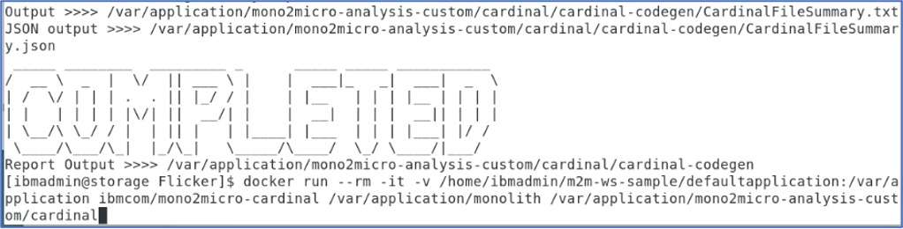

7.4.2 Examine the Cardinal Summary report to understand what Cardinal generated for each partition

Upon completion of running cardinal code generation tool, the plumbing code for microservices are generated, along with several reports that provide summary and details of the Java source files that were generated. 

_1.	Examine the **CardinalFileSummary.txt** file. 

This file provides a summary of all the files that were generated or modified during the code generation. 

The location of the cardinal reports is in a folder named **cadinal-codegen**. The path to this folder is relative to the **cardinal** input folder specified on the cardinal command line. 

In this case, the cardinal-codegen folder and associated reports are generated here: **/home/ibmadmin/m2m-ws-sample/defaultapplication/application-data/mono2micro/mono2micro-user-modified/cardinal**.
  
a.	Open the CardinalFileSummary.txt file using an available editor

```
cd  /home/ibmadmin/m2m-ws-sample/defaultapplication/mono2micro-analysis-custom/cardinal/cardinal-codegen

gedit CardinalFileSummary.txt
```

b.	Examine the web partition summary in the **CardinalFileSummary.txt** file 
 
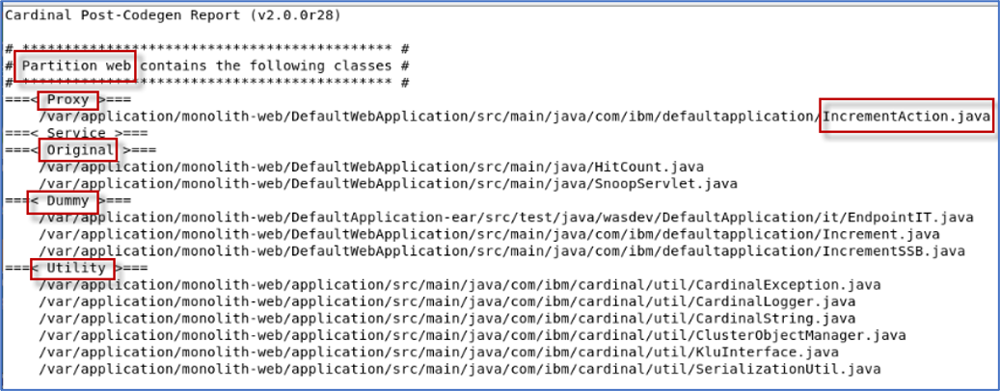
  
This section of the report shows the classes contained in the web partition. The report further denotes the types of classes that are in the partition.
  *	Proxy classes are created for calling out to a class to an outside partition via REST API. In this case, the HitCount Servlet in the web partition calls the IncrementAction REST Service class in partition0. 
  *	Service classes are generated REST Service interface classes. A service class is generated for each Java class that is receiving proxied requests from one partition to another via REST API. 
  *	Original classes are the classes that already existed in the monolith and will remain in the web partition. In this case, the SnoopServlet and HitCount servlet are kept as original. 
  *	Dummy classes are classes that were in the monolith but will now exist in a different partition. The Dummy classes throw an exception that is defined in the Utility classes that are created in every partition. 
  *	Utility classes are created to handle the plumbing such as serialization, exceptions, logging, and interfaces for the new microservices.  

_2.	Scroll down and examine the **partition0** partition summary in the **CardinalFileSummary.txt** file 
 
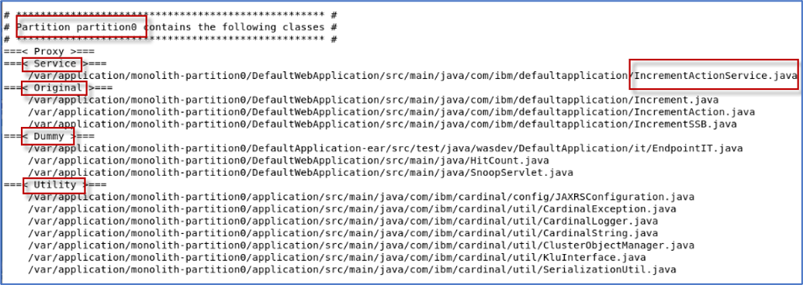
  
This section of the report shows the classes contained in the partition0 partition. The report further denotes the types of classes that are in the partition.
  *	Proxy classes are created for calling out to a class to an outside partition via REST API. 
  *	Service class, IncrementActionService is created based on the web partition calling to the IncrementService in partition1 via REST API. 
  *	Original classes are the classes that already existed in the monolith and will remain in the web partition. In this case, the Increment, IncrementAction, and IncrementSSB classes will remain in the partition0. 
  *	Dummy classes are classes that were in the monolith but will now exist in a different partition. The Dummy classes throw an exception that is defined in the Utility classes that are created in every partition. The SnoopServlet and HitCount Servlet will be in the web partition.
  *	Utility classes are created to handle the plumbing such as serialization, exceptions, logging, and interfaces for the new microservices.  

_3.	Close the editor for the CardinalFileSummary.txt file 

7.4.3 Examine the Java code that was generated by Cardinal

Cardinal generates the Java source files in separate folders for each partition and are named according to their respective partitions.  

The location of the Java source files is in a folder named **-partiton0** and ***-web**. 

The actual folder name is dependent upon the input paths specified on when running the cardinal command. In our case, the actual folder names are: 
  *	monolith-web
  *	monolith-partition0

The root folder for the generated source files is also dependent on the input paths specified when running the cardinal tool.  

In this case, the monolith-web and monolith-partitio0 folders are generated here: **/home/ibmadmin/m2m-ws-sample/defaultapplication**.

For the purpose of this lab, it is not necessary to understand the details of all the code that Cardinal generates. However, we strongly recommend learning this before using Mono2Micro with a production application. See APPENDIX A:  Examine the Java Code generated by Mono2Micro provides a detailed look at these generated files.

7.4.4 Refactoring Non-Java Parts of Monolith, Further Code Changes, and Deploying Final Partitions as Microservices

After Mono2Micro generates the initial microservices plumbing code and places that along with the monolith classes into each partition, the foundations of the microservices are now there. 

That is, each partition is meant to run as a microservice, deployed on an application server (such as WebSphere Liberty) where the monolith classes’ public methods are served up as REST API. Each partition is effectively then a mini version of the original monolith, its folder structure mirroring the original monolith folder and module structure. 

In order to build and run each partition, more than just the Java code is needed of course.  And here is when a key question is usually raised: What exactly does one do with the non-Java parts of the monolith with respect to each partition, and how, in order to facilitate the final goal of running all partitions as microservices?

**One Approach**

One approach that you will follow for the DefaultApplication example and highly recommend for most Java applications is as follows: 
  *	Copy *all* the non-Java files in the monolith (i.e. the build config files such maven’s pom.xml or gradle files, server config files such as WebSphere’s server.xml, Java EE meta-data and deployment descriptors such as application.xml, web.xml, ejb-jar.xml, persistence.xml etc) to *every* partition, following the same directory structure which will partially already exist in each partition. 
  *	Starting with that as a base, the aim then is to pare down and incrementally reduce the content of all these files (based on knowledge of what functionality each partition entails, and/or through an iterative compile-run-debug process), ending up with just the needed content in each partition. 
  *	After this is done, each partition will indeed be a mini subset of the original monolith and working together with all the other running partitions and finally become microservices that provide the exact same functionality as the original monolith.

As each partition is now becoming a separate microservice project and will be developed and deployed independent of the other microservices, ideally, you would create Java projects in your favorite IDE and follow these basic steps for new microservice projects: 
  *	Create a Java EE web project for each partition and set the runtime target a WebSphere Liberty installation
  *	Import the partition from the filesystem into the project
  *	Ensure all partitions module folders containing Java source files are correctly configured as source folders within the Eclipse tools, rooted where the package directories are (this includes the monolith module folders as well as the application utility code folder generated by Cardinal. See previous section)
  *	Build the project and observe any compilation errors

In this lab, you will make the minimal set of changes for the web and partition0 partitions that are required to compile and run the front-end microservice (web) and the back-end microservice (back-end) in Liberty Server in containers.

It is beyond the scope of this lab to take each microservice through the iterative development process in an IDE. But you will get the point, if you spend a little time reviewing the updates that are done via the provided scripts. It’s not that extensive for this simple application. 

7.4.4.1 Move the original non-Java resources from the monolith to the two new partitions

As described above, the first step is to Copy **all** non-Java files to **every** partition, following the same directory structure which will partially already exist in each of the generated partitions.

For this lab, a shell script has been provided for you, which will copy all the resources to the partitions. 

This is the first step to refactoring the partitions. Further refactoring of these artifacts is unique to the microservice functionality in each partition.  

The script performs the following tasks: 
  *	Copies the various pom.xml files to both partitions
  *	Copies all the webapp artifacts (html, jsp, xml) files to both partitions
  *	Copies the application EAR resources to both partitions
  *	Copies the Liberty server configuration file to both partitions
  *	Copies the database configuration files to the back-end partition

_1.	Review the moveResourcesToPartitions.sh shell script.   

```
cd  /home/ibmadmin/m2m-ws-sample/defaultapplication/scripts

gedit moveResourcesToPartitions.sh
```
  
The script:
  * defines a bunch of variables referencing various directories for copying files
  * uses sudo to change directory permissions to allow write access to the partitions that mono2 micro generated

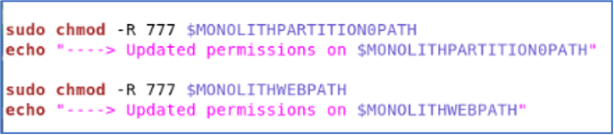

  * copies non-java resources from the monolith application to the (front-end) web partition
    
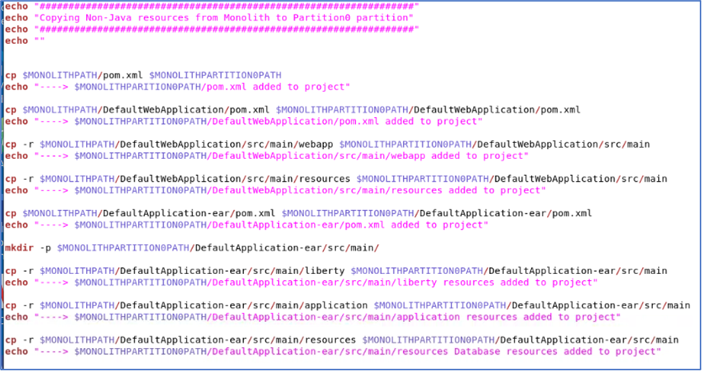
    
  * script copies non-java resources from the monolith application to the (back-end) partition0 partition
 
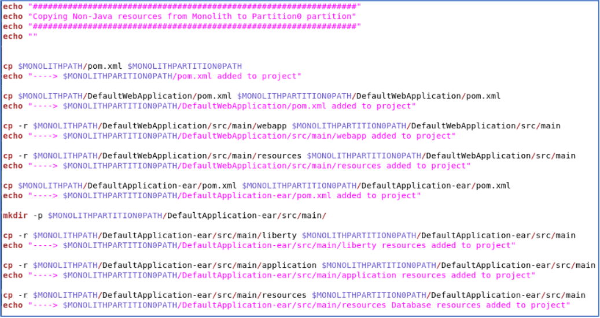

_2.	Close the editor 

To speed up copying files, run the moveResourcesToPartitions.sh script to do it for you. 

_3.	Run the script to copy the non-java resources to the partitions

```
cd /home/ibmadmin/m2m-ws-sample/defaultapplication/scripts

./moveResourcesToPartitions.sh
```

When prompted for a password, enter: **passw0rd**

_4.	 Use a graphical File Explorer   or Terminal window to see the non-Java files now in each of the partitions, and in the same directory structure as the original monolith. 

a.	Navigate to the following directories to explore the newly added non-Java resources. Refer to the shell script to see what exactly was copied. 
  *	/home/ibmadmin/m2m-ws-sample/defaultapplication/monolith-web
  *	/home/ibmadmin/m2m-ws-sample/defaultapplication/monolith-partition0

7.4.4.2  Refactor the original non-Java resources as required for the front-end and back-end partitions

At this point, every partition contains all the Java and non-Java files necessary for the application. 

Starting with that as a base, the next step is to pare down and incrementally reduce the content of all these files, ending up with just the needed content in each partition to build and run the microservice. 

In this lab, you will focus only on the refactoring that is required for the partitions to compile and run in Docker containers. An iterative for further paring down the content is beyond the scope of this lab. 

To simplify the refactoring activities for this lab, a shell script has been provided that performs the refactoring required such that each partition (microservice) will compile and run on their own Liberty Server in separate Docker containers.  

The script performs the following tasks for the web partition:
  *	Create a new pom.xml file to build the Cardinal Utility classes generated by Mono2Micro
  *	Updates the top level pom.xml file to include the Cardinal Utilities module to be built with the app
  *	Updates the DefaultWebApplication pom.xml file to remove Java persistence dependency
  *	Update the DefaultApplication-ear pom.xml file to remove the database config 
  *	Update the DefaultApplication-ear pom.xml file to add Dependency for Cardinal Utility classes 
  *	Update Liberty server.xml file to remove database / datasource configuration
  *	Add a dockerfile to build the Microservice and Docker image running on Liberty

The script performs the following tasks for the partition0 partition:
  *	Create a new pom.xml file to build the Cardinal Utility classes generated by Mono2Micro
  *	Updates the top level pom.xml file to include the Cardinal Utilities module to be built
  *	Updates the DefaultWebApplication pom.xml file to remove Java persistence dependency
  *	Update the DefaultApplication-ear pom.xml file to remove the database config 
  *	Update the DefaultApplication-ear pom.xml file to add Dependency for Cardinal Utility classes 
  *	Update and move the JAXRSConfiguration.java file to DefaultWebApplication class path. 
    *	Update the package in the Java file to match source location in the module.  
    *	This Java file is generated by Mono2Micro
  *	Update the IncrementActionService.java file 
    *	This Java file is generated by Mono2Micro.  
    *	This works around a known issue with conflicting import statements in the Java file 
  *	Add a dockerfile to build the Microservice and Docker image running on Liberty

_1.	Run the refactorPartitions.sh shell script to perform the partition refactoring

```
cd  /home/ibmadmin/m2m-ws-sample/defaultapplication/scripts

./refactorPartitions.sh
```

When prompted for a password, enter: **passw0rd**

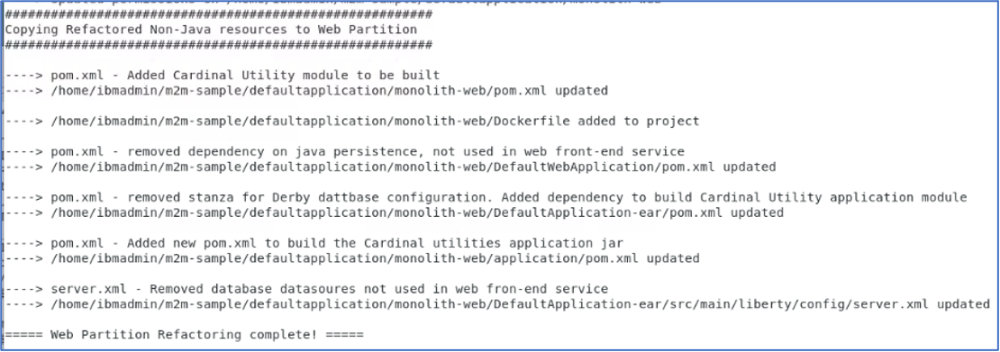

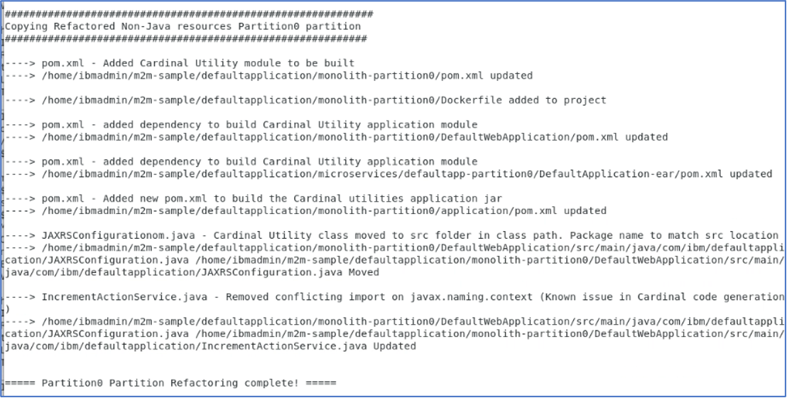
 
In a production application, refactoring the resources within each Microservice could take significant time. 

The aim is to pare down and incrementally reduce the content of all these files (based on knowledge of what functionality each microservice entails) and through an iterative **compile-run-debug** process, ending up with just the needed content for each microservice.

If you are interested in the details of the refactored files that were pared down for this lab, refer to APPENDIX B in this lab guide. APPENDIX B:  Examine the Refactored resources after code generation provides a detailed look at these refactored files. 

7.4.4.3  Deploy Partitions as Containerized Microservices

To portably run the builds of all the partitions, and at the same time prepare them for containerization, this lab uses Docker based builds right from the start.

Multi-stage dockerfiles are used for each partition: 
  *	Stage 1: Performs the Maven build and packaging of the deployable artifacts (WAR, EAR, JAR)
  *	Stage 2: Creates the Docker image from OpenLiberty, and adds the application, server configuration, and other configurations required for the partitions (Derby DB config) 

The dockerfile is slightly different for each partition since each partition will require unique configurations for its Microservice.  

_1.	Navigate to the Dockerfile in the web partition to view this update.   

```
gedit /home/ibmadmin/m2m-ws-sample/defaultapplication/monolith-web/Dockerfile
```
  
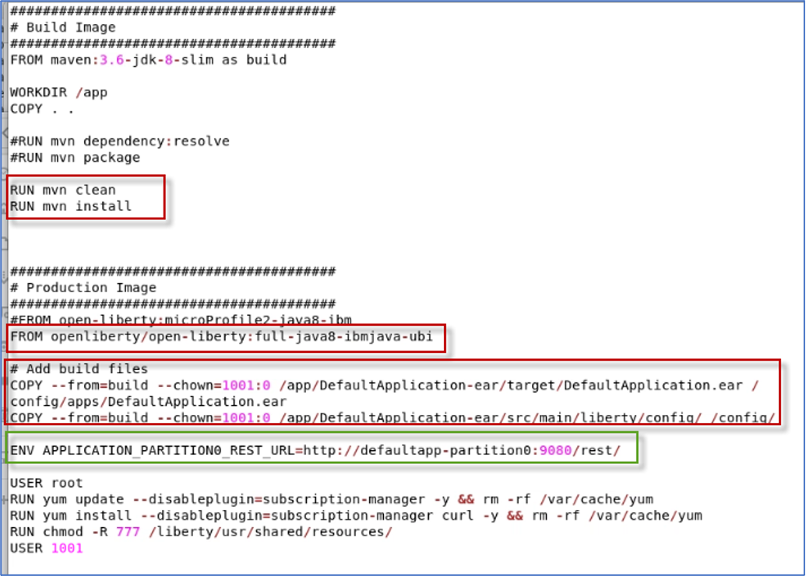

Build Image stage: 
  *	Performs the Maven Build and package of the application based on the pom.xml files in the project. 

Production Image stage: 
  *	Pulls the Universal base Image (UBI) of Open-Liberty Docker image from Dockerhub. The Universal Base Image is the supported images when deploying to RedHat Openshift. 
  *	Copy the EAR to the Liberty apps directory, where Liberty will automatically start when the container is started. 
  *	Copy the Liberty server configuration file to Liberty config directory, which is used to configure the Liberty runtime.
  *	As root user, I install curl as a tool for helping to debug connectivity between Docker containers. This is not required. 
  *	As root user, update the permissions on the shared resources folder in Liberty

ENV Variables required by Mono2Micro

Additionally, each partition is passed environment variables specifying the end point URLs for JAX-RS web services in other partitions. 
  *	The Cardinal generated code uses these environment variables in the proxy code to call the JAX-RS services
  *	It is important to note that for JAX-RS, URLs cannot contain underscores.   

Example ENV Variable for the web partition: 
  
**ENV APPLICATION_PARTITION0_REST_URL=http://defaultapp-partition0:9080/rest/**

  *	When running in Docker, a docker network must be set up so that all partitions can communicate with each other. Yu did this in the lab. 
  *	All partitions in this lab use port 9080 internally within the Docker environment, but expose themselves on separate ports externally to the host machine
  *	Using this scheme as a base, a Kubernetes deployment can be set up on a cluster where each container acts a Kubernetes service

When running in Docker, the hostname must match the **Name** of the container as known in the Docker Network. 
  *	Use command: **docker network list** to see the list of docker networks
  *	Use command: **docker network inspect &ltNETWORKNAME&gt** to see the container names in the Docker network. 
  
Where **&ltNETWORKNAME&gt** is the name of the Docker network to inspect

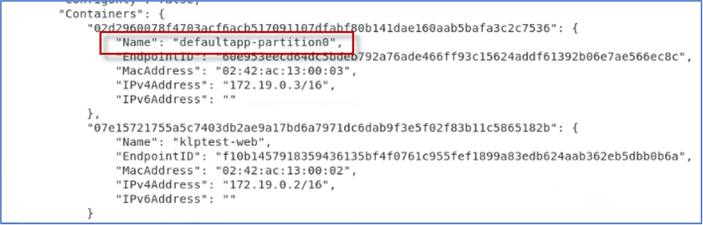

_2.	Navigate to the Dockerfile in the partition0 partition to view this update.   

```
gedit /home/ibmadmin/m2m-ws-sample/defaultapplication/monolith-partition0/Dockerfile
```

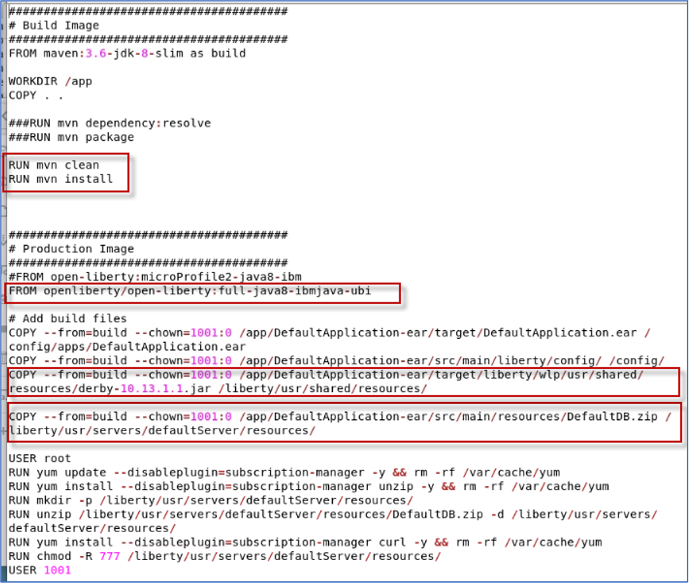

Build Image stage: 
  *	Performs the Maven Build and package of the application based on the pom.xml files in the project. 

Production Image stage: 

In addition to the steps that were performed in the web partition, these additional steps are required for the partition0 Microservice deployment. 
  *	Copies the Derby DB zip file to the shared resources folder for Liberty. The Maven build has a step to unzip the Database contents.
  *	Copies the Derby database JDBC library to Liberty’s shared resources folder

Note: The partition0 partition does not require any Mono2Micro ENV variables to be set since this partition doe not make any REST API calls to other partitions. 

7.5  Build (Compile) the transformed Microservices using Maven

In the previous sections of the lab, you used the Mono2Micro tools to transform the original monolith application into two microservices. 

Then, using the convenience scripts we provided, you started to refactor the microservices by moving the non-java resources and Liberty configuration into the microservices projects. 

You further refactored the microservices by paring down the non-java configuration files, Liberty configuration, and Maven build artifacts to include only the configuration required to build and run each of the microservices in their own Liberty runtime in containers.  

At this point, it would be a good idea to do a quick compilation of the microservices to see if there are any compilation or build errors. Then, iterate on the refactoring of each microservice, as needed. 

Ideally, developers would do try doing a quick compilation of the generated code by using an IDE tailored to support Java EE and the application server. 

Using an IDE for development is beyond the scope of this lab. Instead, you will simply use Maven to test the compilations of the microservices and observe any compilation errors. 

_1.	Compile the monolith-web microservice via command line
  
a.	Change to the monolith-web directory, which contains the top-level pom.xml for building the monolith-web microservice 

```
cd /home/ibmadmin/m2m-ws-sample/defaultapplication/monolith-web
```
  
b.	Run the Maven Build to compile and package the microservice

```
mvn clean install
```
    
If all goes well, the microservice project will compile successfully, as illustrated below:

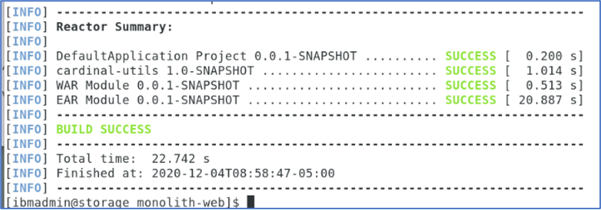
 
_2.	Compile the monolith-partition0 microservice via command line

a.	Change to the monolith-partition0 directory, which contains the top-level pom.xml for building the monolith-web microservice 

```
cd /home/ibmadmin/m2m-ws-sample/defaultapplication/monolith-partition0
```

b.	Run the Maven Build to compile and package the microservice

```
mvn clean install
```
    
If all goes well, the microservice project will compile successfully, as illustrated below:

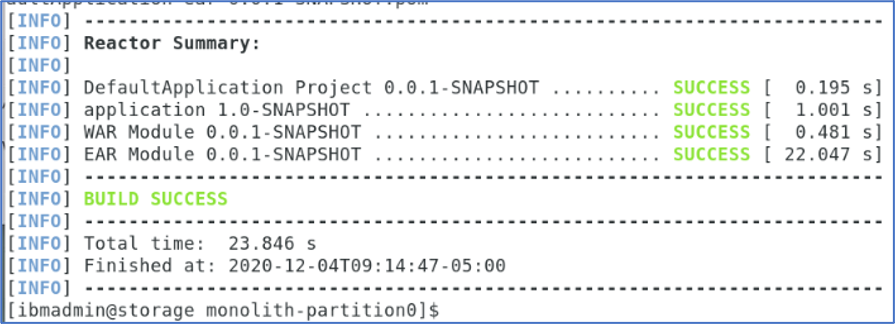
  
**The last section of the lab below is OPTIONAL!**

At this point in the lab. you are back to where this lab started. Recall in Part 1 of the lab, you built and ran the DefaultApplication as microservices in containers using Docker. Those microservices were also transformed using Mono2Micro, using resources we provided in the Git Repo. 

Now it’s your turn! 

To bring the lab full circle, you may continue to the last section of this lab to build and run YOUR transformed and refactored Microservices application.  

7.6 OPTIONAL: Build and run the Transformed Java Microservices Using Docker

_1.	Stop and remove the currently running docker containers that you deployed d Part 1 of the lab

```
docker stop defaultapp-web

docker rm defaultapp-web

docker stop defaultapp-partition0

docker rm defaultapp-partition0

docker ps | grep defaultapp

docker ps -a | grep defaultapp
```
  
NOTE: The docker containers should no longer exist. 

_2.	Remove the DefaultApplication Docker images that you created in part 1 of the lab

```
docker rmi defaultapp-web

docker rmi defaultapp-partition0

docker images | grep defaultapp
```

NOTE: The docker images should no longer exist. 

_3.	Build and start the defaultapplication-web (front-end) container

```
cd /home/ibmadmin/m2m-ws-sample/defaultapplication/microservices/defaultapp-web

docker build -t defaultapp-web  . | tee web.out

docker run --name=defaultapp-web --hostname=defaultapp-web --network=defaultappNetwork -d -p 9095:9080 defaultapp-web:latest

docker ps | grep defaultapp
```

_4.	Build the defaultapplication-partition0 (back-end) container

```
cd /home/ibmadmin/m2m-ws-sample/defaultapplication/microservices/defaultapp-partition0

docker build -t defaultapp-partition0 . | tee partition0.out

docker run --name=defaultapp-partition0 --hostname=defaultapp-partition0 --network=defaultappNetwork -d -p 9096:9080 defaultapp-partition0:latest

docker ps | grep defaultapp
```
  
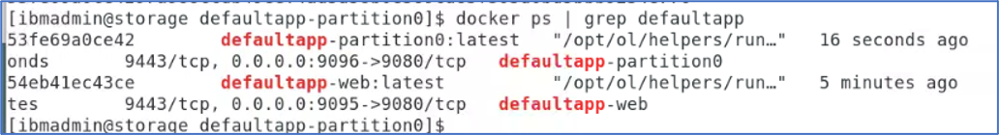
  
Once all the containers have started successfully, the DefaultApplication can be opened at http://localhost:9095/
 
That completes the end-to-end lab: Using Mono2Micro to transform a Java monolith application to Microservices. 

### Conclusion

In this lab, you gained significant hands on experience using Mono2Micro in a full end-to-end flow. 

You started by building and running the final transformed microservices based application in Docker containers running on Liberty server. 

Then, you started from the beginning with a Java EE monolith application, using the AI-driven Mono2Micro tools to analyze it and recommend the different ways it can be partitioned for potential microservices. 

Using Mono2Micro’s UI, you further customized the partitioning to suit our specific requirements. 

You then used the unique code generation tool to generate a bulk of the foundation microservices code, while allowing the monolith Java classes to stay completely as-is without any rewriting. 

And then with further manual refactoring of the non-Java aspects of the monolith, a set of microservices are deployed in containers that provides the exact same functionality as the monolith application.


### Appendix A:  Examine the Java Code generated by Mono2Micro

A.1   Explore Cardinal some notable Java resources generated in the web partition

Fully exploring all the resources in detail is beyond the scope of this lab. You will explore a few of the key resources in the partitions. Feel free to explore in more detail if you desire. 

1.	Using the File Explorer, navigate to the monolith-web directory **Home > m2m-ws-sample > defaultapplication > monolith-web**.

2.	First, let’s look at the UTILITY classes in the application subdirectory of the **monolith-web** folder. 

Notice the folder named **application**.  This folder contains the Utility classes that handles the plumbing for the microservices. It has classes for handling serialization, exceptions, logging, etc. These classes are generated for ALL partitions. 

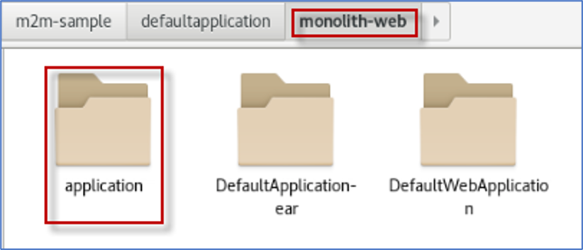

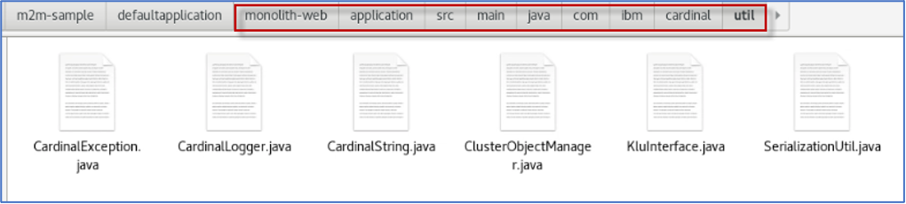
 
Tip: The default name for the Utility classes is **application**. However, this is configurable in the app_config.txt file that is generated by the AIPL tool.  
 
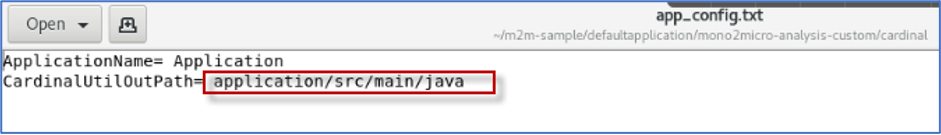
  
The **app_config.txt** file is located here: **/home/ibmadmin/m2m-ws-sample/defaultapplication/mono2micro-analysis-custom/cardinal**.

3.	Explore the DefaultWebAplication subdirectory in the monolith-web folder. 

  *	Original classes: The original HitCount.java and SnoopServlet classes are copied directly from the original monolith application
 
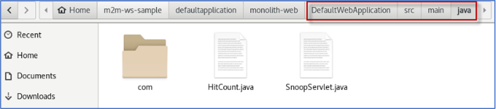
   
  *	Proxy class: Cardinal generated a proxy class for IncrementAction. The proxy invokes the IncrementActionService URL in partition0.
 
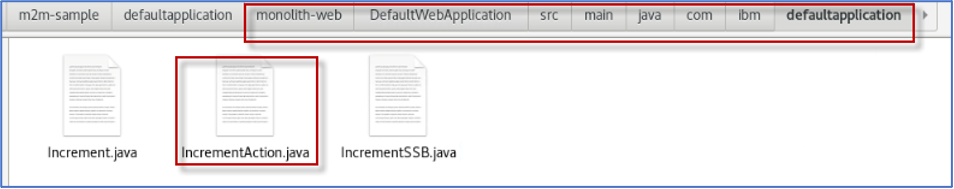
   
  * Dummy classes: Cardinal generated Dummy classes for classes that are present in the original monolith but are moved to a different partition. The Dummy classes simply throw custom exceptions in the event these classes are unexpectedlyinvoked.   

  Dummy classes for Increment.java and IncrementSSB.java were generated. 
 
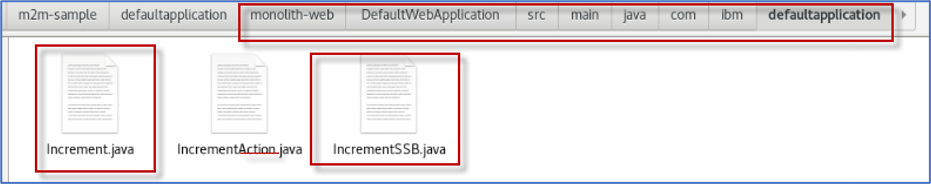

A.2   Explore Cardinal some notable Java resources generated in the partition0 partition

Fully exploring all the resources in detail is beyond the scope of this lab. You will explore a few of the key resources in the partitions. Feel free to explore in more detail if you desire. 

1.	Using the File Explorer, navigate to the **monolith-partition0** directory: **Home > m2m-ws-sample > defaultapplication > monolith-partition0**.

The UTILITY classes in the application subdirectory of the monolith-partition0 partition are the same as those generated in the web partition. These utility classes are required from each microservice.   

Notice the folder named **application**.  This folder contains the Utility classes that handles the plumbing for the microservices. It has classes for handling serialization, exceptions, logging, etc. These classes are generated for ALL partitions.  
 
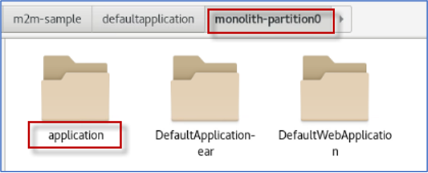

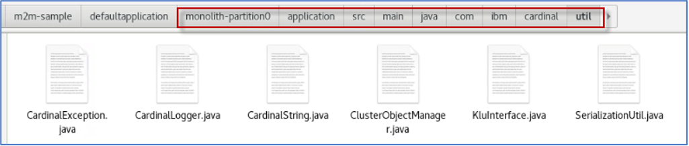

Cardinal generated a Java resource named **JAXRSConfiguration.java**. This file is in the **config** sub-directory under the application subdirectory of the monolith-partition0 partition.  
    
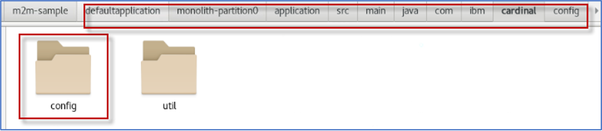
 
As part of the utility code that Cardinal generates, a JAXRSConfiguration class is generated per partition. 

For now, it is important to know this class sets up the JAX-RS config where all service classes are registered and is meant to be copied over and placed in one Java EE module of your preference within each partition. You will work with this file later in the lab as you do final preparation of the microservices for deployment to Liberty Servers in Containers. 
 
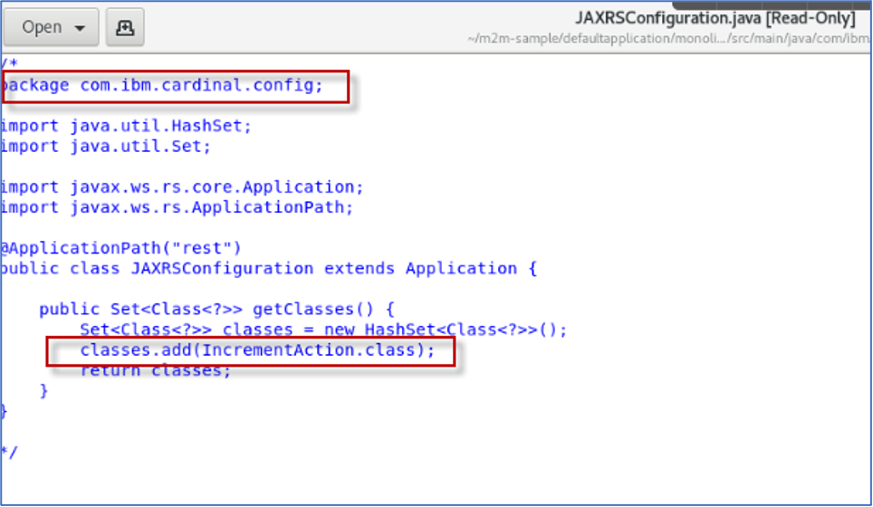
 
**user_defined.txt** - A related file that you might notice is the presence of a user_defined.txt file in /home/ibmadmin/m2m-ws-sample/defaultapplication/mono2micro-analysis-custom/cardinal which the Cardinal tool reads on start-up, if one exists. 

This is a way to provide a list of one or more monolith classes that are to be treated as **external facing**, where classes outside its partition might call into it. These external facing classes are also called **service classes** in Mono2Micro nomenclature. 

Recall that the deep partition analysis report Cardinal-Report.html generated by AIPL lists all external facing classes per partition that the AI analysis deemed necessary… but there could always be cases where some classes were not called out as such (typically due to insufficient use cases being run that allows Mono2Micro to observe this external facing behavior). 

The user_defined.txt file provides the ability to define additional Java classes as external facing **service classes**, if needed. 

4.	Explore the DefaultWebApplication subdirectory in the monolith-partition0 folder. 
  * Original classes: The original classes are copied directly from the original monolith application: 
    *	Increment.java
    *	IncrementAction.java
    *	IncrementSSB.java

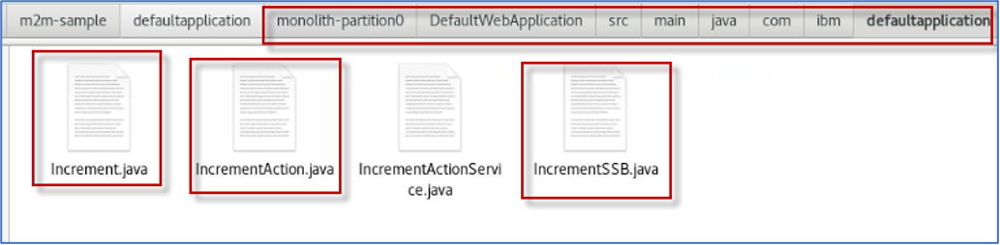
 
  * Service class: Cardinal generated a Service class names IncrementActionService. The service class is the REST Service interface to the IncrementAction service.
 
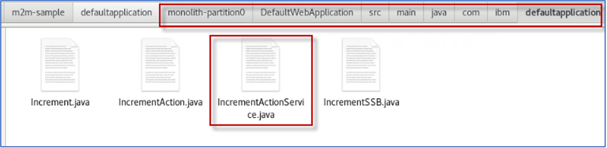

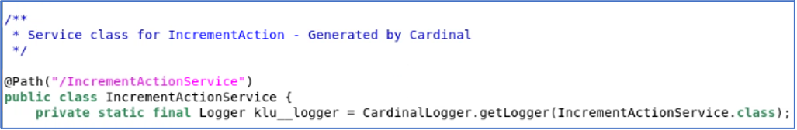
   
  *	Dummy classes: Cardinal generated Dummy classes for classes that are present in the original monolith but are moved to a different partition. The Dummy classes simply throw custom exceptions in the event these classes are unexpectedlyinvoked.   

  Dummy classes for HitCount.java and SnoopServlet.java were generated. 
 
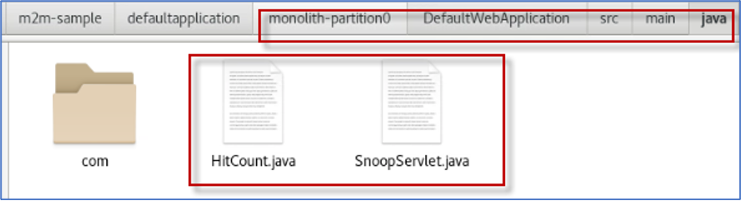

### Appendix B: Examine the Refactored resources after code generation  

In this appendix, you will explore a variety of refactored resources that are representative of the types of refactoring required from many Java application. We will not explore every refactored file. However. You may explore deeper, if desired.  

B.1 Cardinal Utility Code Module

First, to build the generated Cardinal utility code in each partition, this lab we kept the generated application/ folder, but you could have chosen to rename it to something like to cardinal-utils/ to better identify the modules purpose. 

Then, we put together a **pom.xml** fashioned after the monolith’s web module’s pom files, to build it as a utility .jar (with the aim of then including it as an additional module in the partition .ear file):

1.	Navigate to the new **Cardinal Utilities** pom.xml file to view its contents in the web partition. This file was created in ALL partitions. 

```
gedit /home/ibmadmin/m2m-ws-sample/defaultapplication/monolith-web/application/pom.xml
```

This pom.xml file will build a Cardinal Utilities jar file and be included in the partition. The top level pom.xml file was also refactored to include this module for Maven to build
  
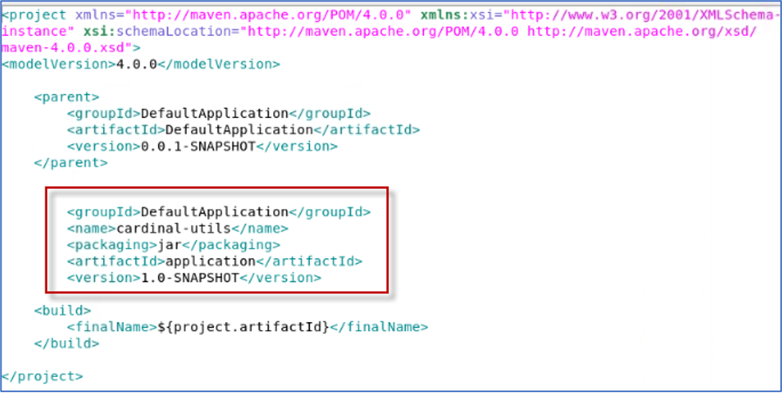
   
B.2 Partitions Build Config

Next, for each partition, the root pom.xml that was copied from the monolith was modified to include the new cardinal-utils module.

1.	Navigate to the top-level pom.xml file in the web partition to view this update. This update was made to all the top-level pom.xml in each partition.  

```
gedit /home/ibmadmin/m2m-ws-sample/defaultapplication/monolith-web/pom.xml
```

The included module to build the Cardinal Utilities must match the **artifactID** in the Cardinal Utils pom.xml that you explored above. 

In this case, it is **application**. It might have been better to rename the module to something like cardinal-utils. But that could be done in another round of refactoring.  
  
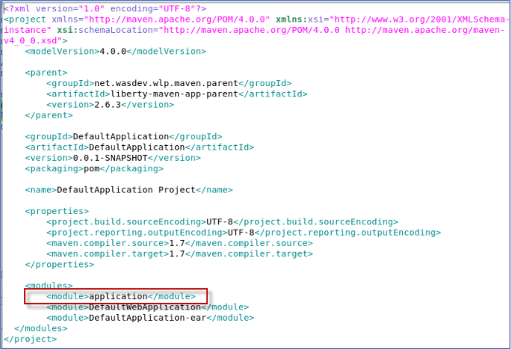

B.3 JAX-RS Configuration

Next look at how to facilitate the JAX-RS code generated by Mono2Micro as these partitions are run on the app server. 

First, as part of the utility code that Cardinal generates, a JAXRSConfiguration class is generated for each partition that has one or more service classes. A service class is class generated by Cardinal that handle incoming REST API calls from outside of the partition.  

This JAXRSConfiguration class sets up the JAX-RS config where all service classes are registered and is meant to be copied over and placed in one Java EE module of your preference within each partition so that it is in the server’s class path. 

For this DefaultApplication example, partition0 partition is the only partition that has a service class. I chose to place the java file in the web module in partitton0, in the same source location as the IncrementActionService class. 

1.	Navigate to the JAXRSConfiguration java file in the partition0 partition to view this update.   

```
gedit /home/ibmadmin/m2m-ws-sample/defaultapplication/monolith-partition0/DefaultWebApplication/src/main/java/com/ibm/defaultapplication/JAXRSConfiguration.java
```

You must specify the package for the class based on where you place the file in the project. 

Notice that this class registered the IncrementActionService class that Cardinal generated. 
  
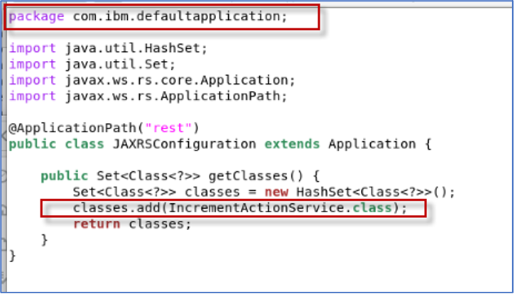
    
B.4 Application Server Config Per Partition

For this DefaultApplication example, the Liberty server config (server.xml) that originally came in the monolith was copied to each partitions ear module. 
  *	The contents of the monolith’s server.xml were **as-is** for parttion0 partition.
  *	The Datasource configuration was removed from the server.xml in the web partition
	
Usually the Liberty server.xml can be further customized and reduced to pull in only applicable server features to each partition.  

If the original monolith was running on a traditional WebSphere server, and you wish to run the partitions on Liberty, a server.xml can either be handcrafted, or created with the assistance of IBM’s other migration and modernization tools. 

Of course, this would only be possible if the monolith uses functionality that WebSphere Liberty supports.  

Additionally, each partition’s server.xml also needs to add JAX-RS related features if they already don’t exist, in order to facilitate the generated code’s JAX-RS webservice service and client code: 

<feature>jaxrs-2.0</feature>
<feature>mpConfig-1.2</feature>
<feature>mpOpenAPI-1.0</feature>

1.	Navigate to the server.xml file in the web partition to view this update.   

```
gedit /home/ibmadmin/m2m-ws-sample/defaultapplication/monolith-web/DefaultApplication-ear/src/main/liberty/config/server.xml
```

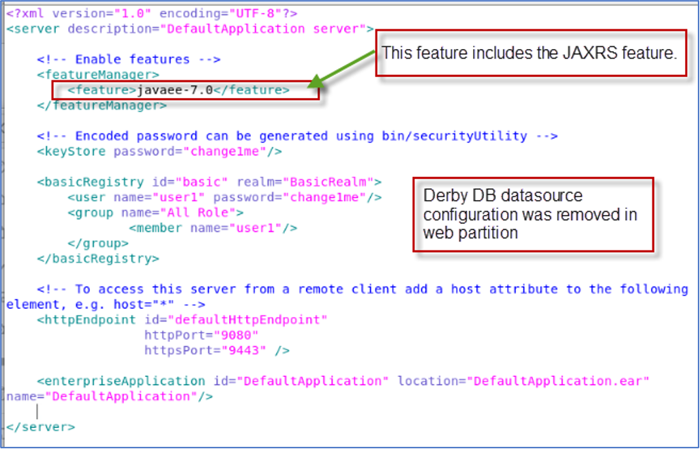

### Appendix C: How can I do this lab using my own environment? 

It is possible to do this lab using your own environment instead of the Skytap environment provided. 

NOTE: The prerequisite software listed in the prerequisites section of the lab MUST be installed on your local environment. 

There were only 3 changes that we had to do, in addition to the obviously issuing commands using your own path instead of /home/ibmadmin:
 
**Section # 7.3 - Run test cases using the instrumented monolith for Runtime data analysis**
  *	Edit the scripts m2m-ws-sample/defaultapplication/scripts/startServer.sh and m2m-ws-sample/defaultapplication/scripts/serverStatus.sh to adjust the path to your own environment
  * OR run the commands manually

```
$LAB_HOME/m2m-ws-sample/defaultapplication/monolith-klu/DefaultApplication-ear/target/liberty/wlp/bin/server start DefaultApplicationServer

$LAB_HOME/m2m-ws-sample/defaultapplication/monolith-klu/DefaultApplication-ear/target/liberty/wlp/bin/server status DefaultApplicationServer
```

**Section # 7.4.4.1 - Move the original non-Java resources from the monolith to the two new partitions**
  *	Edit moveResourcesToPartitions.sh to adjust the path to your own environment, here: WORKDIR="$LAB_HOME/m2m-ws-sample")
 
**Section # 7.4.4.2 - Refactor the original non-Java resources as required for the front-end and back-end partitions**
  *	Edit $LAB_HOME/m2m-ws-sample/defaultapplication/scripts/refactorPartitions.sh to adjust the path to your own environment, here: WORKDIR="$LAB_HOME/m2m-ws-sample"

### Appendix D: How to use Copy / Paste between local desktop and Skytap VMs

In SkyTap, you will find that any text copied to the clipboard on your local workstation is not available to be pasted into the VM on SkyTap. You have to use the copy / Paste capabilities between the lab document on your local workstation to the VM is a good approach to more efficiently work through a lab, while reducing the typing errors that often occur when manually entering data. 

1. First copy the text you intend to paste, from the lab document, to the clipboard on your local workstation, as you always have (CTRL-C)
2. Return to the SkyTap environment and click on the Clipboard at the top of the SkyTap session window. 
 
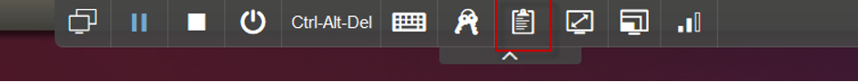
  
3. Use **CTRL-V** to paste the content into the Copy/paste VM clipboard. Or use the paste menu item that is available in the dialog, when you right mouse click in the clipboard text area. 
 
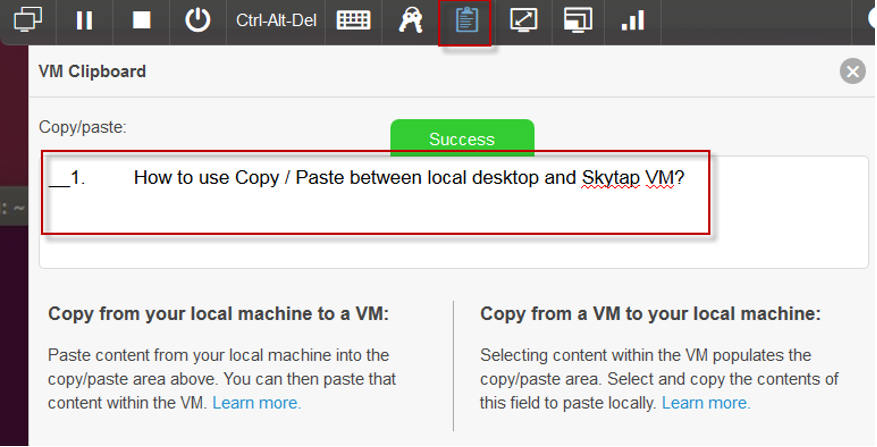
  
4. Once the text is pasted, just navigate away to the VM window where you want to paste the content. Then, use CTRL-C, or right mouse click & us the paste menu item to paste the content. 
 
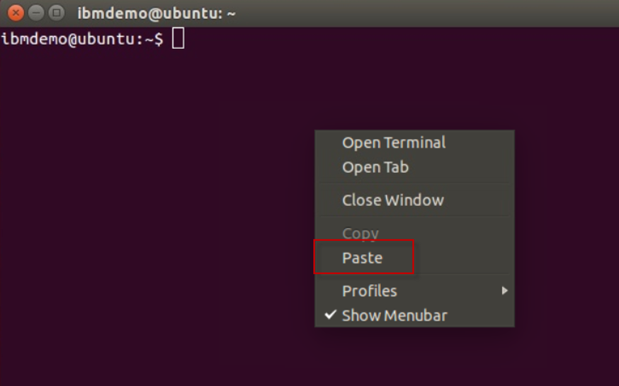
  
The text is pasted into the VM.


 
Note: The very first time you do this, if the text does not paste, you may have to paste the contents into the Skytap clipboard twice. This is a known Skytap issue. It only happens on the 1st attempt to copy / paste into Skytap. 
