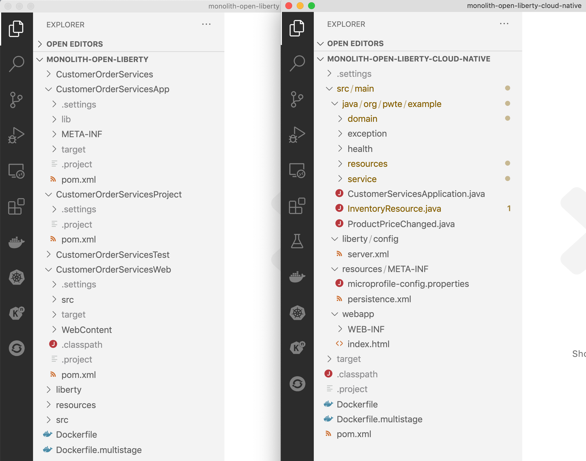

export const Title = () => (
  <span>
Refactoring Java EE Applications<br/> <h2>A phased approach to refactoring a Monolith in to Micro Services</h2>
  </span>
);

<PageDescription>

Modernizing the backend JEE code

</PageDescription>

<AnchorLinks small>
  <AnchorLink>Introduction</AnchorLink>
  <AnchorLink>Move the backend monolith to OpenLiberty</AnchorLink>
  <AnchorLink>Update server.xml</AnchorLink>
  <AnchorLink>Update the pom files</AnchorLink>
  <AnchorLink>Run this solution</AnchorLink>
  <AnchorLink>Summary</AnchorLink>
</AnchorLinks>


## Introduction
In this phase the JEE6 EJB code is modernized to use MicroProfile and is then able to run on the latest open source version of Liberty (OpenLiberty)

## Move the backend monolith to OpenLiberty

  

### Restructure the repository
In order to use the capabilities provided by the OpenLiberty [development mode](https://openliberty.io/blog/2019/10/22/liberty-dev-mode.html) and to make the modernization easier, the structure of the GitHub repository was changed from multiple modules to a single module.

OpenLiberty [development mode](https://openliberty.io/blog/2019/10/22/liberty-dev-mode.html) provides the developer with a framework for:

  - Hot code replacements
  - Debugging incl. debugging in containers
  - IDE support like errors, warnings, auto-complete, and much more

The changes to the repository had the following steps:

- Create a new Open Liberty project and copy the source code from all sub-projects in it
- Merge all pom.xml files
- Take over the configuration files (server.xml, persistence.xml, etc.)
- Update the paths in the Dockerfile

The project structure on the left hand side shows the original multi-modules structure, the right side the simplified new structure.



If you wish to review the repositories structure and pom files, here are the links to the [before repostory](https://github.com/IBM/application-modernization-javaee-quarkus/tree/master/monolith-open-liberty) and [after repository](https://github.com/IBM/application-modernization-javaee-quarkus/tree/master/monolith-open-liberty-cloud-native)

### Replace EJBs with CDI
To simplify the code, EJBs (Enterprise Java Beans) have been replaced with CDI (Contexts and Dependency Injection) since all code runs in the same context now. For example this was the original EJB code:

```
@Stateless
public class ProductSearchServiceImpl implements ProductSearchService {
   ...
}

public class CategoryResource {
   @EJB ProductSearchService productSearch;
   ...
   productSearch = (ProductSearchService) new InitialContext().lookup("java:app/CustomerOrderServices/ProductSearchServiceImpl!org.pwte.example.service.ProductSearchService");
   ...
}
```

This is the converted code using CDI:

```
@ApplicationScoped
public class ProductSearchServiceImpl implements ProductSearchService {
   ...
}

@ApplicationScoped
public class CategoryResource {
   @Inject
   ProductSearchServiceImpl productSearch;
   ...
}
```

In order to handle transactions, you can use @Transactional which is part of the Java/Jakarta EE standard Java Transaction API (JTA). In the easiest case you simply use the annotation on your method.

```
@Transactional
public void updateLineItem(String productId, String newPrice) {
   ...
}
```

If you need more control, you can also manage the transactions manually:

```
@PersistenceContext
protected EntityManager em;

@Resource
UserTransaction utx;

@Transactional
public void updateLineItem(String productId, String newPrice) {
   utx.begin();
   em.persist(lineItem);
   utx.commit();
   ...
}
```

### Update server.xml
In order to `server.xml` file was updated to change the features loaded by Liberty on startup. The older JEE6 features were removed and replaced by jakartaee-8.0` and `microprofile-3.3`. The final [server.xml](https://github.com/IBM/application-modernization-javaee-quarkus/blob/master/monolith-open-liberty/liberty/server.xml) file can be found in the project repository.

```
  <featureManager>
      <feature>microProfile-3.3</feature>
      <feature>jakartaee-8.0</feature>
      <feature>mpReactiveStreams-1.0</feature>
      <feature>mpReactiveMessaging-1.0</feature>
      <feature>monitor-1.0</feature>
  </featureManager>
```

### Update the pom files
After combining the `pom.xml` files in the previous step, it is necessary to now add some dependencies for `jakartaee-8.0` and `microprofile-3.3` as shown below. The final [pom.xml](https://github.com/IBM/application-modernization-javaee-quarkus/blob/master/monolith-open-liberty-cloud-native/pom.xml) file is in the project repository

```
<dependency>
   <groupId>jakarta.platform</groupId>
   <artifactId>jakarta.jakartaee-api</artifactId>
   <version>8.0.0</version>
   <scope>provided</scope>
</dependency>
<dependency>
   <groupId>org.eclipse.microprofile</groupId>
   <artifactId>microprofile</artifactId>
   <version>3.3</version>
   <type>pom</type>
   <scope>provided</scope>
</dependency>
```

### Update the Dockerfile
`OpenLiberty` uses the [openliberty/open-liberty](https://hub.docker.com/r/openliberty/open-liberty) Docker images and has some minor differences from WebSphere Liberty regarding how features are loaded (OpenLiberty has it's own `features.sh` command in addition to `configure.sh`). The final [Dockerfile](https://github.com/IBM/application-modernization-javaee-quarkus/blob/master/monolith-open-liberty-cloud-native/Dockerfile.multistage) can be found in the project repository

```
FROM adoptopenjdk/maven-openjdk11 as BUILD
COPY . /usr/src/app/src
WORKDIR /usr/src/app/src/CustomerOrderServicesProject
RUN mvn clean package

FROM open-liberty:kernel-slim-java11-openj9
USER root
COPY --chown=1001:0 ./liberty/server.xml /config
COPY --chown=1001:0 ./liberty/server.env /config
COPY --chown=1001:0 ./liberty/jvm.options /config

ARG SSL=false
ARG HTTP_ENDPOINT=false

RUN features.sh

COPY --from=build --chown=1001:0 /usr/src/app/src/CustomerOrderServicesApp/target/CustomerOrderServicesApp-0.1.0-SNAPSHOT.ear /config/apps/CustomerOrderServicesApp-0.1.0-SNAPSHOT.ear
COPY --from=build --chown=1001:0 /usr/src/app/src/resources/ /opt/ol/wlp/usr/shared/resources/
RUN chown -R 1001.0 /config /opt/ol/wlp/usr/servers/defaultServer /opt/ol/wlp/usr/shared/resources && chmod -R g+rw /config /opt/ol/wlp/usr/servers/defaultServer  /opt/ol/wlp/usr/shared/resources

USER 1001
RUN configure.sh
```

### Run this solution
Use the following steps to run this solution locally on Docker

```
$ git clone https://github.com/IBM/application-modernization-javaee-quarkus.git && cd application-modernization-javaee-quarkus
$ ROOT_FOLDER=$(pwd)
$ sh ${ROOT_FOLDER}/scripts-docker/build-and-run-monolith-db2.sh
$ sh ${ROOT_FOLDER}/scripts-docker/build-and-run-splitted-frontend-open.sh
```

## Summary
This application has been refactored in a series of steps from the original [WebSphere ND v8.5.5 version](https://github.com/ibm-cloud-architecture/cloudpak-for-applications/tree/was855) to run as Micro Services on Red Hat OpenShift.
