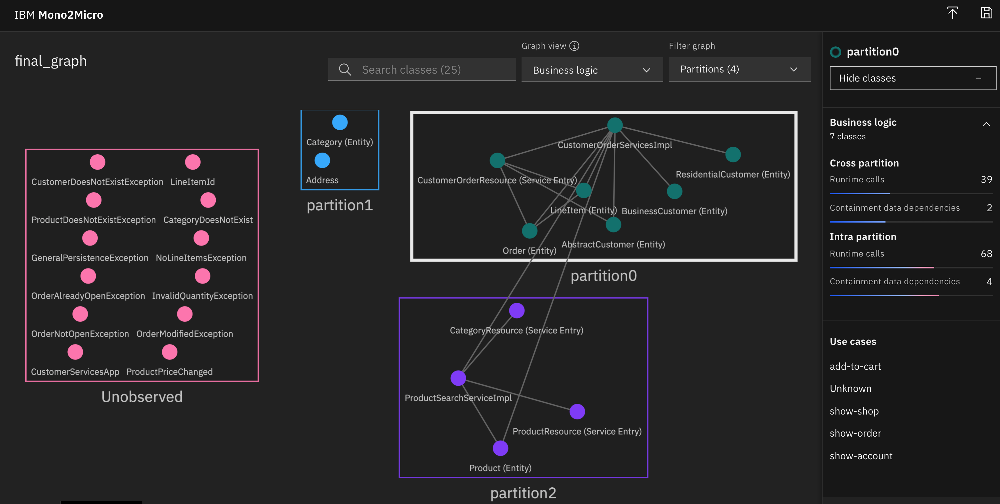
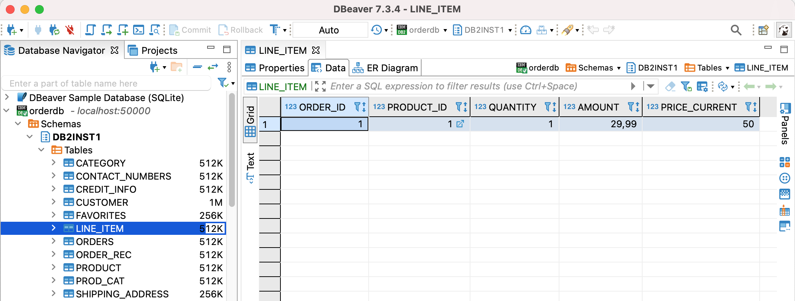

export const Title = () => (
  <span>
Refactoring Java EE Applications<br/> <h2>Using the strangler pattern</h2>
  </span>
);

<PageDescription>

Using the strangler pattern

</PageDescription>

<AnchorLinks small>
  <AnchorLink>Introduction</AnchorLink>
  <AnchorLink>Refactor the Catalog service to Quarkus</AnchorLink>
  <AnchorLink>Analyze the Mono2Micro results</AnchorLink>
  <AnchorLink>Run this solution</AnchorLink>
  <AnchorLink>Summary</AnchorLink>
</AnchorLinks>


## Introduction
In this phase the backend application was analyzed and the Catalog service was identified as a candidate to be extracted in to it's own Micro Service. The code was strangled from the monolith and deployed using Quarkus allowing the service to be developed, deployed and scaled independently of the rest of the application code.

### Refactor the Catalog service to Quarkus
The [Mono2Micro](http://ibm.biz/Mono2Micro) tool was used to identify the `Catalog` service as a good candidate to become it's own service. In this scenario, the `Catalog` service handles information about the items in the store such as prices, titles, ratings and descriptions. When this information changes the store front as well as the items in the users carts should be updated.

  

### Analyze the Mono2Micro results
Running Mono2Micro is out of the scope of this article but detailed steps can be found [here](http://heidloff.net/article/step-by-step-instructions-mono2micro/).

  

The purple rectangle is essentially the catalog service (except of the missing Category class).

The green classes make up the remaining monolith (except of Address).

The red classes need to be assigned to either the catalog service of the remaining monolith dependent of class dependencies. Most of them are exceptions which weren’t covered in the use cases.

### The Quarkus Event Producer
In order to display the new price, the order service (the remaining monolith) could invoke a synchronous REST API of the catalog service. However, in order to minimize the coupling between the components, we will use events instead.

Here is the [code](https://github.com/nheidloff/application-modernization-javaee-quarkus/blob/master/service-catalog-quarkus-synch/src/main/java/com/ibm/catalog/ProductResource.java) of the ‘strangled’ catalog service which has been implemented with Quarkus. The application uses MicroProfile and Kafka to send events asynchronously.

```
@PUT
@Consumes("application/json")
@Produces("application/json")
@Path("/CustomerOrderServicesWeb/jaxrs/Product/{id}")
@Transactional
public Product update(@PathParam("id") Long id, Product updatedProduct) {
   Product existingProduct = entityManager.find(Product.class, id);
   if (existingProduct == null) {
      throw new WebApplicationException(Response.Status.BAD_REQUEST);
   }
   existingProduct.price = updatedProduct.price;
   entityManager.persist(existingProduct);
   sendMessageToKafka(existingProduct.id, existingProduct.price);
   return existingProduct;
}

@ConfigProperty(name = "kafka.bootstrap.servers")
String kafkaBootstrapServer;

@Inject
Vertx vertx;

private KafkaProducer<String, String> producer;

@PostConstruct
void initKafkaClient() {
   Map<String, String> config = new HashMap<>();
   config.put("bootstrap.servers", kafkaBootstrapServer);
   config.put("key.serializer", "org.apache.kafka.common.serialization.StringSerializer");
   config.put("value.serializer", "org.apache.kafka.common.serialization.StringSerializer");
   producer = KafkaProducer.create(vertx, config);
}

public void sendMessageToKafka(Long productId, BigDecimal price) {
   String productIdString = productId.toString();
   String priceString = price.toString();
   try {
      KafkaProducerRecord<String, String> record = KafkaProducerRecord.create("product-price-updated", productIdString + "#" + priceString);
      producer.write(record, done -> System.out.println("Kafka message sent: product-price-updated - " + productIdString + "#" + priceString));
   } catch (Exception e) {
   }
}
```

### The Event Consumer
The remaining monolith runs on Open Liberty. In order to prevent synchronous invocations of the catalog service, it caches the changed prices in it’s own Db2 database in a new column.

  

Here is the [code](https://github.com/nheidloff/application-modernization-javaee-quarkus/blob/master/monolith-open-liberty-cloud-native/src/main/java/org/pwte/example/ProductPriceChanged.java) of the remaining monolith which also uses MicroProfile.

```
import org.eclipse.microprofile.reactive.messaging.Incoming;
import javax.enterprise.context.ApplicationScoped;
import org.pwte.example.service.CustomerOrderServicesImpl;
import javax.inject.Inject;

@ApplicationScoped
public class ProductPriceChanged {

@Inject
CustomerOrderServicesImpl customerOrderServices;

@Incoming("product-price-updated")
public String process(String message) {
   String productId = "";
   String newPrice = "0";
   try {
      productId = message.substring(0, message.indexOf("#"));
      newPrice = message.substring(message.indexOf("#") + 1, message.length());
      customerOrderServices.updateLineItem(productId, newPrice);
   }
   catch (Exception e) {}
      return message;
   }
}
```

### Run this solution
Use the following steps to run this solution locally on Docker

```
$ git clone https://github.com/IBM/application-modernization-javaee-quarkus.git && cd application-modernization-javaee-quarkus
$ ROOT_FOLDER=$(pwd)
$ sh ${ROOT_FOLDER}/scripts-docker/build-and-run-monolith-db2.sh
$ sh ${ROOT_FOLDER}/scripts-docker/run-database-postgres-catalog.sh
$ sh ${ROOT_FOLDER}/scripts-docker/run-kafka.sh
$ sh ${ROOT_FOLDER}/scripts-docker/build-and-run-catalog.sh
```

## Summary
This application has been refactored in a series of steps from the original [WebSphere ND v8.5.5 version](https://github.com/ibm-cloud-architecture/cloudpak-for-applications/tree/was855) to run as Micro Services on Red Hat OpenShift.
