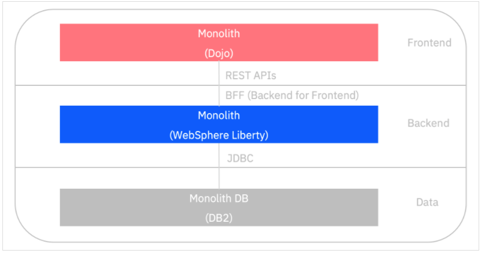

export const Title = () => (
  <span>
Refactoring Java EE Applications<br/> <h2>Extracting the frontend code</h2>
  </span>
);

<PageDescription>

Extracting the frontend code

</PageDescription>

<AnchorLinks small>
  <AnchorLink>Introduction</AnchorLink>
  <AnchorLink>Separate the frontend from the monolith</AnchorLink>
  <AnchorLink>Run this solution</AnchorLink>
  <AnchorLink>Summary</AnchorLink>
</AnchorLinks>


## Introduction
Once the monolith is containerized the application owners may choose to separate the frontend application code (DOJO based) from the monolith's EAR file in to a separately deployable component. With the front and backend separated they can be developed, tested and deployed independently.


### Separate the frontend from the monolith

The CustomerOrderServices application frontend was developed using the [DOJO Toolkit](https://dojotoolkit.org/) which is similar to jQuery and communicates with the backend using HTTP based REST APIs which use JSON for data. While these APIs are not resource focused (instead they are RPC style), they do still allow an easy seperation of the frontend and backend with the *backend for frontend* (BFF) pattern. Had the frontend used older server-side technologies such as JSP or JSF then a rewrite of the frontend would probably have been required.



Given that the frontend is now static client-side HTML content that doesn't require an application server to *serve* it, it could be deployed using a simple web server such as NGINX. In this example it is deployed using WebSphere Liberty for simplicity as it was going to be rewritten to use newer technologies later in the modernization journey.

### Run this solution
Use the following steps to run this solution locally on Docker

```
$ git clone https://github.com/IBM/application-modernization-javaee-quarkus.git && cd application-modernization-javaee-quarkus
$ ROOT_FOLDER=$(pwd)
$ sh ${ROOT_FOLDER}/scripts-docker/build-and-run-monolith-db2.sh
$ sh ${ROOT_FOLDER}/scripts-docker/build-and-run-splitted-frontend.sh
```

- Open [http://localhost/CustomerOrderServicesWeb](http://localhost/CustomerOrderServicesWeb) in order to test the application and see the frontend

## Summary
This frontend of the application has been extracted from the EAR file and is deployed to its own container. This gives more flexibility to develop and deploy the parts of the application independently of each other.
