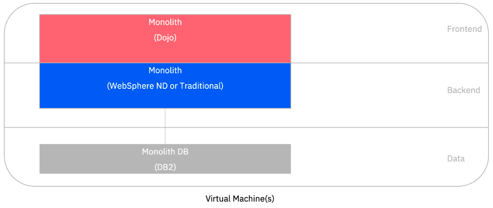
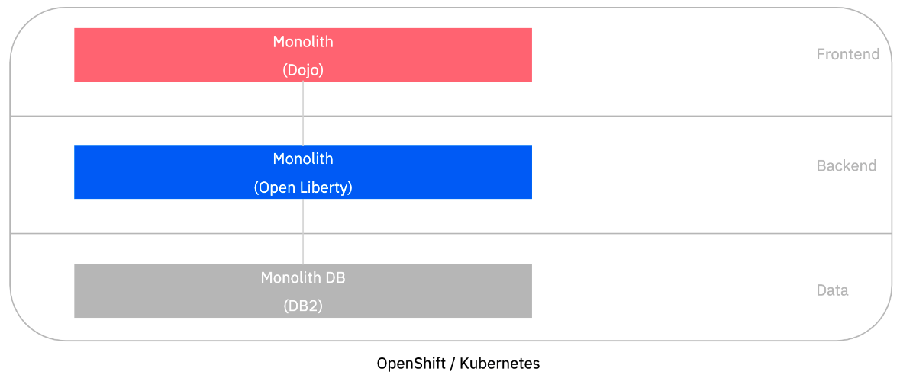
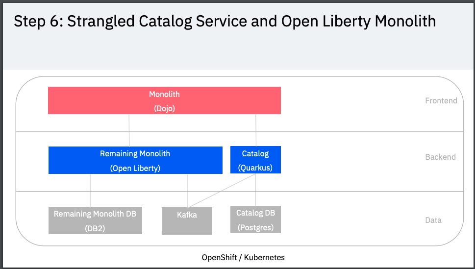

export const Title = () => (
  
Refactoring Java EE Applications  <h2>A phased approach to refactoring a Monolith in to Micro Services</h2>
  
);

<PageDescription>

A phased approach to refactoring a Monolith in to Micro Services

</PageDescription>

<AnchorLinks small>
  <AnchorLink>Introduction</AnchorLink>
  <AnchorLink>How the Application was Modernized</AnchorLink>
  <AnchorLink>Move the monolith to WebSphere Liberty with minimal changes</AnchorLink>
  <AnchorLink>Separate the frontend from the monolith</AnchorLink>
  <AnchorLink>Move the backend monolith to OpenLiberty</AnchorLink>
  <AnchorLink>Refactor the Catalog service to Quarkus</AnchorLink>
  <AnchorLink>Building Micro-frontends and further modernization</AnchorLink>
  <AnchorLink>Summary</AnchorLink>
</AnchorLinks>

## Introduction
This document descibes the phases that were performed to modernize the **Customer Order Services** application taking the legacy JEE6 application, removing older technologies, updating the frontend and strangling a microservice. Niklas describes the process in the video below:

<iframe width="560" height="315" src="https://www.youtube.com/embed/lw95LLqa37g" frameborder="0" allow="accelerometer; autoplay; clipboard-write; encrypted-media; gyroscope; picture-in-picture" allowfullscreen></iframe>

## How the Application was Modernized
The **Customer Order Services** application is a simple store-front shopping application, built during the early days of the Web 2.0 movement. Users interact directly with a browser-based interface and manage their cart to submit orders.  This application is built using the traditional [3-Tier Architecture](http://www.tonymarston.net/php-mysql/3-tier-architecture.html) model, with an HTTP server, an application server, and a supporting database.

There are several components of the overall application architecture:
- Starting with the database, the application leverages two SQL-based databases running on [IBM DB2](https://www.ibm.com/analytics/us/en/technology/db2/).
- The application exposes its data model through an [Enterprise JavaBean](https://en.wikipedia.org/wiki/Enterprise_JavaBeans) layer, named **CustomerOrderServices**.  This components leverages the [Java Persistence API](https://en.wikibooks.org/wiki/Java_Persistence/What_is_JPA%3F) to exposed the backend data model to calling services with minimal coding effort.
  - This build of the application uses JavaEE6 features for EJBs and JPA.
- The next tier of the application, named **CustomerOrderServicesWeb**, exposes the necessary business APIs via REST-based web services.  This component leverages the [JAX-RS](https://en.wikipedia.org/wiki/Java_API_for_RESTful_Web_Services) libraries for creating Java-based REST services with minimal coding effort.
  - This build of the application is using **JAX-RS 1.1** version of the respective capability.
- The application's user interface is exposed through the **CustomerOrderServicesWeb** component as well, in the form of a [Dojo Toolkit](#tbd)-based JavaScript application.  Delivering the user interface and business APIs in the same component is one major inhibitor our migration strategy will help to alleviate in the long-term.
- Finally, there is an additional integration testing component, named **CustomerOrderServicesTest** that is built to quickly validate an application's build and deployment to a given application server.  This test component contains both **JPA** and **JAX-RS**-based tests.

  

### Move the monolith to WebSphere Liberty with minimal changes
The first phase of the modernization is to move the existing JEE6 application from traditional WebSphere ND to a WebSphere Liberty container using IBM Cloud Transformation Advisor

  

This phase has it's own section in this playbook titled [Runtime Modernization](https://ibm-cloud-architecture.github.io/modernization-playbook/applications/liberty)

### Separate the frontend from the monolith
Once the monolith is containerized the application owners may choose to separate the frontend application code (DOJO based) from the monolith's EAR file in to a separately deployable component. With the front and backend separated they can be developed, tested and deployed independently.

  

A more detailed description of the steps that were taken in this phase can be found [here](refactor/frontend)

### Move the backend monolith to OpenLiberty
In this phase the JEE6 EJB code is modernized to use MicroProfile and is then able to run on the latest open source version of Liberty (OpenLiberty)

  

A more detailed description of the steps that were taken in this phase can be found [here](refactor/backend)

### Refactor the Catalog service to Quarkus
In this phase the backend application was analyzed and the Catalog service was identified as a candidate to be extracted in to it's own Micro Service. The code was strangled from the monolith and deployed using Quarkus

  

A more detailed description of the steps that were taken in this phase can be found [here](refactor/catalog)

### Building Micro-frontends and further modernization
The next logical step in the modernization journey is to address the legacy circa-2010 web front end and replace it with [micro frontends](http://heidloff.net/article/using-micro-frontends-microservices/). You may be interested in articles that describe how to create [Micro frontends with SPA](http://heidloff.net/article/developing-micro-frontends-single-spa/) and [loosely coupled micro frontends with RxJS](http://heidloff.net/article/developing-loosely-coupled-micro-frontends-rxjs/)

## Summary
This application has been refactored in a series of steps from the original [WebSphere ND v8.5.5 version](https://github.com/ibm-cloud-architecture/cloudpak-for-applications/tree/was855) to run as Micro Services on Red Hat OpenShift.
