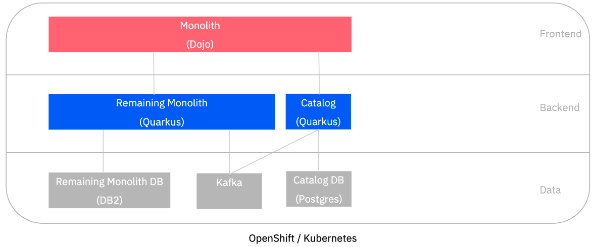
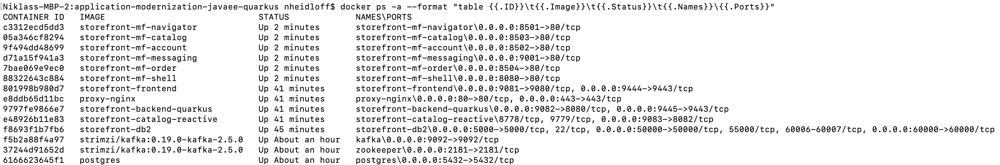
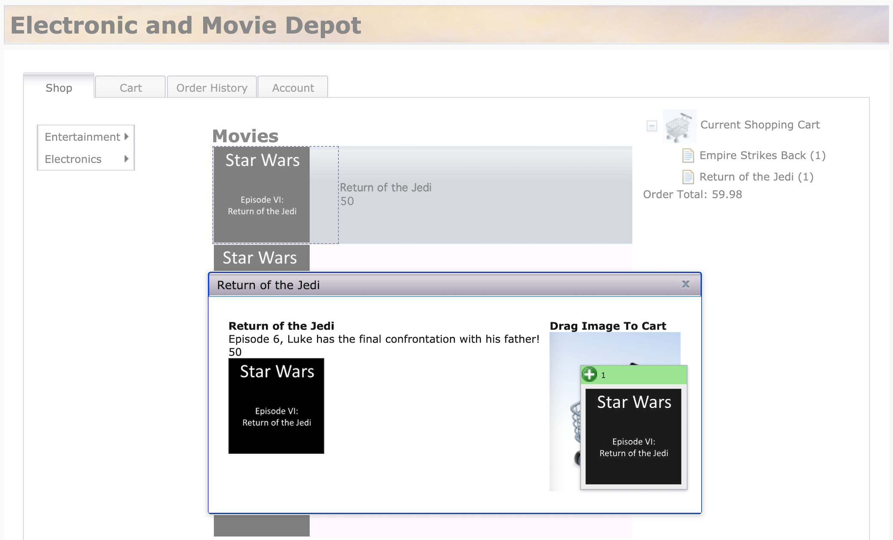
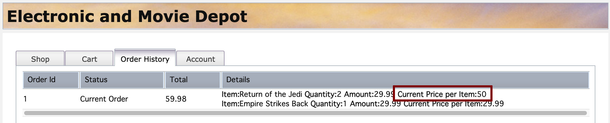

export const Title = () => (
  <span>
Refactoring Java EE Applications<br/> <h2>Run the solution locally using Docker Compose</h2>
  </span>
);

<PageDescription>

Run the solution locally using Docker Compose

</PageDescription>

<AnchorLinks small>
  <AnchorLink>Introduction</AnchorLink>
  <AnchorLink>Run the final solution</AnchorLink>
  <AnchorLink>Run the WebSphere Liberty monolith solution</AnchorLink>
  <AnchorLink>Run the separated frontend solution</AnchorLink>
  <AnchorLink>Run the backend monolith on OpenLiberty solution</AnchorLink>
  <AnchorLink>Run the refactored Catalog service on Quarkus solution</AnchorLink>
  <AnchorLink>Summary</AnchorLink>
</AnchorLinks>


## Introduction
This section covers how to run the solution at various stages throughout the modernization journey. Docker Compose is used to provide an environment to run the containers that make up the application.

This application requires Docker to be configured with:
  - Docker + Docker Compose
  - 14 GB RAM
  - 10 CPUs
  - 80 GB Disk Space (for images)

## Run the final solution
The final solution for the refactoring effort has the components shown below

  

Use the following commands to clone the repository and start the containers for the application.

```
$ git clone https://github.com/IBM/application-modernization-javaee-quarkus.git && cd application-modernization-javaee-quarkus
$ ROOT_FOLDER=$(pwd)
$ sh ${ROOT_FOLDER}/scripts-docker/build-and-run.sh
```

**Note:** it may take 10 or more minutes for all of the containers to build and start

The 'build-and-run.sh' script will launch the following containers.



Once everything has been started, you can open the web applications:

- Legacy Dojo frontend: http://localhost/CustomerOrderServicesWeb

- Modern micro-frontend based application: http://localhost:8080

Add the item "Return of the Jedi" to the shopping cart via drag and drop.



Update the price of this item:

```
$ curl -X PUT "http://localhost/CustomerOrderServicesWeb/jaxrs/Product/1" -H "accept: application/json" -H "Content-Type: application/json" -d "{\"id\":1, \"price\":50}"
```

Open the "Order History" tab to see the updated price. The new price has been updated in the catalog service and the remaining monolith.



### Run the WebSphere Liberty monolith solution
If you are interested in the initial WebSphere Liberty solution with a single monolith deployed, then you can run the commands shown below:

  

```
$ git clone https://github.com/nheidloff/application-modernization-javaee-quarkus.git && cd application-modernization-javaee-quarkus
$ ROOT_FOLDER=$(pwd)
$ sh ${ROOT_FOLDER}/scripts-docker/build-and-run-monolith-db2.sh
$ sh ${ROOT_FOLDER}/scripts-docker/build-and-run-monolith-app.sh
```

- Open [http://localhost/CustomerOrderServicesWeb](http://localhost/CustomerOrderServicesWeb) in order to test the application and see the frontend

### Run the separated frontend solution
If you are interested in the solution that took the single monolith and split out the frontend component from the EJB code, then you can run the commands shown below:

  

```
$ git clone https://github.com/IBM/application-modernization-javaee-quarkus.git && cd application-modernization-javaee-quarkus
$ ROOT_FOLDER=$(pwd)
$ sh ${ROOT_FOLDER}/scripts-docker/build-and-run-monolith-db2.sh
$ sh ${ROOT_FOLDER}/scripts-docker/build-and-run-splitted-frontend.sh
```

- Open [http://localhost/CustomerOrderServicesWeb](http://localhost/CustomerOrderServicesWeb) in order to test the application and see the frontend

### Run the backend monolith on OpenLiberty solution
If you are interested in the solution that took the backend monolith and modernized the code to run on OpenLiberty and removed the EJBs, then you can run the commands shown below:

  

```
$ git clone https://github.com/IBM/application-modernization-javaee-quarkus.git && cd application-modernization-javaee-quarkus
$ ROOT_FOLDER=$(pwd)
$ sh ${ROOT_FOLDER}/scripts-docker/build-and-run-monolith-db2.sh
$ sh ${ROOT_FOLDER}/scripts-docker/build-and-run-splitted-frontend-open.sh
```

- Open [http://localhost/CustomerOrderServicesWeb](http://localhost/CustomerOrderServicesWeb) in order to test the application and see the frontend

### Run the refactored Catalog service on Quarkus solution
If you are interested in the solution that took strangled the Catalog service from the monolith and deployed it using Quarkus, then you can run the commands shown below:

  

```
$ git clone https://github.com/IBM/application-modernization-javaee-quarkus.git && cd application-modernization-javaee-quarkus
$ ROOT_FOLDER=$(pwd)
$ sh ${ROOT_FOLDER}/scripts-docker/build-and-run-monolith-db2.sh
$ sh ${ROOT_FOLDER}/scripts-docker/run-database-postgres-catalog.sh
$ sh ${ROOT_FOLDER}/scripts-docker/run-kafka.sh
$ sh ${ROOT_FOLDER}/scripts-docker/build-and-run-catalog.sh
```

- Open [http://localhost/CustomerOrderServicesWeb](http://localhost/CustomerOrderServicesWeb) in order to test the application and see the frontend

## Summary
This application has been refactored in a series of steps from the original [WebSphere ND v8.5.5 version](https://github.com/ibm-cloud-architecture/cloudpak-for-applications/tree/was855) to run as Micro Services on Red Hat OpenShift.
