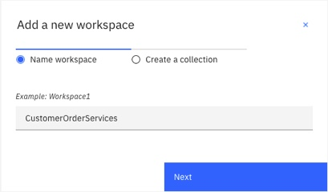
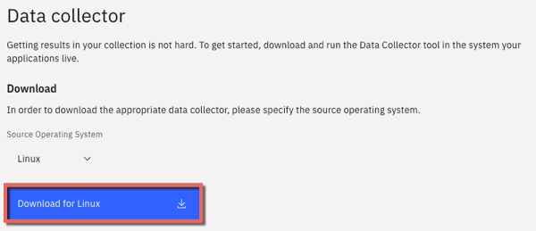
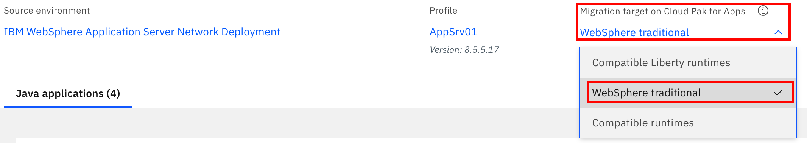
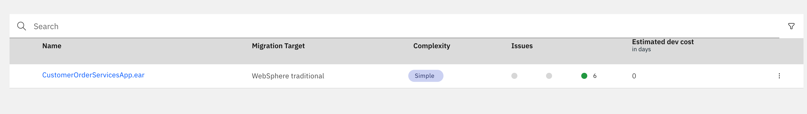
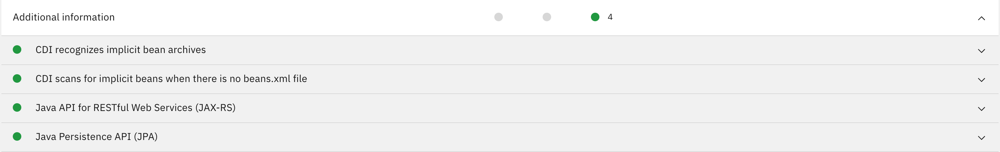
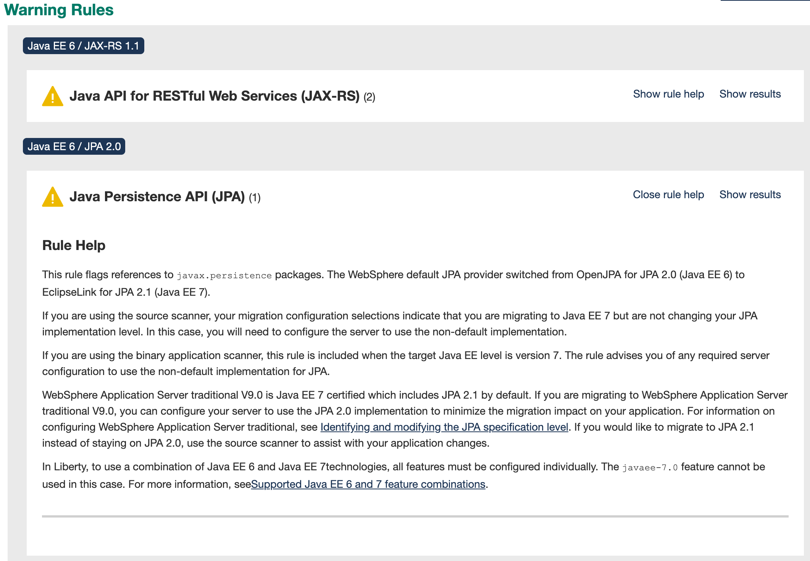

export const Title = () => (
  <span>
Modernizing operations <br/> <h2>Analyze existing applications</h2>
  </span>
);

<PageDescription>

This section covers how to use [IBM Cloud Transformation Advisor](https://www.ibm.com/cloud/garage/practices/learn/ibm-transformation-advisor) to analyze an existing traditional WebSphere application. For this scenario the traditional WebSphere Application Server runtime is chosen as the target runtime and the intention is to migrate this application without code changes. Migrating to the containerized version of traditional WebSphere Application Server will prepare the organization for:

- moving workloads to the cloud.
- improving DevOps and speed-to-market.
- receiving the benefits of the consistency and reliability of containers.

</PageDescription>

## Summary
This section has the following steps:

<AnchorLinks small>
  <AnchorLink>Introduction to IBM Cloud Transformation Advisor </AnchorLink>
  <AnchorLink>Install IBM Cloud Transformation Advisor</AnchorLink>
  <AnchorLink>Scan a WebSphere Environment or use the pre-provided file</AnchorLink>
  <AnchorLink>Download the Data Collector</AnchorLink>
  <AnchorLink>Run the Data Collector </AnchorLink>
  <AnchorLink>Upload the Data Collector results </AnchorLink>
  <AnchorLink>Analyze the Recommendations </AnchorLink>
</AnchorLinks>

## Introduction to IBM Cloud Transformation Advisor
IBM Cloud Transformation Advisor helps you access, analyze and modernize middleware based apps into IBM Cloud(s). It categorizes Java EE apps and MQ queue managers as simple, medium and complex based on migration complexity and provides guidance for modernization. IBM Cloud Transformation Advisor can accelerate the process to move your on-premises apps to cloud, minimize migration errors and risks, and reduce time to market in five steps.

You can use IBM Transformation Advisor for these activities:
- Identify the Java EE programming models in an app
- Determine the complexity of apps by reviewing a high-level inventory of the content and structure of each app
- Highlight the Java EE programming model and WebSphere API differences between the profile types
- Learn any Java EE specification implementation differences that might affect the app

The tool also provides suggestions for the right-fit IBM WebSphere Application Server edition and offers advice, practices, and potential solutions to move apps to WebSphere Liberty or to newer versions of WebSphere Application Server.

## Note
If you don't have an environment to scan a [sample IBM Cloud Transformation Advisor Data Collector results file](https://github.com/ibm-cloud-architecture/appmod-liberty-tekton/blob/master/AppSrv01.zip) has been provided for you and you can still complete the steps in this exercise.

## Install IBM Cloud Transformation Advisor
IBM Cloud Transformation Advisor is split in to two components (the `analysis engine` and the `data collector`). You can choose to between installing the `analysis engine` into a Red Hat OpenShift cluster with Cloud Pak for Applications or a stand-alone operator, or locally on a machine with Docker.

[Installing IBM Cloud Transformation Advisor on IBM Cloud Pak for Applications](https://www.ibm.com/support/knowledgecenter/SS5Q6W/gettingStarted/deployICP4A.html)

[Installing IBM Cloud Transformation Advisor locally](https://www.ibm.com/cloud/garage/tutorials/install-ibm-transformation-advisor-local)

[Installing IBM Cloud Transformation Advisor with an operator](https://www.ibm.com/support/knowledgecenter/SS5Q6W/gettingStarted/operatorHub.html)

## Scan a WebSphere Environment or use the pre-provided file
If you have configured traditional WebSphere ND with the Customer Order Services application using the provided [instructions](https://github.com/ibm-cloud-architecture/cloudpak-for-applications/tree/was855) then you can proceed with the `Download the Data Collector` and `Run the Data Collector` steps below.

Alternatively, you can use the provided Data Collector [results file](https://github.com/ibm-cloud-architecture/appmod-liberty-tekton/blob/master/AppSrv01.zip) and jump to the [Upload the Data Collector results](#upload-the-data-collector-results) section.

### Download the Data Collector
Once IBM Cloud Transformation Advisor is installed, it is necessary to create a new Workspace and Collection and then download the **Data Collector** that will be used to examine the existing environment and applications.

1. Open IBM Cloud Transformation Advisor in a browser and click the button to create a new **Workspace**

  

2. Enter a Workspace name such as `CustomerOrderServices` and click **Next**

  

3. Enter a Collection name such as `WAS855_AppSrv01` and click **Let's go**

  

4. When the **No recommendations available** page is displayed, click the **Data Collector** button

  

5. When the **Data Collector** page is displayed, select the **Source Operating System** for your environment and click the **Download** button to download the Data Collector.

  

  This results in a file with a name similar to `transformationadvisor-Linux_CustomerOrderServices_WAS855_AppSrv01.tgz` being downloaded.

## Run the Data Collector
Upload the Data Collector zip file that was downloaded from IBM Cloud Transformation Advisor in the previous step to the machine that the WebSphere ND Deployment Manager or the Standalone WebSphere Application Server is installed. The directory used is arbitrary.

1. Navigate to the directory you uploaded the `transformationadvisor-Linux_CustomerOrderServices_WAS855_AppSrv01.tgz` file to and issue the following commands to extract the Data Collector:

  ```bash
  mkdir datacollector
  cd datacollector
  mv transformationadvisor-Linux_CustomerOrderServices_WAS855_AppSrv01.tgz .
  tar -zxvf transformationadvisor-Linux_CustomerOrderServices_WAS855_AppSrv01.tgz
  cd transformationadvisor-*
  ```

2. It is necessary to modify the scan performed by the Data Collector to include the `org.pwte` package as the Data Collector doesn't scan `org.*` packages by default. Open the `conf/customCmd.properties` file and modify it as shown below:

  ```bash
  scan_opt=--excludePackages=ch.qos,com.fasterxml,com.ibm,com.informix,com.lowagie,com.mchange,com.meterware,com.microsoft,com.sun,com.sybase,freemarker,groovy,java,javax,net,oracle,sqlj,sun,twitter4j,_ibmjsp --includePackages=org.pwte
  #java_opt=-Xmx2g
  ```

2. The following command assumes that WebSphere Application Server v855 is installed to `/opt/IBM/WebSphere/AppServer855` with a **profile** named `AppSrv01` and that the **administration user** is `wasadmin` with a **password** of `wasadmin`. Modify and issue the following command as necessary to execute the Data Collector against the WebSphere environment:

  ```bash
  ./bin/transformationadvisor -w /opt/IBM/WebSphere/AppServer855 -p AppSrv01 wasadmin wasadmin
  ```

3. When prompted, accept the **license agreement**. The Data Collection process will now start and will analyze all of the applications installed in the WebSphere Application Server environment and will also collect the related Java EE artifacts such as Data Sources and JMS definitions.

4. When the analysis is complete, the Data Collector will attempt to upload the collection results to IBM Cloud Transformation Advisor. If this is successful, you can skip to the **Analyze the Recommendations** section. If not, you will receive an error at the end of Data Collection and will find a file named `AppSrv01.zip` in your current directory as shown below.

  ```bash
  ~/datacollector/transformationadvisor-1.9.6# ls -la *.zip
  -rw-r--r-- 1 root root 625493 Jun 12 12:58 AppSrv01.zip
  ```

  Download this **Data Collector Results zip** file ready for uploading to IBM Cloud Transformation Advisor in the next section

### Upload the Data Collector results
In this section the results from the Data Collector will be uploaded to IBM Cloud Transformation Advisor.

1. In the IBM Cloud Transformation Advisor web browser session, click the **Recomendations** link in the top left corner and then click the **Upload data** button as shown below

  

2. When the **Upload data** dialog is displayed, use the **Drop or Add File** button to select the **Data Collector Results zip** file that was downloaded in the previous section. Click **Upload**

  

  After a few moments the upload of the data collector results will be completed.

## Analyze the Recommendations
Once the Data Collector Results have been uploaded to IBM Cloud Transformation Advisor a set of recommendations will be created and shown on the **Recommendations** page. In this section the recommendations will be analyzed and interpreted.

1. The default recommendations are based on a target of **Compatible Liberty runtimes**. In this scenario the desired target runtime is **WebSphere traditional**. Use the **Migration target on Cloud Pak for Apps** drop down to select WebSphere traditional as shown below.

  

2. The Data Collector analyzed all of the applications running on the traditional WebSphere profile and displays a row in the chart for each application.

  

  In the case of the **CustomerOrderServicesApp.ear** application, IBM Cloud Transformation Advisor has determined that the migration to WebSphere traditional is of **Simple** complexity and that there are four **Suggested issues** that have been detected. Click on the **CustomerOrderServicesApp.ear** application name to see more information.

3. Review the analysis results and scroll down to the **Issue details** section and the **Additional information**. Note that IBM Cloud Transformation Advisor has detected that there are issues with JPA. In this case it determined to use a non-default setting to avoid an issue where the second-level cache and the JPA configuration properties would need to be migrated. There is also a JAX-RS suggestion to use a non-default setting.  If not using the non-default settings there would be changes required with JAX-RS (to handle missing Apache and Wink packages). These two issues are related to a decision that was taken by IBM to allow WebSphere Application Server V9 to run in either JPA 2.0 or JPA 2.1 mode [as described here](https://www.ibm.com/support/knowledgecenter/SSEQTP_9.0.0/com.ibm.websphere.base.doc/ae/cejb_jpa21_behavior.html) and in either JAX-RS 2.0 or JAX-RS 1.1 mode [as described here](https://www.ibm.com/support/knowledgecenter/en/SS7K4U_9.0.0/com.ibm.websphere.zseries.doc/ae/rwbs_jaxrs_coexist.html). Transformation Advisor will make the needed changes for you in order to run in JPA 2.1 mode and JAX-RS 2.0 mode. The application **can run** in JPA 2.0 mode and JAX-RS 1.1 mode **with no changes** by the user due to the automated changes Transformation Advisor makes.

  

4. In order to review the IBM Cloud Transformation Advisor results in more detail, scroll to the bottom of the analysis page and click on the **Analysis Report** link

  

5. When the warning dialog is displayed, click **OK**

  

6. The **Detailed Migration Analysis Report** will be displayed which show the results of the migration rules that were executed by the Data Collector and returned results. Scroll down to the **Warning Rules** section and click on the **Show rule help** link for each of the results. Review the recommendations.

  

### Final Analysis
The intention of this traditional WebSphere V855 --> traditional WebSphere V9 scenario is to migrate the Customer Order Services application to the new runtime without code changes.

IBM Cloud Transformation Advisor was used to analyze the application for compatibility with traditional WebSphere V9 and determined that code changes would be required.

Now proceed to the [traditional WebSphere - Build](tWAS-build) section where the process of extracting the application configuration from the WebSphere V855 Application Server profile will be covered step-by-step
