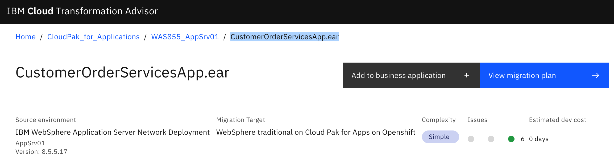
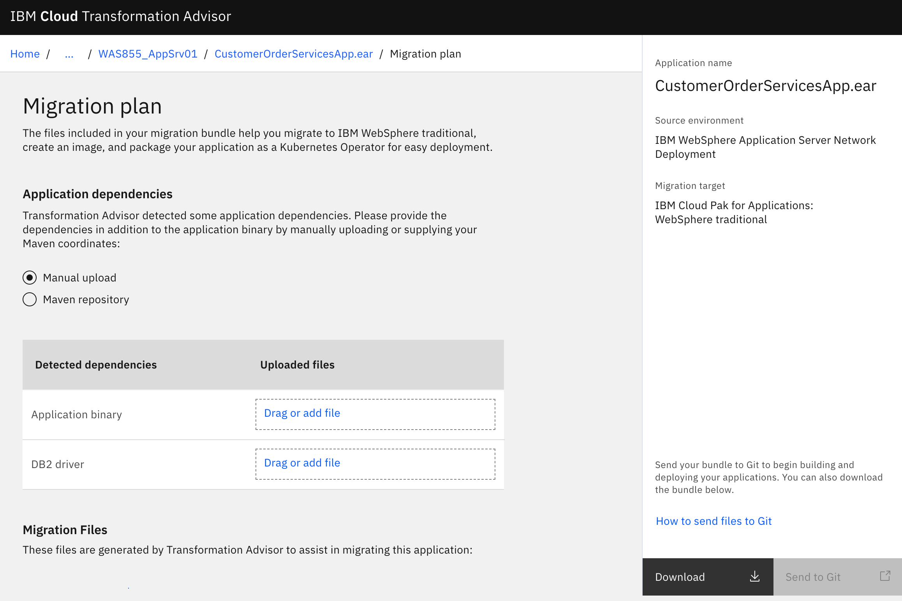

export const Title = () => (
  <span>
Modernizing operations using traditional WAS <br/> <h2>Build</h2>
  </span>
);

<PageDescription>

This section covers how to containerize an existing application running on traditional WebSphere Application Server. 

</PageDescription>

The final versions of the files created in this section can be found in the [was90](https://github.com/ibm-cloud-architecture/cloudpak-for-applications/tree/was90) branch of this repo

## Summary:
This section has the following steps:


- [Test the application locally](tWAS-build.md#test-the-image)
- [Using environment variables in properties files to allow configuration to be injected in to the runtime environment dynamically.](tWAS-build.md#modifying-configuration-without-rebuilding-container)
- [Advanced: put your passwords in secrets.](tWAS-build.md#advanced--put-your-passwords-in-secrets)

## Build a container

IBM Cloud Transformation Advisor will provide an initial set of files to simplify creating a container for the application.  Transformation Advisor creates a **migration bundle** that will have a Dockerfile, WAS configuration scripts and Kubernetes deployment resources.

1. Start by clicking on CustomerOrderServices.ear in IBM Cloud Transformation Advisor.  


1. Select **View Migration Plan** to begin process of creating the files needed to containerize the application.


1. Verify Manual Upload is selected.  Optionally we could provide the application binary and drivers but we will leave them blank and update the generated files later to provide the information.

1. Select Download to generate a zip file of the assets needed to build a container for the application.

1. Review the [migration bundle](https://github.com/ibm-cloud-architecture/cloudpak-for-applications/tree/was90/migration-bundle/customerorderservicesapp_migrationBundle.zip) generated for this application.

1. The [READ_THIS_FIRST.md](https://github.com/ibm-cloud-architecture/cloudpak-for-applications/tree/was90/migration-bundle/READ_THIS_FIRST.md) gives important information on how to use the bundle.
We will follow the steps listed below.

1. The DB2 drivers are added to the [lib](https://github.com/ibm-cloud-architecture/cloudpak-for-applications/tree/was90/migration-bundle/lib) directory.

1. The [application ear](https://github.com/ibm-cloud-architecture/cloudpak-for-applications/tree/was90/CustomerOrderServicesApp-0.1.0-SNAPSHOT.ear) is added.

1. The [Dockerfile](https://github.com/ibm-cloud-architecture/cloudpak-for-applications/tree/was855/migration-bundle/Dockerfile) is updated to include the name of the ear file
    ```
    COPY --chown=was:root CustomerOrderServicesApp-0.1.0-SNAPSHOT.ear /work/config/CustomerOrderServicesApp-0.1.0-SNAPSHOT.ear
    ```
1. The [server_config.py](https://github.com/ibm-cloud-architecture/cloudpak-for-applications/tree/was855/migration-bundle/src/config/install_app.py) is updated to include the name of the application ear file.
    ```
    app = AdminApp.install("/work/config/CustomerOrderServicesApp-0.1.0-SNAPSHOT.ear", [parms])
    ```

1. Build the container image using docker build command.
The code is in the was90 branch.  Clone the branch to copy the files to your system
    ```
    git clone --branch was90 https://github.com/ibm-cloud-architecture/cloudpak-for-applications.git
    cd cloudpak-for-applications
    docker build --tag customer-order-app .
    Sending build context to Docker daemon  23.11MB
    Step 1/5 : FROM ibmcom/websphere-traditional:latest-ubi
     ---> fd0ada1243f0
    Step 2/5 : COPY --chown=was:root CustomerOrderServicesApp-0.1.0-SNAPSHOT.ear /work/config/CustomerOrderServicesApp-0.1.0-SNAPSHOT.ear
     ---> 1960bcb9ce1b
    Step 3/5 : COPY --chown=was:root ./src/config /work/config
     ---> f507eb4297c9
    Step 4/5 : COPY --chown=was:root ./lib /work/config/lib
     ---> 408dfe7dc1c2
    Step 5/5 : RUN /work/configure.sh
     ---> Running in 8b8cf71da2c9
    Setting Password
    Starting server ...................
    ADMU0116I: Tool information is being logged in file
               /opt/IBM/WebSphere/AppServer/profiles/AppSrv01/logs/server1/startServer.log
    ADMU0128I: Starting tool with the AppSrv01 profile
    ADMU3100I: Reading configuration for server: server1
    ADMU3200I: Server launched. Waiting for initialization status.
    ADMU3000I: Server server1 open for e-business; process id is 466
    Applying configuration
    + Found config-files under /work/config. Executing...
    WASX7209I: Connected to process "server1" on node DefaultNode01 using SOAP connector;  The type of process is: UnManagedProcess
    Installing application ...
    ADMA5016I: Installation of customerorderservicesapp started.
    ADMA5058I: Application and module versions are validated with versions of deployment targets.
    ADMA5005I: The application customerorderservicesapp is configured in the WebSphere Application Server repository.
    ADMA5005I: The application customerorderservicesapp is configured in the WebSphere Application Server repository.
    ADMA5081I: The bootstrap address for client module is configured in the WebSphere Application Server repository.
    ADMA5053I: The library references for the installed optional package are created.
    ADMA5005I: The application customerorderservicesapp is configured in the WebSphere Application Server repository.
    ADMA5001I: The application binaries are saved in /opt/IBM/WebSphere/AppServer/profiles/AppSrv01/wstemp/Script1753253ef80/workspace/cells/DefaultCell01/applications/customerorderservicesapp.ear/customerorderservicesapp.ear
    ADMA5005I: The application customerorderservicesapp is configured in the WebSphere Application Server repository.
    SECJ0400I: Successfully updated the application customerorderservicesapp with the appContextIDForSecurity information.
    ADMA5005I: The application customerorderservicesapp is configured in the WebSphere Application Server repository.
    ADMA5005I: The application customerorderservicesapp is configured in the WebSphere Application Server repository.
    ADMA5113I: Activation plan created successfully.
    ADMA5011I: The cleanup of the temp directory for application customerorderservicesapp is complete.
    ADMA5013I: Application customerorderservicesapp installed successfully.
    WASX7209I: Connected to process "server1" on node DefaultNode01 using SOAP connector;  The type of process is: UnManagedProcess
    Starting Creating JVM Properties
    Starting Creating Authentication Alias
    Starting Creating Queues
    Starting Creating Topics
    Starting Creating Activation Specifications
    Starting Creating Connection Factories
    Starting Creating JDBC Providers
    Starting Creating Variables
    Starting Saving Configuration Changes Before Application Deployment
    Starting Application Deployment
    Stopping server ...................
    Removing intermediate container 8b8cf71da2c9
     ---> dfa50aba03f5
    Successfully built dfa50aba03f5
    Successfully tagged customer-order-app:latest
    ````


Validate that image is in the repository using the images command (you should also see original websphere-traditional image):

```
$docker images
REPOSITORY                                  TAG                 IMAGE ID            CREATED             SIZE
customer-order-app                          latest              f8d3eafdd30a        3 days ago          1.85GB
ibmcom/websphere-traditional                9.0.0.11            2985c9be759f        10 days ago         1.78GB

```

## Test the image
To test the image locally you are also going to need a database to connect to locally.  We aren't going to go into this much.  Since we want the DB2 and tWAS containers to be able to talk to each other we create a network they can share
```
$docker network create customer-order
```

Now we start DB2.  This DB2 contains scripts to populate the database with sample data for our application on startup.
```
$docker run -d --network customer-order --privileged=true -e LICENSE=accept -e DB2INST1_PASSWORD=db2inst1 -e DBNAME=orderdb --name db2-customer-order vandepol/db2-cos
```
This take a while to start up since it creates the database from scratch.

to access this database from the tWAS container, we use the hostname = container name.  In this case the hostname would be `db2-customer-order`

You are going to test the image in local Docker engine. Issue the following command to start the container:

```
$docker run -d --network customer-order --name twas-customer-order -p 9443:9443 -p 9043:9043 customer-order-app:latest
```

Check if container started successfully using command:

```
$docker logs -f 9ee253a59956869c6
WASX7303I: The following options are passed to the scripting environment and are available as arguments that are stored in the argv variable: "[/work/config-ibm/webContainer.props]"
Starting server ...................
ADMU3000I: Server server1 open for e-business; process id is 494
HPEL is enabled
run logViewer.sh
```

Right now the problem we have is that the database hostname in the scripts we used to configure the application doesn't match the hostname of the db2 docker container we started.  That leads us to our next section on modifying the configuration without rebuilding the container.  We could simply modify the jython scripts and change the hostname of the databases to `db2-customer-order`, however we're going to do it using configuration files.


## Modifying Configuration without rebuilding container

When building the traditional WebSphere container there may be configuration you will want to add or change between environments.  You don't want to have to rebuild your container just because a database hostname changed, or for password changes.

To solve this problem, you can load configuration changes at server start-up using properties files. In this section we'll
show how to extract the configuration into properties files.  In the Deploy [section](tWAS-deploy.md) we'll describe how to
create the configMaps and load them at server start-up when deploying using the cloudpak.

We have pre-extracted configuration files in the [runtimeConfig](https://github.com/ibm-cloud-architecture/cloudpak-for-applications/blob/was90/runtimeConfig) folder, however if you want to extract your own you can follow the steps below.  

We start with a server environment setup and running with the resources defined as you desire. We can use the docker container we created above.  We can run this locally.   

`docker run -d --rm --name twas-customer-order -p 9443:9443 -p 9043:9043 -p9080:9080 -v /myconfigs/:/etc/websphere/  customer-order-app:latest`  

Here we expose port `9043` for the WebSphere admin console.  We also mount a volume so that we can extract the properties files we're generating locally.

Next, we ssh into the container to execute commands to extract the configuration.  To enter the shell script of our container locally we run the command:  

`docker exec -it twas-customer-order bash`

Once in the container shell, we execute the following commands

`/opt/IBM/WebSphere/AppServer/bin/wsadmin.sh -lang jython`  

you will be prompted for your credentials.  Use the credentials you would use in the Admin Console.
in our example we have:`wasadmin/passw0rd`

Run the following command to extract the Datasource configuration and the Password information:  
```
AdminTask.extractConfigProperties('[-propertiesFileName /etc/websphere/Datasource.inds.props -configData DataSource=INDS -options [[PortablePropertiesFile true]]]')
AdminTask.extractConfigProperties('[-propertiesFileName /etc/websphere/Datasource.orderds.props -configData DataSource=OrderDS -options [[PortablePropertiesFile true]]]')
AdminTask.extractConfigProperties('[-propertiesFileName /etc/websphere/JAASAuth.db2password.props -configData Security= -filterMechanism SELECTED_SUBTYPES -selectedSubTypes [JAASAuthData] -options [[PortablePropertiesFile true]]]')
```
The syntax for these commands can get complicated.  Documentation available [here](https://www.ibm.com/support/knowledgecenter/SS7K4U_9.0.5/com.ibm.websphere.zseries.doc/ae/txml_7extractprops.html?origURL=SS7K4U_9.0.0/com.ibm.websphere.zseries.doc/ae/txml_7extractprops.html)


**Sample Configuration Files**  

[Datasource.inds.props](https://github.com/ibm-cloud-architecture/cloudpak-for-applications/blob/was90/tWAS/runtimeConfigs/Datasource.inds.props)  
[Datasource.orderds.props](https://github.com/ibm-cloud-architecture/cloudpak-for-applications/blob/was90/tWAS/runtimeConfigs/Datasource.orderds.props)  
[JAASAuth.db2password.props](https://github.com/ibm-cloud-architecture/cloudpak-for-applications/blob/was90/tWAS/runtimeConfigs/JAASAuth.db2password.props)


If we want to change something in this configuration, we can make a change to these properties files.
To apply this to the container we can do this at container **build** time by copying the properties file into
the `/work/config` folder as described in the [Modifying Artifact section](#modify-artifacts).  

However, if you want to modify these at **deploy** time without rebuilding the docker container (ideal for passwords and database hostnames which change between environments), you can do a volume mount to
`/etc/websphere`, and these will be applied at server start-up.  

Let's try this!  

Open the properties files, `Datasource.inds.props` and `Datasource.orderds.props`.  Here let's change the server name of the database we're accessing to the name of our local db2 container we start above.   
```
serverName=db2-customer-order #String
```

If our container is still running from before we want to stop it so that we can restart it and allow for the new properties to be loaded.   
`docker stop twas-customer-order`

Restart the docker container and map the properties files again. Remember to connect to the same network of the db2 container we started above

`docker run -d --rm --name twas-customer-order --network customer-order -p 9443:9443 -p 9043:9043 -p 9080:9080 -v /runtimeConfigs/:/etc/websphere/ customer-order-app:guide`

We can look at the logs to see if the properties files are loaded.
**TIP**: the properties files MUST end in .props.  it will not detect different file types in the /etc/websphere folder at server start-up.

```
$ docker logs twas-customer-order -f
ENABLE_BASIC_LOGGING is
Configure logging mode
WASX7357I: By request, this scripting client is not connected to any server process. Certain configuration and application operations will be available in local mode.
+ Found config-files under /etc/websphere. Executing...
WASX7357I: By request, this scripting client is not connected to any server process. Certain configuration and application operations will be available in local mode.
WASX7303I: The following options are passed to the scripting environment and are available as arguments that are stored in the argv variable: "[/etc/websphere/Datasource.inds.props]"
WASX7357I: By request, this scripting client is not connected to any server process. Certain configuration and application operations will be available in local mode.
WASX7303I: The following options are passed to the scripting environment and are available as arguments that are stored in the argv variable: "[/etc/websphere/Datasource.orderds.props]"
WASX7357I: By request, this scripting client is not connected to any server process. Certain configuration and application operations will be available in local mode.
WASX7303I: The following options are passed to the scripting environment and are available as arguments that are stored in the argv variable: "[/etc/websphere/JAASAuth.db2password.props]"
WASX7357I: By request, this scripting client is not connected to any server process. Certain configuration and application operations will be available in local mode.
```

How we can log into the admin console to see our changes.  

## Verify the application

After the server is successfully started, you can connect to it using browser. Use http://localhost:9043/ibm/console to access admin console of the server running in the container. Login using your original credentials, that where migrated.


Also validate that application has successfully started


And the Datasources were also migrated


Finally open the application https://localhost:9443/CustomerOrderServicesWeb use `rbarcia/bl0wfish` for username and password if prompted.


**You have successfully migrated application to the traditional WebSphere Application Server container. Good job!**


## Advanced:  Put your passwords in Secrets!

One issue with the above scenario is that the contents of the [JAASAuth.db2password.props](https://github.ibm.com/CASE/cloudpak-for-applications/blob/was90/tWAS/runtimeConfigs/JAASAuth.db2password.props) is in plain text (or XOR encrypted...which isn't hard to crack).  Typically, we wouldn't want to store this in a properties file, which would then be stored as a configmap in Kubernetes.  We'd want to use secrets.  The way secrets work is that the properties loaded into the secret are loaded as environment variables at container start-up.  Ideally, we would want to replace values in the properties files we've loaded above with environment variables, this is currently not supported in the cloudpak (Feature request made to development); however, we have a work around to load these values ourselves.

First, we would replace a value with reference to an environment variable.
Let's use that the port number as an example again.
```
syncQueryTimeoutWithTransactionTimeout= #boolean
freeResourcesOnClose=false #String
traceFileCount=null
**portNumber=!{inds.port.number} #integer**
stripTrailingZerosForDecimalNumbers=null
translateForBitData=null
webSphereDefaultQueryTimeout= #integer
clientApplicationInformation= #String
```

Here we have assigned the `portNumber` to the environment variable `inds.port.number`.  

We have created a simple script to run prior to server startup which will replace all references to environment variables with the environment variable values.  

The script we created is available [here](tWAS/envsubst.sh)
```
#!/bin/sh

mkdir /etc/websphere/orig
cp /etc/websphere/*.props /etc/websphere/orig/
for f in $(find /etc/websphere/orig/ -regex '.*\.props');
do
  envsubst < $f > "/etc/websphere/$(basename $f)";
done
```

One issue is that we need to install `envsubst` into the container, which is included inside the gettext package.  We have to run apt-get install to install this.  Next we need to copy our script into the container, and lastly we need to modify the startup command to run this command prior to server start-up.  Here is our solution to this:  

```
RUN apt-get update && apt-get install -y gettext
COPY --chown=was:0 envsubst-cmd.sh /work/
CMD ["sh", "-c", "/work/envsubst-cmd.sh && /work/start_server.sh"]
```  

Now we should be able to start up the container and pass a new value as an environment variable to change the port number.

`docker run -d --rm --name customer-order-app -p9443:9443 -p 9043:9043 -v /myconfigs/:/etc/websphere/ -e inds.port.number=50002 customer-order-app:latest`

To specify environment variable in the properties file you can replace the value with `${inds.port.number}`


## Conclusion

In conclusion, we've taken our estisting traditional WebSphere application.  We've loaded the container with the server and application configuration.  We've installed the application, and modified the configuration if required.  This sets us up for integrating all of this into a CI/CD pipeline and then deploying this to Kubernetes.

We're on our way to the cloud!
