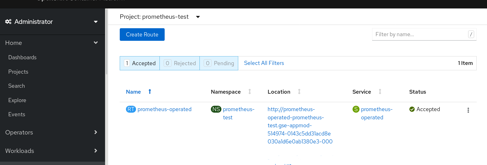

# Install a Prometheus instance to monitor an Open Liberty application on OCP 4.3

We will use the Prometheus Operator provided by OCP to install and configure Prometheus into a new namespace (project). We will then install a test application using the Open Liberty Operator. The application will provide a metrics endpoint for Prometheus to gather statistics.   


## 1. Test app
Use a simple Microprofile metrics demo application from Open Liberty guides
https://openliberty.io/guides/microprofile-metrics.html

This app is used 'as is' (although we disabled the default security for now to make it simpler to play with).  You can pull the docker image from the hub to run it locally.
```
docker run -p 9080:9080 yarod/microprofile-monitoring
```

## 2. Install and configure Prometheus

OCP provides a monitoring stack (Prometheus + Grafana) but up to now has not allowed it to be used for user workload monitoring.

As there is a Liberty monitoring dashboard for Grafana designed to visualize Liberty-specific Microprofile metrics, we will use our own instance of Prometheus to gather the metrics and as a target for a new Grafana instance to display the Liberty dashboard.  

### 2.1 Create the required Service IDs, ClusterRoles, and ClusterRoleBindings

This scenario generally follows Kabanero documentation and installs a separate Prometheus instance.

https://kabanero.io/guides/app-monitoring-ocp4.2

#### 2.1.1  Create a new Project/Namespace

To facilitate security and isolation we want to run Prometheus in its own namespace.  To achieve this we create a new project/namespace for it.  For our example we will call it "prometheus-test". You must be logged into the OCP system and able to use the Openshift CLI (oc) commands to complete this exercise. We use the "test" suffix throughout our examples but in production you would likely use some other suffix that identifies your applications.
~~~
oc new-project prometheus-test
~~~

#### 2.1.2 Service Accounts

Both the *Prometheus Operator* and *Prometheus* itself must have an identity (account) when they are run.  Each of these programs requires specific authorizations in order to function. In a Role Based Authentication System (RBAC) like OpenShift these accounts are called **Service Accounts**. Roles with cluster wide access are called **ClusterRoles**. To connect an account with a clusterrole you use a **ClusterRoleBinding**.  Note that you will require admin authority on the cluster to create, alter, or delete cluster roles and bindings.

The service account for the *Prometheus Operator* is named **prometheus-operator**. To create it copy the file PromOperServiceAccount.yaml and issue the command:

~~~
oc apply -f PromOperServiceAccount.yaml
~~~

Do the same for the next two:

The service acccount for *Prometheus* itself:

~~~
oc apply -f PrometheusServiceAccount.yaml
~~~
Add the 2nd service account that Prometheus expects:
~~~
oc apply -f k8sServiceAccount.yaml
~~~
confirm via:
~~~
oc get serviceaccount
~~~
and you should see the three new service accounts (along with those kubernetes creates for each namespace):

~~~
NAME                  SECRETS   AGE
builder               2         7m49s
default               2         7m49s
deployer              2         7m49s
prometheus            2         115s
prometheus-k8s        2         4s
prometheus-operator   2         3m30s
~~~


#### 2.1.3 Create the Cluster Roles

As we are running on an OpenShift system there are cluster roles already for those service IDs. However, those cluster roles were defined for the *openshift-monitoring* namespace. They may not match those we need for our instance of prometheus.  Additionally, any changes to those cluster roles by cluster administrators can potentially have unknown consequences for our instance.

 Therefore, we will create our own versions of the cluster roles (note: if you wish to reuse the existing cluster roles you must still create our prometheus-k8s-test cluster role if you want Prometheus to monitor an application outside its own namespace as the default prometheus-k8s cluster role does not have that ability).

You are free to replace the *test* suffix with something more meaningful but then you must edit the cluster role bindings yaml files  to pick up the new object names.

 prometheus-operator-test cluster role:
 ~~~
 oc apply -f promoprole.yaml
 ~~~

 prometheus-test cluster role:
 ~~~
oc apply -f promrole.yaml
 ~~~

 prometheus-k8s-test cluster role:

 ~~~
 oc apply -f prometheus-k8s-custom.yaml
 ~~~
 Note that the prometheus-k8s-test cluster role is a merge of the default OCP permissions for the prometheus-k8s account and those recommended by the *Prometheus Operator* documentation.

 Before granting users access to the Prometheus namespace it is recommended that you review and understand the permissions for all three service IDs.

 Now you can confirm the ClusterRoles you have created via:

 ~~~
 oc get clusterrole
 ~~~
 This will display all the ClusterRoles for the system.
 Or confirm them individually:
 ~~~
 oc get clusterrole/prometheus-test

 oc get clusterrole/prometheus-operator-test

 oc get clusterrole/prometheus-k8s-test
~~~
To view the contents of an individual clusterrole:
~~~
oc describe clusterrole/prometheus-test
~~~
example output:
~~~
Name:         prometheus-test
Labels:       <none>
Annotations:  kubectl.kubernetes.io/last-applied-configuration:
                {"apiVersion":"rbac.authorization.k8s.io/v1beta1","kind":"ClusterRole","metadata":{"annotations":{},"name":"prometheus-test"},"rules":[{"a...
PolicyRule:
  Resources   Non-Resource URLs  Resource Names  Verbs
  ---------   -----------------  --------------  -----
  endpoints   []                 []              [get list watch]
  nodes       []                 []              [get list watch]
  pods        []                 []              [get list watch]
  services    []                 []              [get list watch]
              [/metrics]         []              [get]
  configmaps  []                 []              [get]
~~~


#### 2.1.4 Bind the Service Accounts to their Cluster Roles ###


This is done via a *ClusterRoleBinding*.

prometheus:
~~~
oc apply -f prombinding.yaml
~~~

prometheus-operator:
~~~
oc apply -f promopbinding.yaml
~~~

prometheus-k8s:

~~~
oc apply -f customrolebindingK8s.yaml
~~~


These are based on information in the Github site for the Prometheus Operator. You can refer to it at:  https://github.com/coreos/prometheus-operator/

### 2.2 Create a Prometheus instance

#### 2.2.1 Install the Prometheus Operator

From the IBM Cloud Dashboard select the project (in our example: prometheus-test). Then open the *Operators* section and click on *Installed Operators*:


Our system has only the Open Liberty Operator installed so we must add the Prometheus Operator to it.

Select the *OperatorHub* option:


Put the name prometheus into the *Filter by keyword* area:


Click on the *Prometheus Operator* and answer *Continue* to the warning screen. This will bring up the *Install* option:


This is the Prometheus Operator Subscription Screen.


Click on *Subscribe* at the bottom on the screen.


Now examine the *Installed Operators* and you will see that you now have the *Prometheus Operator* available:


#### 2.2.2 Install & Configure a Prometheus Instance
From the *Installed Operators* click on the *Prometheus Operator*


This will bring up the *Prometheus Operator* screen. Click on *Create Instance*


and you will see the *Create* selection


Copy the contents of the *PromConfigNames.yaml* file into the selection  area of the screen and click on *Create*. This will instantiate prometheus in your namespace (this yaml will need to be customized for a production installation, for example to control storage usage, you can find the options at https://github.com/coreos/prometheus-operator/blob/master/Documentation/api.md).

Verify the Prometheus Service is running:
~~~
oc get svc -n prometheus-test
~~~

~~~
NAME                  TYPE        CLUSTER-IP   EXTERNAL-IP   PORT(S)    AGE
prometheus-operated   ClusterIP   None         <none>        9090/TCP   4m54s
~~~

Expose the *prometheus-operated* service externally:
~~~
oc expose svc/prometheus-operated -n prometheus-test
~~~
~~~

13. Confirm the external route:
~~~
oc get routes -n prometheus-test
~~~
route.route.openshift.io/prometheus-operated exposed
~~~

Now go to your project dashboard page and scroll down to the Deployments area.


Click on the *Route* option



Now click on the URL under the *Location* header to open a new window for the Prometheus console


Prometheus has been installed and is running although as yet it hasn't found any applications to monitor.


## 3 Deploy an app via the Open Liberty Operator

So far we have not created any monitoring targets for Prometheus.  Note that the Prometheus we installed earlier is managed by the Prometheus operator, and the latter will monitor for ServiceMonitor CRD instances to identify monitoring targets.  

### 3.1 Create a new project for the test application

Create a new project to hold your application. Note that we are now working in the *dev-test* namespace.
~~~
oc new-project dev-test
~~~

### 3.2 Install the Open Liberty Operator

Install the Open Liberty operator from the Operator Hub or Installed Operators as you did for the Prometheus Operator.

The documentation for the *Open Liberty Operator* can be found at:

https://github.com/OpenLiberty/open-liberty-operator/blob/master/doc/user-guide.md


Should you need to debug the  Open Liberty operator deployment, you can watch the operator logs that show the deployment activity.
~~~
 oc get pods -A |grep liberty
 ~~~

 The response will look like:
 ~~~
 openshift-operators  open-liberty-operator-847d9d76c4-gt24z 1/1
 ~~~

Then take the name of the open-liberty-operator pod from the openshift-operators namespace and plug it into the logs command:


~~~
 oc logs  open-liberty-operator-847d9d76c4-gt24z -f -n openshift-operators
~~~
Note: the response is not shown here because it is extensive. (ctl-c to end the output in a linux terminal)

### 3.3 Create an Open Liberty Application

Once available the *Installed Operators* option in your project will show it.


Select the Open Liberty Operator to open it


In the *Open Liberty Application* area select *Create Instance*


Now copy the contents of the *openl.yaml* file into the screen for the new application and click on *Create*


Now go back to the dev-test project dashboard and scroll down to the deployments selection to view your deployed application


The *Route* will point to the application


Click on the URL to view the application


If you append */metrics* to the URL in your browser you will see the metrics that the application provides for Monitoring


### 3.4 Create a ServiceMonitor so Prometheus can find the application

Although the Open Liberty Operator has created a ServiceMonitor object in the dev-test namespace; Prometheus (in this implementation) requires it to be in its own namespace. So we must create it.  

Switch back to the *prometheus-test* project and go to the *Installed Operators* again and select the *Prometheus Operator*. Scroll down to find the *Service Monitor* section.


Click on *Create Instance* and copy/paste the contents of the *servicemonitor-test.yaml* file into the create Screen then click on *Create* to generate the ServiceMonitor object


You can view the installed servicemonitors from the Prometheus Operator screens or via oc commands

~~~
oc project prometheus-test
~~~

~~~
oc get servicemonitor
~~~

returns

~~~
NAME   AGE
test   28s
~~~

~~~
oc describe servicemonitor/test
~~~

returns the contents of our new *test* ServiceMonitor

~~~
Name:         test
Namespace:    prometheus-test
Labels:       k8s-app=prometheus
              name=test
Annotations:  <none>
API Version:  monitoring.coreos.com/v1
Kind:         ServiceMonitor
Metadata:
  Creation Timestamp:  2020-04-08T00:15:06Z
  Generation:          1
  Resource Version:    7626170
  Self Link:           /apis/monitoring.coreos.com/v1/namespaces/prometheus-test/servicemonitors/test
  UID:                 59784c39-3a8d-4c9e-8e11-57a26a0487e0
Spec:
  Endpoints:
    Interval:  30s
    Bearer Token Secret:
      Key:  
    Port:   9080-tcp
  Namespace Selector:
    Match Names:
      dev-test
  Selector:
    Match Labels:
      k8s-app:  
Events:         <none>
~~~

## 4 Use Prometheus to view the application Metrics

Our Prometheus instance should now be able to find our application via the *test servicemonitor* and it will begin to scrape the metrics every 30 seconds as we specified.

Return to the *Route* section of the *prometheus-test* dashboard


 Click on the URL to return to the Prometheus console. Select the drop down in the *-insert metric at cursor -* box, click on any metric and then click on the *Execute* box. This will display that metric


Now select the *Status* drop down from the header bar and click on *Targets*


You can see Prometheus is monitoring our application.  
